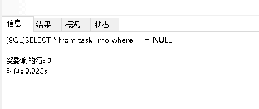

title: SQL中的NULL是这么回事儿
date: 2013-12-24 23:30:09
categories:
- 数据库
---

> 在日常使用数据库时，你在意过NULL值么？

在查询数据库时，如果你想知道一个列（例如：用户注册年限 USER_AGE）是否为 NULL，SQL 查询语句该怎么写呢？

是这样：
~~~sql
SELECT * FROM TABLE WHERE USER_AGE = NULL
~~~
还是这样？
~~~sql
SELECT * FROM TABLE WHERE USER_AGE IS NULL
~~~
当然，正确的写法应该是第二种（**WHERE USER_AGE IS NULL**）。

 

但为什么要这样写呢？在进行数据库数据比较操作时，我们不会使用“IS”关键词，不是吗？
例如，如果我们想要知道一个列的值是否等于 1，WHERE 语句是这样的：

```sql
WHERE USER_AGE = 1
```

那为什么 NULL 值要用 IS 关键字呢？为什么要以这种方式来处理 NULL？

因为，**在 SQL 中，NULL 表示“未知”。也就是说，NULL 值表示的是“未知”的值。**

NULL = 未知；


在大多数数据库中，NULl 和空字符串是有区别的。

但并不是所有数据库都这样，例如，Oracle 就不支持空字符串，它会把空字符串自动转成 NULL 值。

在其他大多数数据库里，NULL 值和字符串的处理方式是不一样的：

空字符（""）串虽然表示“没有值”，但这个值是已知的。
NULL 表示 “未知值”，这个值是未知的。

**""是有坑没萝卜，null是连坑都没挖**


这就好比我问了一个问题：“川建国的小名叫什么？”

有人会回答说：“我不知道川建国的小名是什么”。对于这种情况，可以在数据库中使用Nickname列来表示川建国的小名，而这一列的值为 NULL。

也有人会回答说：“川建国没有小名。他的父母没有给他取小名，大家虽然一直叫他川二狗，但是我知道川建国确实没有小名”。对于这种情况，Nickname列应该是一个空字符串（""）。

Oracle 比较特殊，两个值都使用 NULL 来表示，而其他大多数数据库会区分对待。

但只要记住 NULL 表示的是一个未知的值，那么在写 SQL 查询语句时就会得心应手。


例如，如果你有一个这样的查询语句：
~~~sql
SELECT * FROM SOME_TABLE WHERE 1 = 1
~~~
这个查询会返回所有的行（假设 SOME_TABLE 不是空表），因为表达式“1=1”一定为 true。

如果我这样写：
~~~sql
SELECT * FROM SOME_TABLE WHERE 1 = 0
~~~
表达式“1=0”是 false，这个查询语句不会返回任何数据。

但如果我写成这样：
~~~sql
SELECT * FROM SOME_TABLE WHERE 1 = NULL
~~~
这个时候，数据库不知道这两个值（1 和 NULL）是否相等，因此会认定为“NULL”或“未知”，所以它也不会返回任何数据。


**三元逻辑**

SQL 查询语句中的 WHERE 一般会有三种结果：

- 它可以是 true（这个时候会返回数据）；
- 它可以是 false（这个时候不会返回数据）；
- 它也可以是 NULL 或未知（这个时候也不会返回数据）；




你可能会想：“既然这样，那我为什么要去关心是 false 还是 NULL？它们不是都不会返回数据吗？”

接下来，我来告诉你在哪些情况下会有问题：我们来看看 NOT( ) 方法。

假设有这样的一个查询语句：
~~~sql
SELECT * FROM SOME_TABLE WHERE NOT(1 = 1)
~~~
数据库首先会计算 1=1，这个显然是 true。

接着，数据库会应用 NOT() 条件，所以 WHERE 返回 false。

所以，上面的查询不会返回任何数据。

但如果把语句改成这样：
~~~sql
SELECT * FROM SOME_TABLE WHERE NOT(1 = 0)
~~~
数据库首先会计算 1=0，这个肯定是 false。

接着，数据库应用 NOT() 条件，这样就得到相反的结果，变成了 true。

所以，这个语句会返回数据。

但如果把语句再改成下面这样呢？
~~~sql
SELECT * FROM SOME_TABLE WHERE NOT(1 = NULL)
~~~
数据库首先计算 1=NULL，它不知道 1 是否等于 NULL，因为它不知道 NULL 的值是什么。

所以，这个计算不会返回 true，也不会返回 false，它会返回一个 NULL。

接下来，NOT() 会继续解析上一个计算返回的结果。

当 NOT() 遇到 NULL，它会生成另一个 NULL。未知的相反面是另一个未知。

所以，对于这两个查询：
~~~sql
SELECT * FROM SOME_TABLE WHERE NOT(1 = NULL)

SELECT * FROM SOME_TABLE WHERE 1 = NULL
~~~
都不会返回数据，尽管它们是完全相反的。

NULL 和 NOT IN
如果我有这样的一个查询语句：
~~~sql
SELECT * FROM TABLE WHERE 1 IN (1, 2, 3, 4, NULL)
~~~
很显然，WHERE 返回 true，这个语句将返回数据，因为 1 在括号列表里是存在的。

但如果这么写：
~~~sql
SELECT * FROM SOME_TABLE WHERE 1 NOT IN (1, 2, 3, 4, NULL)
~~~
很显然，WHERE 返回 false，这个查询不会返回数据，因为 1 在括号列表里存在，但我们说的是“NOT IN”。

但如果我们把语句改成这样呢？
~~~sql
SELECT * FROM SOME_TABLE WHERE 5 NOT IN (1, 2, 3, 4, NULL)
~~~
这里的 WHERE 不会返回数据，因为它的结果不是 true。数字 5 在括号列表里可能不存在，也可能存在，因为当中有一个 NULL 值（数据库不知道 NULL 的值是什么）。

这个 WHERE 会返回 NULL，所以整个查询不会返回任何数据。

希望大家现在都清楚该怎么在 SQL 语句中处理 NULL 值了。


