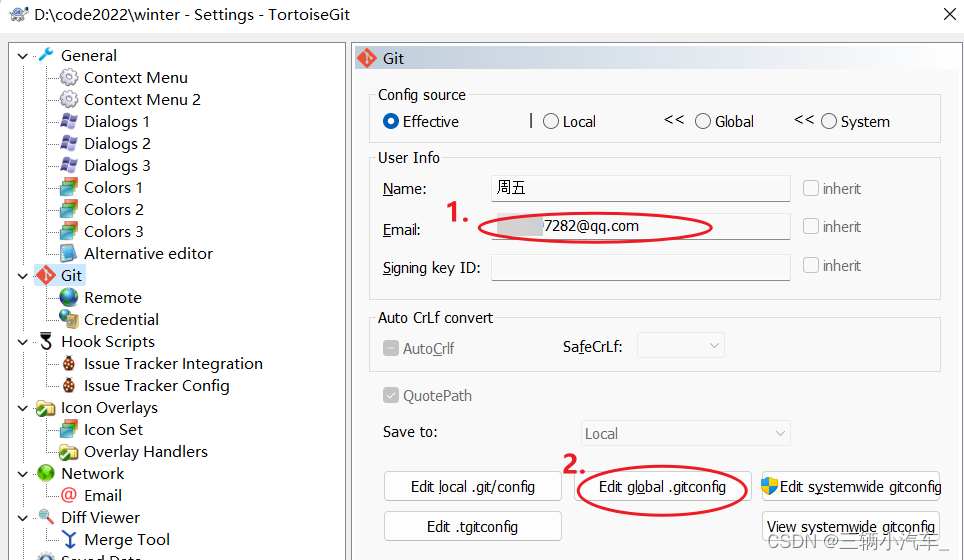

# TortoiseGit 的使用

## 1,下载

https://tortoisegit.org/download/

## 2,使用

分支:

- 主分支: master

- 开发分支: dev

- 自己的分支: gzp

## ①切换分支

1, 在gitee中复制https://gitee.com/gzpstart/blog.git 

2, git clone 到本地

3, 右键查看分支(Git commit --> "master"),现在是master分支,这个分支一般不动

4, TortoiseGit --> switch/checkout -->Branch(切换分支-dev) + Greate New Branch (本地新分支)--(没有就建一个)

## ②现在是dev分支(需要一个自己的分支gzp)

1, TortoiseGit-->Git commit-->"dev" -->switch/checkout -->Branch dev(不用选) 

2, 勾选Create New Branch --> gzp(不用中文)

## ③新建文件,保存提交

1,Git commit --> "gzp"

2,commit (提交版本到本地仓库)

3, 需要把本地的文件提交到线上(自己的分支)

4, TortoiseGit-->push

5, 把gzp分支合并到dev分支

6, 切换到dev分支

7,合并gzp分支

8,  TortoiseGit --> Merge --> Branch选择gzp分支-->ok

9,合并后提交--> push (线上)

## ④ 合并到dev后也要把gzp分支更到最新(把dev合并到gzp)

## ⑤ 一定要保持gzp分支和dev分支一致

## ⑥ show log 查看那些人修改过文件

## ⑦ 如果Switch/checkout切换分支时,看不到其他人的分支,用Fetch

# 提交报错后解决

## ①dev分支日多了个文件,而自己又加了一个新文件

1,在将gzp合并到dev的时候报错

2,要先将dev更新到最新状态

3,切换dev分支 --> pull

4, 后提交 --> push

## ②dev中有test.txt文件,而gzp中也有,但是内容在我拉后合并提交了,我现在又修改了文件

1, 报错后

2,点击确定,下一页面点击resolve

3,双击文件(一个本地的,一个当前分支)

4, 选择一个右击(点击use this text block)

5,点击编辑文档 (绿色的√)

# TortoiseGit设置提交信息模板

1、打开TortoiseGit中Settings配置

2、点击Edit global.gitconfig配置

3、在打开的文件设置模板路径，如图：

~~~java
[commit]
  template=G:\\git-template\\commit_message.txt
~~~

4、在模板路径下新建commit_message.txt

5、打开模板文件，配置模板，内容根据项目自行设置，保存之后即可

注意：如果提交信息是乱码，注意设置配置文件的编码格式为utf-8

# 【gitee】解决gitee本地提交但是无法显示贡献度（绿点）的问题

**1.原因：**
本地邮箱与Gitee上邮箱不一致

**2.解决方案**
将邮箱修改一致

**（1）对于gitee上：**
①点击右上角头像—>点击设置

  

②邮箱设置—>查看自己的邮箱地址

  

**（2）对于本地：**
①找到想要上传的文件夹—>空白处右键—>TortoiseGit—>Settings

  

②查看自己的邮箱
若和Gitee上的不同，可点击图中所示的2.Edit global .gitconfig进行邮箱的修改

  

③打开修改即可

  