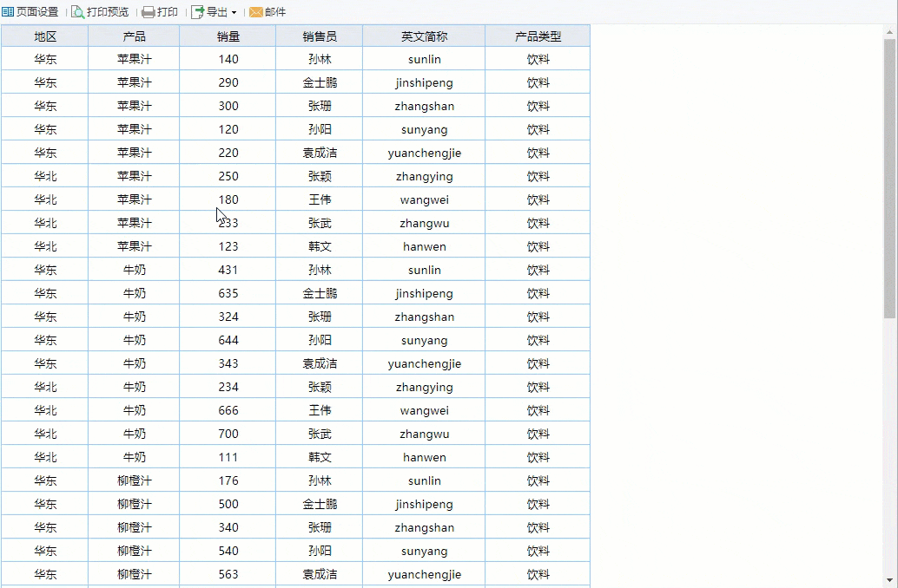
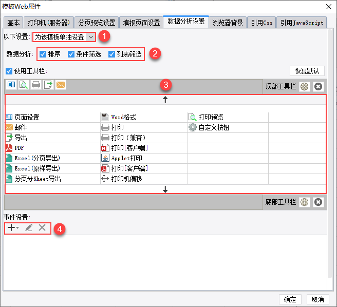

# 数据分析预览

## 1. 概述

### 1.1 应用场景

数据分析预览方式可以在查看数据时，对数据进行简单的分析操作，包括：排序、条件筛选、列表筛选。效果如下图所示：

- 排序：选中某个单元格，使用排序工具对该单元格所在列的数据进行排序。

- 条件筛选：选中某个单元格，设置操作符、数据类型、数值这三个条件，筛选出该单元格所在列的某些数据。

- 列表筛选：选中某个单元格，复选该单元格所在列的去重数据列表，只显示勾选的数据。

注1：移动端是不支持数据分析预览的。

注2：数据分析预览时，数据不会分页展示。

### 1.2 功能入口

数据分析预览的方式有两种，分别如下：

- 按钮：在设计器预览按钮列表下直接选择「数据分析」即可。

- 后缀：直接在访问模板的URL后面加参数后缀&op=view即可。

## 2. 数据分析设置

打开设计器菜单栏模板>模板Web属性下的数据分析设置页面，可以自定义数据分析预览时的前端展示效果。

想要自定义的话，需要先将「以下设置」选择成「为该模板单独设置」。

数据分析的三个工具，用户可以自行选择是否在预览时可用。

用户可以将中间的工具添加到工具栏中，也可以将工具栏中已有的工具删除掉。

左下角事件设置项支持添加 JavaScript 代码，实现更多的预览效果。

## 3. 注意事项

### 3.1 无法排序

数据分析预览排序需要把最前面的父格设置为列表（其它列为分组），否则除了最父格，其他无法排序。

### 3.2 不显示列表筛选工具

如果前端显示的数据量大于 100 条，那么列表筛选工具就不显示，这是 FineReport 数据量限制规则决定的。

### 3.3 无法使用分析工具

以下两个场景，3 个数据分析工具都不能用。

1）双向扩展得到的数据，无法使用数据分析工具。

2）当单元格存在多层父格，且与父格属于同一个数据集，则无法使用数据分析功能。

| 示例 |                             情况                             |                      结果                      |                            分析                            |
| :--: | :----------------------------------------------------------: | :--------------------------------------------: | :--------------------------------------------------------: |
|  1   | 单元格 C1 的父格是 B1单元格 B1 的父格是 A1单元格 A1 无父格 单元格 A1、B1、C1 是一个数据集 |   单元格 A1、B1 有数据分析功能单元格 C1 没有   | 单元格 C1 的父格层级是 2且父格 A1、B1 与 C1 是同一个数据集 |
|  2   | 单元格 C1 的父格是 B1单元格 B1 的父格是 A1单元格 A1 无父格单元格 A1、B1 是一个数据集，单元格 C1 是一个数据集，通过过滤和单元格 A1、B1关联起来的 |         单元格 A1、B1、C1 都有分析功能         |                             -                              |
|  3   | 单元格 E1 的父格是 D1单元格 D1 的父格是 C1单元格 C1 的父格是 B1单元格 B1 的父格是 A1单元格 A1 无父格单元格 A1、B1 是一个数据集，单元格 C1、D1、E1是一个数据集，通过过滤和 A1、B1关联起来的 | 单元格 A1、B1、C1、D1 有分析功能单元格 E1 没有 |  单元格 E1的父格层级是2且父格 C1、D1 与 E1 是同一个数据集  |

**左父格使用默认,只有序号的时候需要使用公式seq(),没有要求的时候默认就好.**

### 3.4 去除选中单元格时的黑框

数据分析预览时，选中单元格会出现一个黑色边框，对报表整体美观的有一定影响，那么怎么去除掉这个边框呢？

解决方案：[去除数据分析页面选中单元格时的黑色边框](https://help.fanruan.com/finereport/doc-view-1536.html)

**如果出现有的单元格有箭头,而有的没有,那大概率是左父格的问题.**