# Java之异常处理

## 异常的定义

在Java语言中，将程序执行中发生的不正常情况称为“异常”。（开发过程中的语法错误和逻辑错误不是异常）

### 1. 异常的体系结构

Java程序在执行过程中所发生的异常事件可分为两类：

- `Error`： Java虚拟机无法解决的严重问题。如：JVM系统内部错误、资源耗尽等严重情况。比如： `StackOverflowError` 和OOM。一般不编写针对性的代码进行处理。
- `Exception`：其它因编程错误或偶然的外在因素导致的一般性问题，可以使用针对性的代码进行处理。如： 
  - 空指针访问
  - 试图读取不存在的文件
  - 网络连接中断
  - 数组角标越界

```java
异常的体系结构
 * java.lang.Throwable
 * 		|-----java.lang.Error:一般不编写针对性的代码进行处理.
 * 		|-----java.lang.Exception:可以进行异常的处理
 * 			|------编译时异常(checked)不会生成字节码文件
 * 					|-----IOException
 * 						|-----FileNotFoundException
 * 					|-----ClassNotFoundException
 * 			|------运行时异常(unchecked,RuntimeException)
 * 					|-----NullPointerException//空指针异常
 * 					|-----ArrayIndexOutOfBoundsException//数组角标越界
 * 					|-----ClassCastException//类型转化异常
 * 					|-----NumberFormatException//编码格式异常
 * 					|-----InputMismatchException//输入不匹配
 * 					|-----ArithmeticException//算术异常
```

java中异常类的继承关系


### 2. 按照异常发生的时间可以分为两类

- 编译时异常：执行 `javac.exe` 命令时，可能出现的异常：

  指编译器要求必须处置的异常。即程序在运行时由于外界因素造成的一般性异常。编译器要求Java程序必须捕获或声明所有编译时异常对于这类异常，如果程序不处理，可能会带来意想不到的结果。

- 运行时异常：执行 `java.exe` 命令时，出现的异常：

  指编译器不要求强制处置的异常。一般是指编程时的逻辑错误，是程序员应该积极避免其出现的异常。 `java. lang. Runtime Exception` 类及它的子类都是运行时异常。对于这类异常，可以不作处理，因为这类异常很普遍，若全处理可能会对程序的可读性和运行效率产生影响。

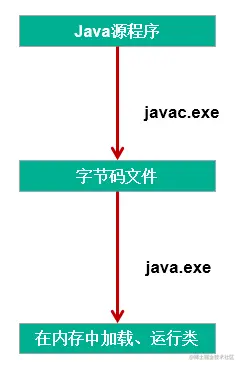

### 3.常见的异常类型

```java
//******************以下是运行时异常***************************
//ArithmeticException
@Test
public void test6(){
    int a = 10;
    int b = 0;
    System.out.println(a / b);
}

//InputMismatchException
@Test
public void test5(){
    Scanner scanner = new Scanner(System.in);
    int score = scanner.nextInt();
    System.out.println(score);

    scanner.close();
}

//NumberFormatException
@Test
public void test4(){

    String str = "123";
    str = "abc";
    int num = Integer.parseInt(str);	
}

//ClassCastException
@Test
public void test3(){
    Object obj = new Date();
    String str = (String)obj;
}

//IndexOutOfBoundsException
@Test
public void test2(){
    //ArrayIndexOutOfBoundsException
    //		int[] arr = new int[10];
    //		System.out.println(arr[10]);
    //StringIndexOutOfBoundsException
    String str = "abc";
    System.out.println(str.charAt(3));
}

//NullPointerException
@Test
public void test1(){		
    //		int[] arr = null;
    //		System.out.println(arr[3]);

    String str = "abc";
    str = null;
    System.out.println(str.charAt(0));

}

//******************以下是编译时异常***************************
@Test
public void test7(){
    //		File file = new File("hello.txt");
    //		FileInputStream fis = new FileInputStream(file);
    //		
    //		int data = fis.read();
    //		while(data != -1){
    //			System.out.print((char)data);
    //			data = fis.read();
    //		}
    //		
    //		fis.close();

}

```

## 异常的处理

### 1. java异常处理的抓抛模型

**过程一："抛"**程序在正常执行的过程中，一旦出现异常，就会在异常代码处生成一个对应异常类的对象。并将此对象抛出。一旦抛出对象以后，其后的代码就不再执行。

关于异常对象的产生：

- 系统自动生成的异常对象
- 手动的生成一个异常对象，并抛出（`throw`）

**过程二："抓"**可以理解为异常的处理方式：① `try-catch-finally` ② `throws`

### 2.异常处理方式一：try-catch-finally

#### 2.1 使用说明：

```java
try{
    //可能出现异常的代码

}catch(异常类型1 变量名1){
    //处理异常的方式1
}catch(异常类型2 变量名2){
    //处理异常的方式2
}catch(异常类型3 变量名3){
    //处理异常的方式3
}
....
    finally{
        //一定会执行的代码
    }

```

**使用说明：**

- `finally` 是可选的。
- 使用 `try` 将可能出现异常代码包装起来，在执行过程中，一旦出现异常，就会生成一个对应异常类的对象，根据此对象的类型，去 `catch` 中进行匹配
- 一旦 `try` 中的异常对象匹配到某一个 `catch` 时，就进入 `catch` 中进行异常的处理。一旦处理完成，就跳出当前的 `try-catch` 结构（在没写 `finally` 的情况。继续执行其后的代码）
- `catch`中的异常类型如果没子父类关系，则谁声明在上，谁声明在下无所谓；`catch`中的异常类型如果满足子父类关系，则要求子类一定声明在父类的上面。否则会报错
- 常用的异常对象处理的方式： ① `String getMessage()` ② `printStackTrace()`
- 在`try` 结构中声明的变量，再出了 `try` 结构以后，就不能再被调用
- `try-catch-finally` 结构可以嵌套

**如何看待代码中的编译时异常和运行时异常？**

- 使用 `try-catch-finally` 处理编译时异常，是得程序在编译时就不再报错，但是运行时仍可能报错。相当于我们使用 `try-catch-finally` 将一个编译时可能出现的异常，延迟到运行时出现。
- 开发中，由于运行时异常比较常见，所以我们通常就不针对运行时异常编写 `try-catch-finally` 了。但是针对于编译时异常，一定要考虑异常的处理。

#### 2.2. finally的再说明：

- `finally` 是可选的
- `finally` 中声明的是一定会被执行的代码。即使catch中又出现异常了，`try` 中包含 `return` 语句，或者`catch`中 `return` 包含语句等情况，`finally` 中的代码也会被执行。
- 像数据库连接、输入输出流、网络编程Socket等资源，JVM是不能自动的回收的，我们需要自己手动的进行资源的释放。此时的资源释放的代码，就需要声明在 `finally` 中。

### 3. 异常处理方式二：

`throws + 异常类型` 写在方法的声明处。指明此方法执行时，可能会抛出的异常类型。 一旦当方法体执行时，出现异常，仍会在异常代码处生成一个异常类的对象，此对象满足 `throws` 后异常类型时，就会被抛出。异常代码后续的代码，就不再执行！

### 4. 对比两种处理方式

`try-catch-finally` 真正的将异常给处理掉了。 `throws` 的方式只是将异常抛给了方法的调用者。并没真正将异常处理掉。

### 5. 开发中应该如何选择两种处理方式？

- 如果父类中被重写的方法没 `throws` 方式处理异常，则子类重写的方法也不能使用 `throws`，意味着如果子类重写的方法中异常，必须使用 `try-catch-finally` 方式处理。
- 执行的方法a中，先后又调用了另外的几个方法，这几个方法是递进关系执行的。我们建议这几个方法使用`throws` 的方式进行处理。而执行的方法a可以考虑使用 `try-catch-finally` 方式进行处理。

> 补充： 方法重写的规则之一： 子类重写的方法抛出的异常类型不大于父类被重写的方法抛出的异常类型

## 手动抛出异常对象

### 1.使用说明

在程序执行中，除了自动抛出异常对象的情况之外，我们还可以手动的 `throw` 一个异常类的对象。

### 2.经典面试题

`throw` 和 `throws`区别： `throw` 表示抛出一个异常类的对象，生成异常对象的过程。声明在方法体内。 `throws` 属于异常处理的一种方式，声明在方法的声明处。

### 3.代码示例

```java
class Student{

    private int id;

    public void regist(int id) throws Exception {
        if(id > 0){
            this.id = id;
        }else{
            //手动抛出异常对象
            //			throw new RuntimeException("您输入的数据非法！");
            //			throw new Exception("您输入的数据非法！");
            throw new MyException("不能输入负数");

        }		
    }

    @Override
    public String toString() {
        return "Student [id=" + id + "]";
    }

}
```

## 自定义异常类

### 1.如何自定义异常类

- 继承于现的异常结构：`RuntimeException 、Exception`
- 提供全局常量：`serialVersionUID`（对类的唯一标识）
- 提供重载的构造器

### 2.代码示例

```java
public class MyException extends Exception{

    static final long serialVersionUID = -7034897193246939L;

    public MyException(){

    }

    public MyException(String msg){
        super(msg);
    }
}
```

# Java之多线程

在进行多线程的内容之前我们需要首先了解涉及操作系统的几个知识点。

## 一、程序、进程、线程

### 1. 程序(program)

概念：是为完成特定任务、用某种语言编写的一组指令的集合。即指一段静态的代码。

### 2. 进程(process)

概念：程序的一次执行过程，或是正在运行的一个程序。 说明：进程作为资源分配的单位，系统在运行时会为每个进程分配不同的内存区域

### 3. 线程(thread)

概念：进程可进一步细化为线程，是一个程序内部的一条执行路径。 说明：线程作为调度和执行的单位，每个线程拥独立的运行栈和程序计数器(pc)，线程切换的开销小。


**内存结构：**


> 进程可以细化为多个线程。 每个线程，拥有自己独立的：栈、程序计数器 多个线程，共享同一个进程中的结构：方法区、堆。

## 二、并行与并发

### 1. 单核CPU与多核CPU

- 单核CPU，其实是一种假的多线程，因为在一个时间单元内，也只能执行一个线程的任务。涉及到CPU处理线程的方式，CPU在单位时间（也就是说一个时间片内）内只能处理一个线程，于是就将其他的线程设置为阻塞状态，加入到阻塞队列中，等到处理完成当前线程后从就绪队列中取出新的线程进行处理，由于切换和处理时间很快用户感知不到于是用户便认为CPU在同一时间内处理多个线程。
- 多核CPU，才能更好的发挥多线程的效率。（现在的服务器都是多核的）
- 一个Java应用程序java.exe，其实至少三个线程：main()主线程，gc()垃圾回收线程，异常处理线程。当然如果发生异常，会影响主线程。

### 2. 并行与并发的理解

并行：多个CPU同时执行多个任务。比如：多个人同时做不同的事。

并发：一个CPU(采用时间片)同时执行多个任务。比如：秒杀、多个人做同一件事

## 为什么要使用多线程？

当我们在进行商品抢购的时候，在支付按钮上总是有个计时器在进行倒计时，但是我们此时仍然可以进行商品信息的查看，这个计时器和我们浏览商品信息的线程是同时进行的，这样也就实现了抢购场景，增加了用户的体验。

### 多线程程序的优点：

1. 提高应用程序的响应。对图形化界面更有意义，可增强用户体验。
2. 提高计算机系统CPU的利用率。
3. 改善程序结构。将既长又复杂的进程分为多个线程，独立运行，利于理解和修改。

### 应用的场景

1. 程序需要同时执行两个或多个任务。
2. 程序需要实现一些需要等待的任务时，如用户输入、文件读写操作、网络操作、搜索等
3. 需要一些后台运行的程序时

## 三、Thread类

Java语言的JVM允许程序运行多个线程，它通过 java. lang.Thread类来体现

#### 1. Thread类的特性

每个线程都是通过某个特定 Thread对象的run（方法来完成操作的，经常把run()方法的主体称为线程体 通过该 Thread对象的 start（方法来启动这个线程，而非直接调用run

#### 2. 构造器：

- Thread()：创建新的 Thread对象
- Thread（String threadName）：创建线程并指定线程实例名
- Thread（Runnable target）：指定创建线程的目标对象，它实现了 Runnable接口中的run方法
- Thread（Runnable target， String name）：创建新的 Thread对象

#### 3. 创建多线程的两种方式

**3.1. 方式一继承Thread类的方式：**

1. 创建一个继承于Thread类的子类
2. 重写Thread类的run() --> 将此线程执行的操作声明在run()中
3. 创建Thread类的子类的对象
4. 通过此对象调用start()：①启动当前线程 ② 调用当前线程的run()

**注意点：**

1. 我们启动一个线程，必须调用start()，不能调用run()的方式启动线程。 如果再启动一个线程，必须重新创建一个Thread子类的对象，调用此对象的start().（注意后面的点）
2. 如果自己手动调用run()方法，那么就只是普通方法，没有启动多线程模式
3. run（方法由JVM调用，什么时候调用，执行的过程控制都有操作系统的CPU调度决定。
4. 想要启动多线程，必须调用 start方法。
5. 一个线程对象只能调用一次 start()方法启动，如果重复调用了，则将抛出异常“lllegalThreadStateException”.

**代码示例**

```java
//1.继承Thread类
class MyThread extends Thread {
    public MyThread() {
    }

    //2.重run方法
    @Override
    public void run() {
        for (int i = 0; i < 100; i++) {
            if (i % 2 == 0) {
                System.out.println(i);
            }
        }
    }
}

public class ThreadTest {
    public static void main(String[] args) {
		//3.新建Thread对象
        MyThread myThread = new MyThread();
        //4.调用start方法
        myThread.start();
    }
}
```


**3.2. 方式二实现Runnable接口的方式：**

1. 创建一个实现了Runnable接口的类
2. 实现类去实现Runnable中的抽象方法：run()
3. 创建实现类的对象
4. 将此对象作为参数传递到Thread类的构造器中，创建Thread类的对象
5. 通过Thread类的对象调用start()

**代码示例：**

```java
//1. 创建一个实现了Runnable接口的类
public class RunnableTest implements Runnable {
    // 2. 实现类去实现Runnable中的抽象方法：run()
    @Override
    public void run() {
        for (int i = 0; i < 100; i++) {
            System.out.println(i);
        }
    }
}

class test {
    public static void main(String[] args) {
        //3. 创建实现类的对象
        RunnableTest runnableTest = new RunnableTest();
        //4. 将此对象作为参数传递到Thread类的构造器中，创建Thread类的对象
        Thread thread = new Thread(runnableTest);
        //5. 通过Thread类的对象调用start()
        thread.start();

    }
}
```

**两种方式的对比：**

开发中优先选择：实现Runnable接口的方式

**原因：**

 1. 实现的方式没类的单继承性的局限性

 2. 实现的方式更适合来处理多个线程共享数据的情况。

**联系：**public class Thread implements Runnable

**相同点：**两种方式都需要重写run(),将线程要执行的逻辑声明在run()中。 目前两种方式，要想启动线程，都是调用的Thread类中的start()。

**也可以采用创建匿名类的方式**

```java
public class ThreadDemo {
    public static void main(String[] args) {

        //创建Thread类的匿名子类的方式
        new Thread() {
            @Override
            public void run() {
                for (int i = 0; i < 100; i++) {
                    if (i % 2 == 0) {
                        System.out.println(Thread.currentThread().getName() + ":" + i);
                    }
                }
            }
        }.start();

        new Thread() {
            @Override
            public void run() {
                for (int i = 0; i < 100; i++) {
                    if (i % 2 != 0) {
                        System.out.println(Thread.currentThread().getName() + ":" + i);
                    }
                }
            }
        }.start();


    }
}
```

#### 4. Thread类的常用方法

4.1 常用方法：

1. start():启动当前线程；调用当前线程的run()，只有Thread类和他的子类才能调用start()方法
2. run(): 通常需要重写Thread类中的此方法，将创建的线程要执行的操作声明在此方法中
3. currentThread():静态方法，返回执行当前代码的线程
4. getName():获取当前线程的名字
5. setName():设置当前线程的名字
6. yield():释放当前cpu的执行权
7. join():在线程a中调用线程b的join(),此时线程a就进入阻塞状态，直到线程b完全执行完以后，线程a才结束阻塞状态。
8. stop():已过时。当执行此方法时，强制结束当前线程。
9. sleep(long millitime):让当前线程“睡眠”指定的millitime毫秒。在指定的millitime毫秒时间内，当前线程是阻塞状态。
10. isAlive():判断当前线程是否存活

4.2 线程的优先级：

- MAX_PRIORITY：10
- MIN _PRIORITY：1
- NORM_PRIORITY：5 -->默认优先级

获取和设置当前线程的优先级：

- getPriority():获取线程的优先级
- setPriority(int p):设置线程的优先级

> 说明：高优先级的线程要抢占低优先级线程CPU的执行权。但是只是从概率上讲，高优先级的线程高概率的情况下被执行。并不意味着只当高优先级的线程执行完以后，低优先级的线程才执行。

线程通信：wait() / notify() / notifyAll() :此三个方法定义在Object类中的。

**线程的分类**

- 守护线程，如：垃圾回收线程，依赖于主线程而存在
- 用户线程，如：main方法的线程

### 5. Thread的生命周期

**线程的五种状态：**

- 新建：当一个 Thread类或其子类的对象被声明并创建时，新生的线程对象处于新建状态
- 就绪：处于新建状态的线程被star()后，将进入线程队列等待CPU时间片，此时它已具备了运行的条件，只是没分配到CPU资源
- 运行：当就绪的线程被调度并获得CPU资源时，便进入运行状态，run()方法定义了线程的操作和功能
- 阻塞：在某种特殊情况下，被人为挂起或执行输入输出操作时，让出CP∪并临时中止自己的执行，进入阻塞状态
- 死亡：线程完成了它的全部工作或线程被提前强制性地中止或出现异常导致结束


**说明：**

1. 生命周期关注两个概念：状态、相应的方法
2. 关注：状态a-->状态b:哪些方法执行了（回调方法） 某个方法主动调用：状态a-->状态b
3. 阻塞：临时状态，不可以作为最终状态
4. 死亡：最终状态。

## 四、线程的同步机制

### 1.背景

例子：创建个窗口卖票，总票数为100张.使用实现Runnable接口的方式

- 问题：卖票过程中，出现了重票、错票 -->出现了线程的安全问题
- 问题出现的原因：当某个线程操作车票的过程中，尚未操作完成时，其他线程参与进来，也操作车票。
- 如何解决：当一个线程a在操作ticket的时候，其他线程不能参与进来。直到线程a操作完ticket时，其他线程才可以开始操作ticket。这种情况即使线程a出现了阻塞，也不能被改变。

### 2. Java解决方案：同步机制

在Java中，我们通过同步机制，来解决线程的安全问题。

#### 2.1 方式一：同步代码块

```java
synchronized(同步监视器){//同步监视器就是需要同步线程的公共对象
   //需要被同步的代码
    
}
```

**说明：**

1. 操作共享数据的代码，即为需要被同步的代码。 -->不能包含代码多了，也不能包含代码少了。
2. 共享数据：多个线程共同操作的变量。比如：ticket就是共享数据。
3. 同步监视器，俗称：锁。任何一个类的对象，都可以充当锁。
4. 要求多个线程必须要共用同一把锁。

- 在实现Runnable接口创建多线程的方式中，我们可以考虑使用this充当同步监视器。
- 在继承Thread类创建多线程的方式中，慎用this充当同步监视器，考虑使用当前类充当同步监视器。

**代码示例：**

**继承Runnable接口形式同步代码块**

```java
public class Ticket implements Runnable {
    private int tick = 100;

    @Override
    public void run() {

        while (true) {
            synchronized (this) {
                if (tick > 0) {
                    System.out.println(Thread.currentThread().getName() + "号窗口买票，票号为：" + tick--);
                } else {
                    break;
                }
            }
        }
    }
}

class TicketTest {
    public static void main(String[] args) {
        Ticket ticket = new Ticket();

        Thread thread1 = new Thread(ticket);
        Thread thread2 = new Thread(ticket);
        Thread thread3 = new Thread(ticket);

        thread1.setName("窗口1");
        thread2.setName("窗口2");
        thread3.setName("窗口3");

        thread1.start();
        thread2.start();
        thread3.start();
    }
}
```

**继承Thread类形式同步代码块**

```java
public class Ticket2 extends Thread {
    private static int tick = 100;
    private static Object object = new Object();

    public Ticket2() {
    }

    @Override
    public void run() {

        while (true) {
            synchronized (object) {
            //synchronized (Ticket2.class) {//通过反射调用当前类
                if (tick > 0) {
                    System.out.println(Thread.currentThread().getName() + "号窗口买票，票号为" + tick--);
                } else {
                    break;
                }
            }

        }
    }
}

class TicketTest2 {
    public static void main(String[] args) {
        Ticket2 ticket1 = new Ticket2();
        Ticket2 ticket2 = new Ticket2();
        Ticket2 ticket3 = new Ticket2();

        ticket1.setName("窗口1");
        ticket2.setName("窗口2");
        ticket3.setName("窗口3");

        ticket1.start();
        ticket2.start();
        ticket3.start();
    }
}
```

#### 2.2 方式二：同步方法

如果操作共享数据的代码完整的声明在一个方法中，我们不妨将此方法声明同步的。

```java
public synchronized void show(String namer){
	....
}
```

**代码示例：**

```java
public class Ticket3 implements Runnable {
    private int tick = 100;
    private boolean isFlag = true;

    @Override
    public void run() {
        while (isFlag) {
            show();
        }
    }

    public synchronized void show() {//同步show方法，继承Thread类方法一样，只需同步方法即可，同时需要给方法加static关键字，确保不会创建多个对象
        if (tick > 0) {
            try {
                Thread.sleep(100);
            } catch (InterruptedException e) {
                e.printStackTrace();
            }
            System.out.println(Thread.currentThread().getName() + "号窗口买票，票号为：" + tick--);
        } else {
            isFlag = false;
        }
    }
}

class TicketTest3 {
    public static void main(String[] args) {
        Ticket3 ticket = new Ticket3();

        Thread thread1 = new Thread(ticket);
        Thread thread2 = new Thread(ticket);
        Thread thread3 = new Thread(ticket);

        thread1.setName("窗口1");
        thread2.setName("窗口2");
        thread3.setName("窗口3");

        thread1.start();
        thread2.start();
        thread3.start();
    }
}
```

#### 2.3 方式三：Lock锁 --- JDK 5.0新增

- 从JDK 5.0开始，Java提供了更强大的线程同步机制--通过显式定义同步锁对象来实现同步。同步锁使用Lock对象充当。
- java.util.concurrent.locks.Lock接口是控制多个线程对共享资源进行访问的工具。锁提供了对共享资源的独占访问，每次只能有一个线程对Lock对象加锁，线程开始访问共享资源之前应先获得Lock对象。
- ReentrantLock类实现了Lock，它拥有与 synchronized相同的并发性和内存语义，在实现线程安全的控制中，比较常用的是 Reentrantlock，可以显式加锁、释放锁。

```java
class A {
    //1.实例化ReentrantLock对象
    private final ReenTrantLock lock = new ReenTrantLook();
    public void m (){
        lock.lock//2.先加锁
        try{
            //保证线程同步的代码
        }finally{
            lock.unlock();//3.后解锁
        }
    }
}

//注意：如果同步代码块有异常，要将unlock()写入finally语句块中
```

**代码示例：**

```java
class Window implements Runnable{

    private int ticket = 100;
    //1.实例化ReentrantLock
    private ReentrantLock lock = new ReentrantLock();

    @Override
    public void run() {
        while(true){
            try{

                //2.调用锁定方法lock()
                lock.lock();

                if(ticket > 0){

                    try {
                        Thread.sleep(100);
                    } catch (InterruptedException e) {
                        e.printStackTrace();
                    }

                    System.out.println(Thread.currentThread().getName() + "：售票，票号为：" + ticket);
                    ticket--;
                }else{
                    break;
                }
            }finally {
                //3.调用解锁方法：unlock()
                lock.unlock();
            }

        }
    }
}

public class LockTest {
    public static void main(String[] args) {
        Window w = new Window();

        Thread t1 = new Thread(w);
        Thread t2 = new Thread(w);
        Thread t3 = new Thread(w);

        t1.setName("窗口1");
        t2.setName("窗口2");
        t3.setName("窗口3");

        t1.start();
        t2.start();
        t3.start();
    }
}
```

### 3.同步方法的总结：

在《 Thinking in Java》中，是这么说的：对于并发工作，你需要某种方式来防止两个任务访问相同的资源（其实就是共享资源竞争）。防止这种冲突的方法就是当资源被一个任务使用时，在其上加锁。第一个访问某项资源的任务必须锁定这项资源，使其他仼务在其被解锁之前，就无法访问它了，而在其被解锁之时，另一个任务就可以锁定并使用它了。

**synchronized的锁是什么**：

1. 任意对象都可以作为同步锁。所有对象都自动含有单一的锁（监视器）
2. 同步方法的锁：静态方法（类名.class）、非静态方法（this）
3. 同步代码块：自己指定，很多时候也是指定为this或类名.class

**注意点：**

1. 必须确保使用同一个资源的多个线程共用一把锁，这个非常重要，否则就无法保证共享资源的安全
2. 一个线程类中的所有静态方法共用同一把锁（类名.class），所有非静态方法共用同一把锁（this），同步代码块（指定需谨慎）
3. 同步方法仍然涉及到同步监视器，只是不需要我们显式的声明。
4. 非静态的同步方法，同步监视器是：this
5. 静态的同步方法，同步监视器是：当前类本身

### 4. 同步的范围：

**如何找问题，即代码是否存在线程安全？（非常重要**）

（1）明确哪些代码是多线程运行的代码

（2）明确多个线程是否有共享数据

（3）明确多线程运行代码中是否有多条语句操作共享数据

**如何解决呢？（非常重要）**

对多条操作共享数据的语句，只能让一个线程都执行完，在执行过程中，其他线程不可以参与执行。 即所有操作共享数据的这些语句都要放在同步范围中

**注意点：**

范围太小：没锁住所有有安全问题的代码 范围太大：没发挥多线程的功能。

### 5. 面试题：

**1. synchronized 与 Lock的异同？**

1. 相同：二者都可以解决线程安全问题

2. 不同：synchronized机制在执行完相应的同步代码以后，自动的释放同步监视器

3. Lock需要手动的启动同步（lock()，同时结束同步也需要手动的实现（unlock()）

4. 使用的优先顺序：

   Lock---> 同步代码块（已经进入了方法体，分配了相应资源 ) --->同步方法（在方法体之外)

5. 利弊： 同步的方式，解决了线程的安全问题。---好处 操作同步代码时，只能一个线程参与，其他线程等待。相当于是一个单线程的过程，效率低。

**2. Java是如何解决线程安全问题的，有几种方式？并对比几种方式的不同**

利用同步锁的方式，有三种方式同步代码块、同步方法和用lock方法

**3. synchronized和Lock方式解决线程安全问题的对比**

1. 相同：二者都可以解决线程安全问题
2. 不同：synchronized机制在执行完相应的同步代码以后，自动的释放同步监视器
3. Lock需要手动的启动同步（lock()，同时结束同步也需要手动的实现（unlock()）

### 6. 线程安全的单例模式

```java
使用同步机制将单例模式中的懒汉式改写为线程安全的.

class Bank{

    private Bank(){}

    private static Bank instance = null;

    public static Bank getInstance(){
        //方式一：效率稍差
//        synchronized (Bank.class) {
//            if(instance == null){
//
//                instance = new Bank();
//            }
//            return instance;
//        }
        //方式二：效率更高
        if(instance == null){

            synchronized (Bank.class) {
                if(instance == null){

                    instance = new Bank();
                }
            }
        }
        return instance;
    }
}
```

### 6. 死锁问题

1. 死锁的理解： 不同的线程分别占用对方需要的同步资源不放弃，都在等待对方放弃自己需要的同步资源，就形成了线程的死锁
2. 说明：

- 出现死锁后，不会出现异常，不会出现提示，只是所的线程都处于阻塞状态，无法继续

- 我们使用同步时，要避免出现死锁。

  **死锁举例：**

  ```java
  public static void main(String[] args) {
  
      StringBuffer s1 = new StringBuffer();
      StringBuffer s2 = new StringBuffer();
  
      new Thread(){
          @Override
          public void run() {
  
              synchronized (s1){
                  s1.append("a");
                  s2.append("1");
  
                  try {
                      Thread.sleep(100);
                  } catch (InterruptedException e) {
                      e.printStackTrace();
                  }
  
                  synchronized (s2){
                      s1.append("b");
                      s2.append("2");
  
                      System.out.println(s1);
                      System.out.println(s2);
                  }
              }
  
          }
      }.start();
  
      new Thread(new Runnable() {
          @Override
          public void run() {
              synchronized (s2){
  
                  s1.append("c");
                  s2.append("3");
  
                  try {
                      Thread.sleep(100);
                  } catch (InterruptedException e) {
                      e.printStackTrace();
                  }
  
                  synchronized (s1){
                      s1.append("d");
                      s2.append("4");
  
                      System.out.println(s1);
                      System.out.println(s2);
                  }
              }
          }
      }).start();
  }
  ```

## 五、线程通讯

为了解决线程的死锁问题，引入线程通讯

### 1. 线程通信涉及到的三个方法：

- wait():一旦执行此方法，当前线程就进入阻塞状态，并释放同步监视器。
- notify():一旦执行此方法，就会唤醒被wait的一个线程。如果有多个线程被wait，就唤醒优先级高的那个。
- notifyAll():一旦执行此方法，就会唤醒所有被wait的线程。

### 2. 说明：

- wait()，notify()，notifyAll()三个方法必须使用在同步代码块或同步方法中。

- wait()，notify()，notifyAll()三个方法的调用者必须是同步代码块或同步方法中的同步监视器。

  否则，会出现IllegalMonitorStateException异常

- wait()，notify()，notifyAll()三个方法是定义在java.lang.Object类中。

**代码示例：**

使用两个线程打印 1-100，线程1, 线程2 交替打印。

```java
class MyThread implements Runnable {
    private int number = 1;
    private Object object = new Object();

    @Override
    public void run() {
        while (true) {

            synchronized (object) {
                object.notify();//调用notify()方法唤醒线程
                if (number <= 100) {
                    //线程休眠
                    try {
                        Thread.sleep(10);
                    } catch (InterruptedException e) {
                        e.printStackTrace();
                    }

                    System.out.println(Thread.currentThread().getName() + number);
                    number++;

                    try {
                        object.wait();//打印输出一次后调用wait()方法将线程阻塞
                    } catch (InterruptedException e) {
                        e.printStackTrace();
                    }
                } else {
                    break;
                }
            }
        }
    }
}

public class CommunicationTest {
    public static void main(String[] args) {
        MyThread myThread = new MyThread();

        Thread thread1 = new Thread(myThread);
        Thread thread2 = new Thread(myThread);

        thread1.setName("线程1:");
        thread2.setName("线程2:");

        thread1.start();
        thread2.start();
    }
}

```

### 3. 面试题：

sleep() 和 wait()的异同？

相同点：一旦执行方法，都可以使得当前的线程进入阻塞状态。

不同点：

1）两个方法声明的位置不同：Thread类中声明sleep() , Object类中声明wait()

2）调用的要求不同：sleep()可以在任何需要的场景下调用。 wait()必须使用在同步代码块或同步方法中

3）关于是否释放同步监视器：如果两个方法都使用在同步代码块或同步方法中，sleep()不会释放锁，wait()会释放锁。

### 4. 释放锁的操作：

- 当前线程的同步方法、同步代码块执行结束
- 当前线程在同步代码块、同步方法中遇到 break、 return终止了该代码块该方法的继续执行。
- 当前线程在同步代码块、同步方法中出现了未处理的Error或 Exception，导致异常结束。
- 当前线程在同步代码块、同步方法中执行了线程对象的 wait()方法，当前线程暂停，并释放锁

### 5. 不会释放锁的操作：

- 线程执行同步代码块或同步方法时，程序调用 Thread. sleep()、Thread yield()方法暂停当前线程的执行
- 线程执行同步代码块时，其他线程调用了该线程的 suspend()方法将该线程挂起，该线程不会释放锁（同步监视器）
- 应尽量避免使用 suspend()和 resume()来控制线程

## 六、JDK 5.0新增线程创建方式

### 1. 新增方式一：实现Callable接口。

**实现方法：**

1. 创建一个实现Callable的实现类
2. 实现call方法，将此线程需要执行的操作声明在call()中
3. 创建Callable接口实现类的对象
4. 将此Callable接口实现类的对象作为传递到FutureTask构造器中，创建FutureTask的对象
5. 将FutureTask的对象作为参数传递到Thread类的构造器中，创建Thread对象，并调用start()
6. 获取Callable中call方法的返回值

**代码示例：**

```java
//1.创建一个实现Callable的实现类
class NumThread implements Callable{
    //2.实现call方法，将此线程需要执行的操作声明在call()中
    @Override
    public Object call() throws Exception {
        int sum = 0;
        for (int i = 1; i <= 100; i++) {
            if(i % 2 == 0){
                System.out.println(i);
                sum += i;
            }
        }
        return sum;
    }
}


public class ThreadNew {
    public static void main(String[] args) {
        //3.创建Callable接口实现类的对象
        NumThread numThread = new NumThread();
        //4.将此Callable接口实现类的对象作为传递到FutureTask构造器中，创建FutureTask的对象
        FutureTask futureTask = new FutureTask(numThread);
        //5.将FutureTask的对象作为参数传递到Thread类的构造器中，创建Thread对象，并调用start()
        new Thread(futureTask).start();

        try {
            //6.获取Callable中call方法的返回值
            //get()返回值即为FutureTask构造器参数Callable实现类重写的call()的返回值。
            Object sum = futureTask.get();
            System.out.println("总和为：" + sum);
        } catch (InterruptedException e) {
            e.printStackTrace();
        } catch (ExecutionException e) {
            e.printStackTrace();
        }
    }

}
```

**如何理解实现Callable接口的方式创建多线程比实现Runnable接口创建多线程方式强大？**

1. call()可以返回值的。
2. call()可以抛出异常，被外面的操作捕获，获取异常的信息
3. Callable是支持泛型的

### 2. 新增方式二：使用线程池

背景：经常创建和销毁、使用量特别大的资源，比如并发情况下的线程对性能影响很大。

**解决方案：**

提前创建好多个线程，放入线程池中，使用时直接获取，使用完放回池中。可以避免频繁创建销毁、实现重复利用。类似生活中的公共交通工具。

**实现方法：**

1. 提供指定线程数量的线程池
2. 执行指定的线程的操作。需要提供实现Runnable接口或Callable接口实现类的对象
3. 关闭连接池

**相关API：**

```java
JDK 5.0起提供了线程池相关AP|: Executor Service和 Executors

Executor Service: 真正的线程池接口.常见子类 Thread Poolexecutor
void execute(Runnable command):执行任务/命令,没有返回值,一般用来执行Runnable
<T> Future<T> submit（Callable<T>task）:执行任务,有返回值,一般又来执行Callable
void shutdown():关闭连接池

Executors:工具类,线程池的工厂类,用于创建并返回不同类型的线程池
Executors. newCachedThreadPool():创建一个可根据需要创建新线程的线程池
Executors. newFⅸedthreadPool(n):创建一个可重用固定线程数的线程池
EXecutors. newSingleThreadEXecutor():创建一个只有一个线程的线程池
Executors. new thread Poo(n):创建一个线程池,它可安排在给定延迟后运行命令或者定期地执行.

```

**代码示例：**

```java
class NumberThread implements Runnable{

    @Override
    public void run() {
        for(int i = 0;i <= 100;i++){
            if(i % 2 == 0){
                System.out.println(Thread.currentThread().getName() + ": " + i);
            }
        }
    }
}

class NumberThread1 implements Runnable{

    @Override
    public void run() {
        for(int i = 0;i <= 100;i++){
            if(i % 2 != 0){
                System.out.println(Thread.currentThread().getName() + ": " + i);
            }
        }
    }
}

public class ThreadPool {

    public static void main(String[] args) {
        //1. 提供指定线程数量的线程池
        ExecutorService service = Executors.newFixedThreadPool(10);
        ThreadPoolExecutor service1 = (ThreadPoolExecutor) service;
        //设置线程池的属性
//        System.out.println(service.getClass());
//        service1.setCorePoolSize(15);
//        service1.setKeepAliveTime();


        //2.执行指定的线程的操作。需要提供实现Runnable接口或Callable接口实现类的对象
        service.execute(new NumberThread());//适合适用于Runnable
        service.execute(new NumberThread1());//适合适用于Runnable

//        service.submit(Callable callable);//适合使用于Callable
        //3.关闭连接池
        service.shutdown();
    }

}

```

**应用线程池的好处：**

1. 提高响应速度（减少了创建新线程的时间）

2. 降低资源消耗（重复利用线程池中线程，不需要每次都创建）

3. 便于线程管理

   corePoolSize：核心池的大小

   maximumPoolSize：最大线程数

   keepAliveTime：线程没任务时最多保持多长时间后会终止

**面试题：Java中多线程的创建有几种方式？四种。**

JDK 5.0以前：

- 即继承Thread类重run方法
- 实现Runnable接口实现run方法

JDK 5.0以后：

- 实现callable接口，实现call方法
- 利用线程池

# Java之常用类

## 一、String类

`java.lang.String` 类的使用

### （一）概述

String:字符串，使用一对""引起来表示。

1. String声明为final的，不可被继承

2. String 实现了 `Serializable` 接口：表示字符串是支持序列化的。 实现了  `Comparable` 接口：表示String可以比较大小

3. String内部定义了 `final char[] value` 用于存储字符串数据

4. String:代表不可变的字符序列。简称：不可变性。

   **体现：**

   4.1.当对字符串重新赋值时，需要重写指定内存区域赋值，不能使用原有的value进行赋值。

   4.2.当对现有的字符串进行连接操作时，也需要重新指定内存区域赋值，不能使用原有的value进行赋值。

   4.3.当调用String的 `replace()` 方法修改指定字符或字符串时，也需要重新指定内存区域赋值，不能使用原有的value进行赋值。

5. 通过字面量的方式（区别于new给一个字符串赋值，此时的字符串值声明在字符串常量池中)。

6. 字符串常量池中是不会存储相同内容(使用String类的equals()比较，返回true)的字符串的)。

### （二）String的特性

String类：代表字符串。Java程序中的所有字符串字面值（如"abc"）都作为此类的实例实现。 String是一个final类，代表不可变的字符序列。 字符串是常量，用双引号引起来表示。它们的值在创建之后不能更改。 String对象的字符内容是存储在一个字符数组vaue[]中的。

**String源码构造器:**

```java
public final class String
    implements java.io.Serializable, Comparable<String>, CharSequence {
    /** The value is used for character storage. */
    private final char value[];

    /** Cache the hash code for the string */
    private int hash; // Default to 0
```

### 1. String的不可变性

#### 1.1 说明：

1. 当对字符串重新赋值时，需要重写指定内存区域赋值，不能使用原有的value进行赋值。
2. 当对现的字符串进行连接操作时，也需要重新指定内存区域赋值，不能使用原有的value进行赋值。
3. 当调用String的 `replace()` 方法修改指定字符或字符串时，也需要重新指定内存区域赋值，不能使用原有的value进行赋值。

#### 1.2 代码举例：

```java
String s1 = "abc";//通过字面量的定义方式
String s2 = "def";
s1 = "hello";

System.out.println(s1 == s2); //false 比较s1与s2的地址值

System.out.println(s1);//hello
System.out.println(s2);//def

System.out.println("-----------------------");

String s3 = "abc";
s3 += "def";
System.out.println(s3);//abcdef
System.out.println(s2);//def

System.out.println("-----------------------");

String s4 ="test";
String s5 = s4.replace("t","b");
//String的replace不会改变原来的String，会新增一个String
System.out.println(s4);//test
System.out.println(s5);//besb
```

#### 1.3 图示解析：

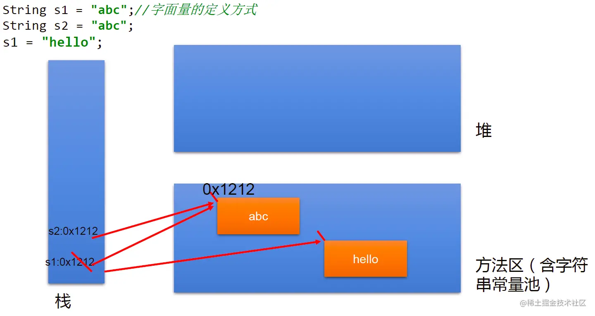

### 2. String实例化方法

#### 2.1 实现方式说明：

- 方式一：通过字面量定义的方式
- 方式二：通过new + 构造器的方式

**面试题：**

`String s = new String("abc");` 方式创建对象，在内存中创建了几个对象？

两个:一个是堆空间中new结构，另一个是`char[]`对应的常量池中的数据："abc"

#### 2.2 代码实例：

```java
//通过字面量定义的方式：此时的s1和s2的数据javaEE声明在方法区中的字符串常量池中。
String s1 = "javaEE";
String s2 = "javaEE";
//通过new + 构造器的方式:此时的s3和s4保存的地址值，是数据在堆空间中开辟空间以后对应的地址值。
String s3 = new String("javaEE");
String s4 = new String("javaEE");

System.out.println(s1 == s2);//true
System.out.println(s1 == s3);//false
System.out.println(s1 == s4);//false
System.out.println(s3 == s4);//false
```

`String str1=“abc”;` 与 `String str2= new String(“abc”);` 的区别?


新建String对象的内存解析

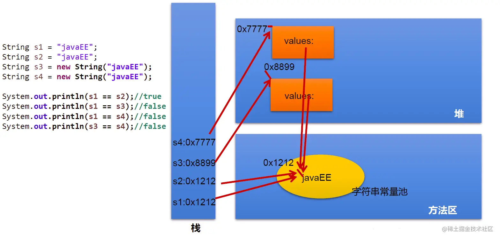

### 3. 字符串拼接方式赋值对比

#### 3.1说明：

1. 常量与常量的拼接结果在常量池。且常量池中不会存在相同内容的常量。
2. 只要其中一个是变量，结果就在堆中。
3. 如果拼接的结果调用 `intern()` 方法，返回值就在常量池中

#### 3.2 代码示例

```java
String s1 = "javaEE";
String s2 = "hadoop";

String s3 = "javaEEhadoop";
String s4 = "javaEE" + "hadoop";
String s5 = s1 + "hadoop";
String s6 = "javaEE" + s2;
String s7 = s1 + s2;

System.out.println(s3 == s4);//true
System.out.println(s3 == s5);//false
System.out.println(s3 == s6);//false
System.out.println(s3 == s7);//false
System.out.println(s5 == s6);//false
System.out.println(s5 == s7);//false
System.out.println(s6 == s7);//false

String s8 = s6.intern();//返回值得到的s8使用的常量值中已经存在的“javaEEhadoop”
System.out.println(s3 == s8);//true
****************************
String s1 = "javaEEhadoop";
String s2 = "javaEE";
String s3 = s2 + "hadoop";
System.out.println(s1 == s3);//false

final String s4 = "javaEE";//s4:常量
String s5 = s4 + "hadoop";
System.out.println(s1 == s5);//true
```

内存解析


### 4. String使用陷阱

- `String s1="a"；`

  说明：在字符串常量池中创建了一个字面量为"a"的字符串。

- s1=s1+"b"

  说明：实际上原来的“a”字符串对象已经丢弃了，现在在堆空间中产生了一个字符串s1+"b"（也就是"ab"）。如果多次执行这些改变串内容的操作，会导致大量副本字符串对象存留在内存中，降低效率。如果这样的操作放到循环中，会极大影响程序的性能。

- `String s2="ab";` 说明：直接在字符串常量池中创建一个字面量为"ab"的字符串。

- `String s3="a"+"b";` 说明：s3指向字符串常量池中已经创建的"ab"的字符串。

- `String s4=s1.intern(); `说明：堆空间的S1对象在调用 intern()之后，会将常量池中已经存在的"ab"字符串赋值给s4。

### 5. String类常用方法

#### 5.1 字符串操作

**操作字符：**

1. `int length()`：返回字符串的长度： `return value.length`
2. `char charAt(int index)`： 返回某索引处的字符 `return value[index]`
3. `boolean isEmpty()`：判断是否是空字符串：`return value.length == 0`
4. `String toLowerCase()`：使用默认语言环境，将 String 中的所字符转换为小写
5. `String toUpperCase()`：使用默认语言环境，将 String 中的所字符转换为大写
6. `String trim()`：返回字符串的副本，忽略前导空白和尾部空白
7. `boolean equals(Object obj)`：比较字符串的内容是否相同
8. `boolean equalsIgnoreCase(String anotherString)`：与 `equals()` 方法类似，忽略大小写
9. `String concat(String str)`：将指定字符串连接到此字符串的结尾。 等价于用 `+`
10. `int compareTo(String anotherString)`：比较两个字符串的大小
11. `String substring(int beginIndex)`：返回一个新的字符串，它是此字符串的从beginIndex 开始截取到最后的一个子字符串。
12. `String substring(int beginIndex, int endIndex)` ：返回一个新字符串，它是此字符串从 beginIndex 开始截取到 endIndex (不包含)的一个子字符串。

**代码示例：**

```java
@Test
public void test2() {
    String s1 = "helloword";
    System.out.println(s1.length());//9
    System.out.println(s1.charAt(4));//o
    System.out.println(s1.isEmpty());//false

    String s2 = "HELLOword";
    System.out.println(s2.toLowerCase());//hellowod
    System.out.println(s2.toUpperCase());//HELLOWORD

    String s3 = " hello word ";
    System.out.println(s3.trim());//hello word
    String s4 = "helloword";
    System.out.println(s4.equals(s1));//true
    System.out.println(s4.equalsIgnoreCase(s2));//true
    String s5 = "hello";
    System.out.println(s5.compareTo(s4));//-4 相等时返回0，小的时候返回负数
    System.out.println(s4.compareTo(s1));//0

    System.out.println(s4.substring(5));//word
    System.out.println(s4.substring(5, 9));//word,取值范围左开右闭

}
```

**判断字符：**

1. `boolean endsWith(String suffix)`：测试此字符串是否以指定的后缀结束
2. `boolean startsWith(String prefix)`：测试此字符串是否以指定的前缀开始
3. `boolean startsWith(String prefix, int toffset)`：测试此字符串从指定索引开始的子字符串是否以指定前缀开始

```java
@Test
public void test3() {
    String s1 = "javaEE";
    System.out.println(s1.endsWith("EE"));//true
    System.out.println(s1.startsWith("a"));//false
    System.out.println(s1.startsWith("EE", 4));//true

}
```

#### 5.2 查找字符串中的字符

1. `boolean contains(CharSequence s)：`当且仅当此字符串包含指定的 char 值序列时，返回 true
2. `int indexOf(String str)`：返回指定子字符串在此字符串中第一次出现处的索引
3. `int indexOf(String str, int fromIndex)`：返回指定子字符串在此字符串中第一次出现处的索引，从指定的索引开始
4. `int lastIndexOf(String str)`：返回指定子字符串在此字符串中最右边出现处的索引
5. `int lastIndexOf(String str, int fromIndex)`：返回指定子字符串在此字符串中最后一次出现处的索引，从指定的索引开始反向搜索

> 注：`indexOf` 和 `lastIndexOf` 方法如果未找到都是返回-1

**代码示例：**

```java
@Test
public void test3() {
    String s2="hello word";
    System.out.println(s2.contains("o"));//true
    System.out.println(s2.indexOf("h"));//0
    System.out.println(s2.indexOf("o", 5));//7
    System.out.println(s2.lastIndexOf("o"));//7
    System.out.println(s2.lastIndexOf("l", 2));//2
}
```

#### 5.3 字符串操作方法

1. 替换：
   - `String replace(char oldChar, char newChar)`：返回一个新的字符串，它是通过用 newChar 替换此字符串中出现的所 oldChar 得到的。
   - `String replace(CharSequence target, CharSequence replacement)`：使用指定的字面值替换序列替换此字符串所匹配字面值目标序列的子字符串。
   - `String replaceAll(String regex, String replacement)`：使用给定的 replacement 替换此字符串所匹配给定的正则表达式的子字符串。
   - `String replaceFirst(String regex, String replacement)`：使用给定的 replacement 替换此字符串匹配给定的正则表达式的第一个子字符串。
2. 匹配:
   - `boolean matches(String regex)`：告知此字符串是否匹配给定的正则表达式。
3. 切片：
   - `String[] split(String regex)`：根据给定正则表达式的匹配拆分此字符串。
   - `String[] split(String regex, int limit)`：根据匹配给定的正则表达式来拆分此字符串，最多不超过limit个，如果超过了，剩下的全部都放到最后一个元素中。

**代码示例:**

```java
@Test
public void test4() {
    String str1 = "北京你好，你好北京";
    String str2 = str1.replace('北', '南');

    System.out.println(str1);//北京你好，你好北京
    System.out.println(str2);//南京你好，你好南京

    String str3 = str1.replace("北京", "上海");
    System.out.println(str3);//上海你好，你好上海

    System.out.println("*************************");
    String str = "12hello34world5java7891mysql456";
    //把字符串中的数字替换成,，如果结果中开头和结尾有，的话去掉
    String string = str.replaceAll("\\d+", ",").replaceAll("^,|,$", "");
    System.out.println(string);//hello,world,java,mysql

    System.out.println("*************************");
    str = "12345";
    //判断str字符串中是否全部有数字组成，即有1-n个数字组成
    boolean matches = str.matches("\\d+");
    System.out.println(matches);//true
    String tel = "0571-4534289";
    //判断这是否是一个杭州的固定电话
    boolean result = tel.matches("0571-\\d{7,8}");
    System.out.println(result);//true


    System.out.println("*************************");
    str = "hello|world|java";
    String[] strs = str.split("\\|");
    for (int i = 0; i < strs.length; i++) {
        System.out.println(strs[i]);//依次输出hello word java
    }
    System.out.println();
    str2 = "hello.world.java";
    String[] strs2 = str2.split("\\.");
    for (int i = 0; i < strs2.length; i++) {
        System.out.println(strs2[i]);//依次输出hello word java
    }
}
```

### 6. String与其他结构的转换

#### 6.1 String与基本数据类型、包装类之间的转换

String --> 基本数据类型、包装类：调用包装类的静态方法：`parseXxx(str)`

基本数据类型、包装类 --> String:调用String重载的 `valueOf(xxx)`

**代码示例：**

```java
@Test
public void StringToBasic() {
    String str1 = "123";
    int i = Integer.parseInt(str1);
    System.out.println(i);
    System.out.println(i == 123);//true

    int j = 456;
    String s = String.valueOf(j);
    System.out.println(s);
    System.out.println(s.equals("456"));//true
}
```

#### 6.2 与字符数组之间的转换

String --> char[]:调用String的 `toCharArray() char[]` --> String:调用String的构造器

**代码示例：**

```java
@Test
public void BasicToString() {
    String s1 = "helloword";
    char[] chars = s1.toCharArray();
    for (int i = 0; i < chars.length; i++) {
        System.out.println(chars[i]);
    }

    char[] charArray = new char[]{'h', 'e', 'l', 'l', 'o'};
    String s2 = new String(charArray);
    System.out.println(s2);

}
```

#### 6.3 与字节数组之间的转换

编码：String --> byte[]:调用String的 `getBytes()`

解码：byte[] --> String:调用String的构造器

编码：字符串 -->字节 (看得懂 --->看不懂的二进制数据)

解码：编码的逆过程，字节 --> 字符串 （看不懂的二进制数据 ---> 看得懂

说明：解码时，要求解码使用的字符集必须与编码时使用的字符集一致，否则会出现乱码。

```java
@Test
public void StringToByteTest() throws UnsupportedEncodingException {
    String s1 ="你好java世界";
    byte[] bytesArray = s1.getBytes();//使用默认字符集编码
    System.out.println(Arrays.toString(bytesArray));//[-28, -67, -96, -27, -91, -67, 106, 97, 118, 97, -28, -72, -106, -25, -107, -116]

    byte[] gbks = s1.getBytes("gbk");//使用gbk编码集合
    System.out.println(Arrays.toString(gbks));//[-60, -29, -70, -61, 106, 97, 118, 97, -54, -64, -67, -25]

    System.out.println("--------------------------------");

    String str1=new String(bytesArray);//使用默认字符进行解码
    System.out.println(str1);//你好java世界

    String str2 = new String(gbks);//使用默认字符对gbk编码进行解码
    System.out.println(str2);//���java����解码错误，出现中文乱码,原因：编码和解码不一致

    String str3 = new String(gbks,"gbk");//使用gbk格式进行解码
    System.out.println(str3);//你好java世界，解码正确，原因：编码和解码一致
}
```

#### 6.4 与StringBuffer、StringBuilder之间的转换

1.String -->StringBuffer、StringBuilder: 调用StringBuffer、StringBuilder构造器

```java
@Test
public void StringToStringBufferTest(){
    String str1 ="helloword";

    StringBuffer stringBuffer = new StringBuffer(str1);
    System.out.println(stringBuffer);//helloword

    StringBuilder stringBuilder = new StringBuilder(str1);
    System.out.println(stringBuilder);//helloword

    stringBuffer.append("isStringBuffer");
    System.out.println(stringBuffer);//hellowordandgood

    stringBuilder.append("isStringBuider");
    System.out.println(stringBuilder);
}
```

2.StringBuffer、StringBuilder -->String:

①调用String构造器； ②StringBuffer、StringBuilder的toString()

```java
@Test
public void StringBuiderOrStringBufferToStringTest() {
    StringBuffer sb1 = new StringBuffer("hello StringBuffer");
    System.out.println(sb1);

    StringBuilder sb2 = new StringBuilder("hello StringBuider");
    System.out.println(sb2);

    System.out.println("----------------------");

    String str1 = new String(sb1);
    System.out.println(str1);

    String str2 = new String(sb2);
    System.out.println(str2);

    System.out.println("----------------------");
    System.out.println(sb1.toString());
    System.out.println(sb2.toString());
}
```

### 7. JVM中字符串常量池存放位置说明：

jdk 1.6 (jdk 6.0 ,java 6.0):字符串常量池存储在方法区（永久区）

jdk 1.7:字符串常量池存储在堆空间

jdk 1.8:字符串常量池存储在方法区（元空间）

### 8. 常见算法题目的考查：

1）模拟一个trim方法，去除字符串两端的空格。

```java
public String myTrim(String str) {
    if (str != null) {
        int start = 0;//记录从前往后首次索引位置不是空格的位置索引
        int end = str.length() - 1;//记录从后往前首次索引位置不是空格的位置索引
        while (start < end && str.charAt(start) == ' ') {
            start++;
        }
        while (start < end && str.charAt(end) == ' ') {
            end--;
        }
        if (str.charAt(start) == ' ') {
            return "";
        }
        return str.substring(start, end + 1);
    }

    return null;
}
```

2）将一个字符串进行反转。将字符串中指定部分进行反转。比如“abcdefg”反转为”abfedcg”

```java
//方式一
public String reverse1(String str, int start, int end) {
    if (str != null) {
        //1.转换成char型数组
        char[] charArray = str.toCharArray();
        //2.进行反转操作
        for (int i = start, j = end; i < j; i++, j--) {
            char temp = charArray[i];
            charArray[i] = charArray[j];
            charArray[j] = temp;
        }
        //3.返回值
        return new String(charArray);
    }
    return null;
}

//方式二
//分析：整个字符串分为三部分不反转的、反转的、不反转的
//先将前面不反转的部分取出来，将反转的部分取出后进行拼接
public String reverse2(String string, int start, int end) {
    if(string != null){
        //第一部分
    String newStr = string.substring(0, start);
    //第二部分
    for (int i = end; i >= start; i--) {
        newStr += string.charAt(i);
    }
    //第三部分
    newStr += string.substring(end + 1);
	//拼接操作
    return newStr;
    }
    return null;
}

//方式三,使用StringBuffer或StringBuilder替换String优化
public String reverse3(String str, int start, int end) {
    if(str != null){
      //1.新建StringBuffer
    StringBuffer stringBuffer = new StringBuffer(str.length());
    //2.第一部分
    stringBuffer.append(str.substring(0, start));
    //3.第二部分
    for (int i = end; i >= start; i--) {
        stringBuffer.append(str.charAt(i));
    }
    //4.第三部分
    stringBuffer.append(str.substring(end + 1));
    //5.拼接操作
    return stringBuffer.toString();  
    }
    return null;
}
```

3）获取一个字符串在另一个字符串中出现的次数。 比如：获取“ ab”在 “abkkcadkabkebfkabkskab” 中出现的次数

```java
public int count(String mainStr, String subStr) {
    //1.判断主串和部分串的大小
    if (mainStr.length() >= subStr.length()) {
        int index = 0;
        int count = 0;
        //2.在主串中取出子串下标，并将新的下标赋值给主串，统计量加1
        //            while ((index = mainStr.indexOf(subStr) )!= -1){
        //                count++;
        //				//从已经找到的子串的下一个开始
        //                mainStr = mainStr.substring(index + subStr.length());
        //            }
        //改进，不再新建字符串，只做位置比对
        while ((index = mainStr.indexOf(subStr, index)) != -1) {
            index += subStr.length();
            count++;
        }
        return count;
    } else {
        return 0;
    }
}
```

4）获取两个字符串中最大相同子串。比如： str1 = "abcwerthelloyuiodef“;str2 = "cvhellobnm" 提示：将短的那个串进行长度依次递减的子串与较长的串比较。

```java
//只存在一个子串的情况
public String getMaxSameSubString(String str1, String str2) {
    //1.判断两个字串的大小
    if (str1 != null && str2 != null) {
        String maxStr = (str1.length() >= str2.length()) ? str1 : str2;
        String minStr = (str1.length() < str2.length()) ? str1 : str2;

        int len = minStr.length();
        //2.用小的依次去比对大的子串
        for (int i = 0; i < len; i++) {//这层for循环用来确定需要比对的字符次数
            for (int x = 0, y = len - i; y <= len; x++, y++) {
                if (maxStr.contains(minStr.substring(x, y))) {
                    return minStr.substring(x, y);
                }
            }

        }
    }
    return null;
}

//存在多个相同子串的情况
// 此时先返回String[]，后面可以用集合中的ArrayList替换，较方便
public String [] getMaxSameSubStrings(String str1, String str2) {
    //1.先比较出两个子串的大小
    if (str1 != null && str2 != null) {
        StringBuffer stringBuffer = new StringBuffer();
        String maxStr = (str1.length() > str2.length()) ? str1 : str2;
        String minStr = (str1.length() > str2.length()) ? str2 : str1;
        //2.用小的去依次匹配大的
        int len = minStr.length();
        for (int i = 0; i < len; i++) {
            for (int x = 0, y = len - i; y <= len; x++,y++ ){
                String subString = minStr.substring(x,y);
                //3.取出匹配到的子串
                if (maxStr.contains(subString)){
                    stringBuffer.append(subString+",");
                }
            }
            //System.out.println(stringBuffer);
            if (stringBuffer.length() != 0){
                break;
            }
        }

        String [] split = stringBuffer.toString().replaceAll(",$","").split("\\,");
        return split;
    }
    return null;
}
```

5）对字符串中字符进行自然顺序排序。 提示：

1. 字符串变成字符数组。
2. 对数组排序，择，冒泡，`Arrays.sort()`;
3. 将排序后的数组变成字符串。

```java
@Test
public void charTest() {
    String str1 = "hello java";
    char[] charArray = str1.toCharArray();

    Arrays.sort(charArray);

    String str2 = new String(charArray);
    System.out.println(str2);
}
```

## 二、StringBuffer和StringBuilder

### （一）StringBuffer类

#### 1.概述：

`java.lang.String.Buffer` 代表可变的字符序列，JDK1.0中声明，可以对字符串内容进行增删，此时不会产生新的对象。 很多方法与 String相同 作为参数传递时，方法内部可以改变值。

```java
abstract class AbstractStringBuilder implements Appendable, CharSequence {
    /**
     * The value is used for character storage.
     */
    char[] value;//value没有final声明，value可以不断扩容

    /**
     * The count is the number of characters used.
     */
    int count;//count记录有效字符个数
```

- StringBuffer类不同于 String，其对象必须使用构造器生成。
- 有三个构造器: 
  - `StringBuffer()`：初始容量为16的字符串缓冲区
  - `StringBuffer(int size)`：构造指定容量的字符串缓冲区
  - `StringBuffer(String str)`：将内容初始化为指定字符串内容

```java
String s= new String("我喜欢学习");
StringBuffer buffer= new StringBuffer("我喜欢学习");
buffer. append("数学");
```


#### 2.常用方法：

1. `StringBuffer append(xxx)`：提供了很多的 `append()` 方法，用于进行字符串拼接
2. `StringBuffer delete(int start,int end)`：删除指定位置的内容
3. `StringBuffer replace(int start, int end, String str)`：把[start,end)位置替换为str
4. `StringBuffer insert(int offset, xxx)`：在指定位置插入xxx
5. `StringBuffer reverse()` ：把当前字符序列逆转

当 append和insert时，如果原来vaue数组长度不够，可扩容。 如上这些方法支持方法链操作。 方法链的原理：

```java
@Override
public StringBuilder append(String str) {
    super.append(str);
    return this;
}
```

- `public int indexOf(String str)`：返回子串的下标
- `public String substring(int start,int end)`:返回一个从start开始到end索引结束的左闭右开区间的子字符串
- `public int length()`：获取字符串的长度
- `public char charAt(int n )`：返回指定位置的字符
- `public void setCharAt(int n ,char ch)`：设置指定位置的字符

**总结：**

增：`append(xxx)` ；

删：`delete(int start,int end)` ；

改：`setCharAt(int n ,char ch) `/` replace(int start, int end, String str)` ；

查：`charAt(int n )` ；

插：`insert(int offset, xxx)` ；

长度：`length()`;

遍历：`for() + charAt() `/` toString()`；

**代码示例：**

```java
@Test
public void stringBufferMethodTest(){
    StringBuffer s1 = new StringBuffer("abc");
    System.out.println(s1);

    System.out.println(s1.append("1"));//abc1
    System.out.println(s1.delete(0, 1));//bc1
    System.out.println(s1.replace(0, 1, "hello"));//helloc1
    System.out.println(s1.insert(3, "v"));//helvloc1
    System.out.println(s1.reverse());//1colvleh
}
```

### （二）StringBuilder类

StringBuilder和 StringBuffer非常类似，均代表可变的字符序列，而且提供相关功能的方法也一样，只是StringBuilder类没有加线程锁，执行效率更高。

#### 1. String、StringBuffer、StringBuilder三者的对比

- String:不可变的字符序列；底层使用 `char[]` 存储；占用内存（会不断的创建和回收对象）
- StringBuffer:可变的字符序列；线程安全的，效率低；线程安全；底层使用char[]存储；
- StringBuilder:可变的字符序列；jdk5.0新增的，线程不安全的，效率高；线程不安全；底层使用 `char[]` 存储

> 注意：作为参数传递的话，方法内部Stng不会改变其值， StringBuffer和 StringBuilder会改变其值。

#### 2. StringBuffer与StringBuilder的内存解析

**以StringBuffer为例：**

```java
String str = new String();//char[] value = new char[0];
String str1 = new String("abc");//char[] value = new char[]{'a','b','c'};

StringBuffer sb1 = new StringBuffer();//char[] value = new char[16];底层创建了一个长度是16的数组。
System.out.println(sb1.length());//
sb1.append('a');//value[0] = 'a';
sb1.append('b');//value[1] = 'b';

StringBuffer sb2 = new StringBuffer("abc");//char[] value = new char["abc".length() + 16];
```

**StringBuffer构造器源码：**

```java
public StringBuffer(String str) {
    super(str.length() + 16);
    append(str);
}
```

问题1. `System.out.println(sb2.length());//3`

问题2. 扩容问题:如果要添加的数据底层数组盛不下了，那就需要扩容底层的数组。 默认情况下，扩容为原来容量的2倍 + 2，同时将原有数组中的元素复制到新的数组中。

指导意义：开发中建议大家使用：`StringBuffer(int capacity)` 或 `StringBuilder(int capacity)`


#### 3. 对比String、StringBuffer、StringBuilder三者的执行效率

从高到低排列：StringBuilder > StringBuffer > String

```java
@Test
public void test3(){
    //初始设置
    long startTime = 0L;
    long endTime = 0L;
    String text = "";
    StringBuffer buffer = new StringBuffer("");
    StringBuilder builder = new StringBuilder("");
    //开始对比
    startTime = System.currentTimeMillis();
    for (int i = 0; i < 20000; i++) {
        buffer.append(String.valueOf(i));
    }
    endTime = System.currentTimeMillis();
    System.out.println("StringBuffer的执行时间：" + (endTime - startTime));

    startTime = System.currentTimeMillis();
    for (int i = 0; i < 20000; i++) {
        builder.append(String.valueOf(i));
    }
    endTime = System.currentTimeMillis();
    System.out.println("StringBuilder的执行时间：" + (endTime - startTime));

    startTime = System.currentTimeMillis();
    for (int i = 0; i < 20000; i++) {
        text = text + i;
    }
    endTime = System.currentTimeMillis();
    System.out.println("String的执行时间：" + (endTime - startTime));

}
```

## 三、JDK 8.0以前的日期时间API

### 1. `java.lang.System` 类

System类提供的 `public static long currentTimeMillis()` 用来返回当前时间与1970年1月1日0时0分0秒之间以毫秒为单位的时间差。(时间戳) 此方法适于计算时间差。

> 计算世界时间的主要标准有：
>
> - UTC（Coordinated Universal Time）
> - GMT（Greenwich Mean Time）
> - CST（Central Standard Time）

**代码示例：**

```java
//获取系统当前时间：System类中的currentTimeMillis()
long time = System.currentTimeMillis();
//返回当前时间与1970年1月1日0时0分0秒之间以毫秒为单位的时间差。
//称为时间戳
System.out.println(time);
```

### 2. `java.util.Date`类

表示特定的瞬间，精确到毫秒

#### 2.1 构造器

`Date()`:使用无参的构造器创建对象可以获取本地当前时间

```
Date(long date)
```

#### 2.2 常用方法

`getTime()`：返回自1970年1月1日00：00：00GMT以来此Date对象表示的毫秒数

`tostring()`：把此Date对象转换为以下形式的 String：

> - dow mon dd
> - hh: mm:ss zzz yyyy

其中：doW是一周中的某一天（Sun，Mon，Tue，Wed，Thu，Fri，Sat），zzz是时间标准。 其它很多方法都过时了

#### 2.3 `java.util.Date类与java.sql.Date` 类

- `java.util.Date `类
- `java.sql.Date` 类

1.两个构造器的使用

- 构造器一：`Date()`：创建一个对应当前时间的Date对象
- 构造器二：创建指定毫秒数的Date对象

2.两个方法的使用

- `toString()`:显示当前的年、月、日、时、分、秒
- `getTime()`:获取当前Date对象对应的毫秒数。（时间戳）

3.`java.sql.Date` 对应着数据库中的日期类型的变量

如何将 `java.util.Date` 对象转换为 `java.sql.Date` 对象

```java
@Test
public void dateTest(){
    //构造器一：Date()：创建一个对应当前时间的Date对象
    Date date1 = new Date();
    System.out.println(date1.toString());//Sun Apr 19 13:35:12 CST 2020
    System.out.println(date1.getTime());//1587274512876

    //构造器二：创建指定毫秒数的Date对象
    Date date2 = new Date(15872745176L);
    System.out.println(date2.toString());
    System.out.println("-----------------------");

    //创建java.sql.Date对象
    java.sql.Date date3 = new java.sql.Date(1587274512876L);
    System.out.println(date3.toString());

    //如何将java.util.Date对象转换为java.sql.Date对象
    Date date4 = new Date();
    //第一种方式，存在问题：java.util.Date cannot be cast to java.sql.Date
    //        java.sql.Date date6 = (java.sql.Date) date4;
    //        System.out.println(date6);
    //第二种方式
    java.sql.Date date5 = new java.sql.Date(date4.getTime());
    System.out.println(date5);
}
```

### 3.  `java.text.SimpleDateFormat` 类

Date类的AP不易于国际化，大部分被废弃了， `java.text.SimpleDateFormat` 类是一个不与语言环境有关的方式来格式化和解析日期的具体类。

它允许进行格式化：日期→文本、解析：文本→日期

**格式化：**

`SimpleDateFormat()`：默认的模式和语言环境创建对象

`public SimpleDateFormat(String pattern)`：该构造方法可以用参数 pattern指定的格式创建一个对象，该对象调用：

`public String format(Datedate)`：方法格式化时间对象date

**解析**： `public Date parse(String source)`：从给定字符串的开始解析文本，以生成个日期

#### 1. SimpleDateFormat对日期Date类的格式化和解析

两个操作：

1.1 格式化：日期 --->字符串

1.2 解析：格式化的逆过程，字符串 ---> 日期

#### 2. `SimpleDateFormat` 的实例化:`new + 构造器`

照指定的方式格式化和解析：调用带参的构造器

```java
SimpleDateFormat sdf1 = new SimpleDateFormat("yyyyy.MMMMM.dd GGG hh:mm aaa");
```

**代码示例：**

```java
@Test
public void test2() throws ParseException {
    //实例化Date对象
    Date date1 = new Date();
    //实例化SimpleDateFormate对象，并设置显示格式
    SimpleDateFormat simpleDateFormat = new SimpleDateFormat("yyyy-MM-dd hh:mm:aaa");
    //格式化date对象
    String format = simpleDateFormat.format(date1);
    System.out.println(format.toString());//2020-09-19 02:09:下午
    //解析:要求字符串必须是符合SimpleDateFormat识别的格式(通过构造器参数体现),
    //否则，抛异常
    Date date2 = simpleDateFormat.parse("2020-04-20 14:20:下午");
    System.out.println(date2.toString());//Tue Jan 21 02:20:00 CST 2020
}
```


**小练习：**

将字符串"2020-09-08"转换为 `java.sql.Date` 格式的时间

```java
@Test
public void test3() throws ParseException {
    String brith = "1997-10-15";
    //新建SimpleDateFormat对象并设置时间格式
    SimpleDateFormat simpBrith = new SimpleDateFormat("yyyy-mm-dd");
    //将字符串格式的时间格式化为Date类
    Date brithday = simpBrith.parse(brith);
    //通过Date的getTime方法将Date对象转化为时间戳放到java.sql.date类的构造方法中
    java.sql.Date brithDate = new java.sql.Date(brithday.getTime());
    System.out.println(brithDate);
}
```

### 4. Calendar类：日历类、抽象类

Calendar是一个抽象基类，主用用于完成日期字段之间相互操作的功能。

- 获取 Calenda实例的方法 使用 Calendar.getInstance()方法 调用它的子类 GregorianCalendarl的构造器。
- 一个 Calendar的实例是系统时间的抽象表示，通过 get(int field)方法来取得想要的时间信息。 比如YEAR、MONTH、DAY_OF_WEEK、HOUR_OF_DAY、MINUTE、SECOND

> 注意： 获取月份时：一月是0，二月是1，以此类推，12月是11 获取星期时：周日是1，周二是2，。。。周六是7

#### 4.1 实例化

方式一：创建其子类(GregorianCalendar)的对象

方式二：调用其静态方法 `getInstance()`

```java
Calendar calendar = Calendar.getInstance();
```

#### 4.2 常用方法

`get()`:获取日期

`set()`:设置日期

`add()`:添加、修改日期

`getTime`:日历类-->Date

`setTime`:Date-->日历类

**代码示例：**

```java
Calendar calendar = Calendar.getInstance();
//        System.out.println(calendar.getClass());

//2.常用方法
//get()
int days = calendar.get(Calendar.DAY_OF_MONTH);//获取本月第几天
System.out.println(days);
System.out.println(calendar.get(Calendar.DAY_OF_YEAR));//获取本年第几天

//set()
//calendar可变性
calendar.set(Calendar.DAY_OF_MONTH,22);//设置本月第几天
days = calendar.get(Calendar.DAY_OF_MONTH);
System.out.println(days);

//add()
calendar.add(Calendar.DAY_OF_MONTH,-3);
days = calendar.get(Calendar.DAY_OF_MONTH);
System.out.println(days);

//getTime():日历类---> Date
Date date = calendar.getTime();
System.out.println(date);

//setTime():Date ---> 日历类
Date date1 = new Date();
calendar.setTime(date1);
days = calendar.get(Calendar.DAY_OF_MONTH);
System.out.println(days);

```

## 四、JDK 8.0中新的日期时间类

### 1. 日期时间API的迭代：

第一代：jdk 1.0 Date类

第二代：jdk 1.1 Calendar类，一定程度上替换Date类

第三代：jdk 1.8 提出了新的一套API

### 2. 前两代的问题：

可变性：像日期和时间这样的类应该是不可变的。

偏移性：Date中的年份是从1900开始的，而月份都从0开始。

格式化：格式化只对Date用，Calendar则不行。 此外，它们也不是线程安全的；不能处理闰秒等。

Java 8.0中新引入的java.time API:

Java 8.0吸收了Joda-Time的精华，以一个新的开始为Java创建优秀的APl。新的java.time中包含了所有关于本地日期(LocalDate)、本地时间(Localtime)、本地日期时间(LocalDate time)、时区(ZonedDate time)和持续时间(Duration)的类。历史悠久的Date类新增了tolnstant()方法用于把Date转换成新的表示形式。这些新增的本地化时间日期API大大简化了日期时间和本地化的管理。

### 3. Java 8.0中新的日期时间API涉及的包:


### 4. 本地日期、本地时间、本地日期时间的使用：

LocalDate / LocalTime / LocalDateTime

#### 4.1 说明：

① 分别表示使用 ISO-8601日历系统的日期、时间、日期和时间。它们提供了简单的本地日期或时间，并不包含当前的时间信息，也不包含与时区相关的信息。

② LocalDateTime相较于LocalDate、LocalTime，使用频率要高

③ 类似于Calendar

#### 4.2 常用方法：


**代码示例：**

```java
@Test
public void test1(){
    //now():获取当前的日期、时间、日期时间
    LocalDate localDate = LocalDate.now();
    LocalTime localTime = LocalTime.now();
    LocalDateTime localDateTime = LocalDateTime.now();

    System.out.println(localDate);//2020-04-21
    System.out.println(localTime);//18:52:54.929
    System.out.println(localDateTime);//2020-04-21T18:52:54.929

    //of():设置指定的年、月、日、时、分、秒。没有偏移量
    LocalDateTime localDateTime1 = LocalDateTime.of(2020,10,6,12,13,12);
    System.out.println(localDateTime1);//2020-10-06T12:13:12

    //getXxx()：获取相关的属性
    System.out.println(localDateTime.getDayOfMonth());//21
    System.out.println(localDateTime.getDayOfWeek());//TUESDAY
    System.out.println(localDateTime.getMonth());//APRIL
    System.out.println(localDateTime.getMonthValue());//4
    System.out.println(localDateTime.getMinute());//52

    //体现不可变性
    //withXxx():设置相关的属性
    LocalDate localDate1 = localDate.withDayOfMonth(22);
    System.out.println(localDate);//2020-04-21
    System.out.println(localDate1);//2020-04-22

    LocalDateTime localDateTime2 = localDateTime.withHour(4);
    System.out.println(localDateTime);//2020-04-21T18:59:17.484
    System.out.println(localDateTime2);//2020-04-21T04:59:17.484

    //不可变性
    LocalDateTime localDateTime3 = localDateTime.plusMonths(3);
    System.out.println(localDateTime);//2020-04-21T18:59:17.484
    System.out.println(localDateTime3);//2020-07-21T18:59:17.484

    LocalDateTime localDateTime4 = localDateTime.minusDays(6);
    System.out.println(localDateTime);//2020-04-21T18:59:17.484
    System.out.println(localDateTime4);//2020-04-15T18:59:17.484
}
```

### 5.时间点：Instant

#### 5.1 说明：

① 时间线上的一个瞬时点。 概念上讲，它只是简单的表示自1970年1月1日0时0分0秒（UTC开始的秒数。）

② 类似于 `java.util.Date` 类

#### 5.2 常用方法：


**代码示例：**

```java
@Test
public void test2(){
    //now():获取本初子午线对应的标准时间
    Instant instant = Instant.now();
    System.out.println(instant);//2020-04-21T11:03:21.469Z

    //添加时间的偏移量
    OffsetDateTime offsetDateTime = instant.atOffset(ZoneOffset.ofHours(8));
    System.out.println(offsetDateTime);//2020-04-21T19:03:21.469+08:00

    //toEpochMilli():获取自1970年1月1日0时0分0秒（UTC）开始的毫秒数  ---> Date类的getTime()
    long milli = instant.toEpochMilli();
    System.out.println(milli);//1587467105795

    //ofEpochMilli():通过给定的毫秒数，获取Instant实例  -->Date(long millis)
    Instant instant1 = Instant.ofEpochMilli(1587467105795L);
    System.out.println(instant1);//2020-04-21T11:05:05.795Z
}
```

### 6.日期时间格式化类：`DateTimeFormatter`

#### 6.1 说明：

① 格式化或解析日期、时间

② 类似于 `SimpleDateFormat`

#### 6.2 常用方法：

1. 实例化方式： 预定义的标准格式。如：`ISO\_LOCAL\_DATE\_TIME;`

- ISO_LOCAL_DATE;ISO_LOCAL_TIME 本地化相关的格式：
- 如：`ofLocalizedDateTime(FormatStyle.LONG) `
- 自定义的格式：如：`ofPattern(“yyyy-MM-dd hh:mm:ss”)`

1. 常用方法：

   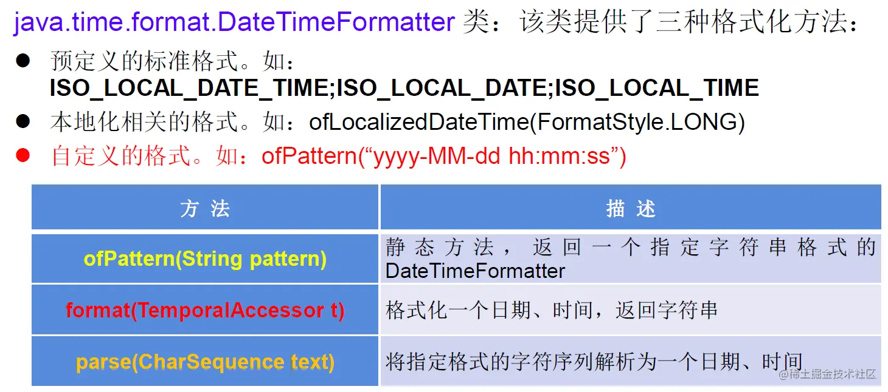

   特别的：自定义的格式。如：`ofPattern(“yyyy-MM-dd hh:mm:ss”)`

   **代码示例：**

   ```java
   @Test
   public void test3(){
       //方式一：预定义的标准格式。
       //如：ISO_LOCAL_DATE_TIME;ISO_LOCAL_DATE;ISO_LOCAL_TIME
       DateTimeFormatter formatter = DateTimeFormatter.ISO_LOCAL_DATE_TIME;
       //格式化:日期-->字符串
       LocalDateTime localDateTime = LocalDateTime.now();
       String str1 = formatter.format(localDateTime);
       System.out.println(localDateTime);//2020-04-21T19:13:13.530
       System.out.println(str1);//2020-04-21T19:13:13.53
   
       //解析：字符串 -->日期
       TemporalAccessor parse = formatter.parse("2000-04-21T19:13:13.53");
       System.out.println(parse);//{},ISO resolved to 2000-04-21T19:13:13.530
       //方式二：
       //本地化相关的格式。如：ofLocalizedDateTime()
       //FormatStyle.LONG / FormatStyle.MEDIUM / FormatStyle.SHORT :适用于LocalDateTime
       DateTimeFormatter formatter1 = DateTimeFormatter.ofLocalizedDateTime(FormatStyle.LONG);
       //格式化
       String str2 = formatter1.format(localDateTime);
       System.out.println(str2);//2020年4月21日 下午07时16分57秒
   
       //本地化相关的格式。如：ofLocalizedDate()
       //FormatStyle.FULL / FormatStyle.LONG / FormatStyle.MEDIUM / FormatStyle.SHORT : 适用于LocalDate
       DateTimeFormatter formatter2 = DateTimeFormatter.ofLocalizedDate(FormatStyle.MEDIUM);
       //格式化
       String str3 = formatter2.format(LocalDate.now());
       System.out.println(str3);//2020-4-21
   
       //重点：方式三：自定义的格式。如：ofPattern(“yyyy-MM-dd hh:mm:ss”)
       DateTimeFormatter formatter3 = DateTimeFormatter.ofPattern("yyyy-MM-dd hh:mm:ss");
       String Str4 = formatter3.format(LocalDateTime.now());
       System.out.println(Str4);//2020-04-21 07:24:04
   
       TemporalAccessor accessor = formatter3.parse("2020-02-03 05:23:06");
       System.out.println(accessor);//{SecondOfMinute=6, HourOfAmPm=5, NanoOfSecond=0, MicroOfSecond=0, MinuteOfHour=23, MilliOfSecond=0},ISO resolved to 2020-02-03
   }
   ```

### 7.其它API的使用：


#### 7.1 带时区的日期时间：

ZonedDateTime / ZoneId

**代码示例：**

```java
// ZoneId:类中包含了所的时区信息
@Test
public void test1(){
    //getAvailableZoneIds():获取所的ZoneId
    Set<String> zoneIds = ZoneId.getAvailableZoneIds();
    for(String s : zoneIds){
        System.out.println(s);
    }
    System.out.println();

    //获取“Asia/Tokyo”时区对应的时间
    LocalDateTime localDateTime = LocalDateTime.now(ZoneId.of("Asia/Tokyo"));
    System.out.println(localDateTime);


}
//ZonedDateTime:带时区的日期时间
@Test
public void test2(){
    //now():获取本时区的ZonedDateTime对象
    ZonedDateTime zonedDateTime = ZonedDateTime.now();
    System.out.println(zonedDateTime);
    //now(ZoneId id):获取指定时区的ZonedDateTime对象
    ZonedDateTime zonedDateTime1 = ZonedDateTime.now(ZoneId.of("Asia/Tokyo"));
    System.out.println(zonedDateTime1);
}
```

#### 7.2 时间间隔：

Duration--用于计算两个“时间”间隔，以秒和纳秒为基准


**代码示例：**

```java
@Test
public void test3(){
    LocalTime localTime = LocalTime.now();
    LocalTime localTime1 = LocalTime.of(15, 23, 32);
    //between():静态方法，返回Duration对象，表示两个时间的间隔
    Duration duration = Duration.between(localTime1, localTime);
    System.out.println(duration);

    System.out.println(duration.getSeconds());
    System.out.println(duration.getNano());

    LocalDateTime localDateTime = LocalDateTime.of(2016, 6, 12, 15, 23, 32);
    LocalDateTime localDateTime1 = LocalDateTime.of(2017, 6, 12, 15, 23, 32);

    Duration duration1 = Duration.between(localDateTime1, localDateTime);
    System.out.println(duration1.toDays());

}
```

#### 7.3 日期间隔：

Period --用于计算两个“日期”间隔，以年、月、日衡量


**代码示例：**

```java
@Test
public void test4(){
    LocalDate localDate = LocalDate.now();
    LocalDate localDate1 = LocalDate.of(2028, 3, 18);

    Period period = Period.between(localDate, localDate1);
    System.out.println(period);

    System.out.println(period.getYears());
    System.out.println(period.getMonths());
    System.out.println(period.getDays());

    Period period1 = period.withYears(2);
    System.out.println(period1);

}
```

#### 7.4 日期时间校正器：`TemporalAdjuster`

**代码示例：**

```java
@Test
public void test5(){
    //获取当前日期的下一个周日是哪天？
    TemporalAdjuster temporalAdjuster = TemporalAdjusters.next(DayOfWeek.SUNDAY);

    LocalDateTime localDateTime = LocalDateTime.now().with(temporalAdjuster);
    System.out.println(localDateTime);

    //获取下一个工作日是哪天？
    LocalDate localDate = LocalDate.now().with(new TemporalAdjuster(){

        @Override
        public Temporal adjustInto(Temporal temporal) {
            LocalDate date = (LocalDate)temporal;
            if(date.getDayOfWeek().equals(DayOfWeek.FRIDAY)){
                return date.plusDays(3);
            }else if(date.getDayOfWeek().equals(DayOfWeek.SATURDAY)){
                return date.plusDays(2);
            }else{
                return date.plusDays(1);
            }

        }

    });

    System.out.println("下一个工作日是：" + localDate);
}
```

#### 7.5 新的日期API与原来API的转化问题：

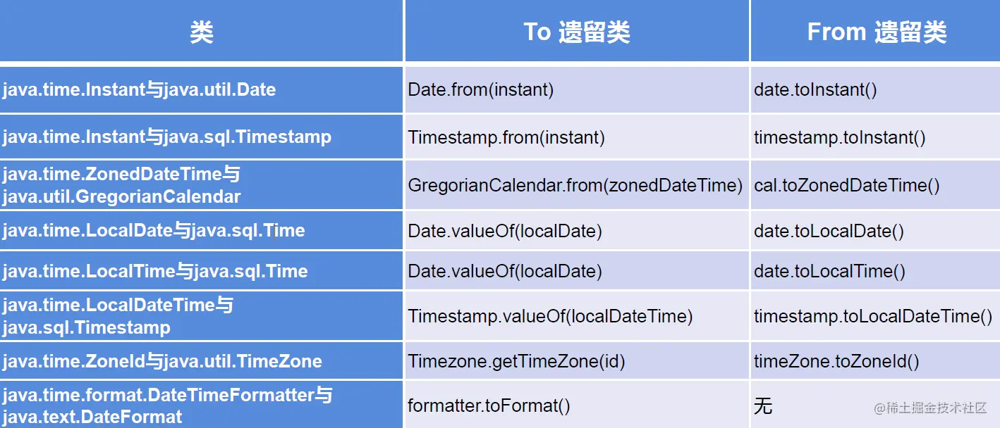

## 五、Java比较器

### 1. Java比较器的使用背景：

- Java中的对象，正常情况下，只能进行比较：`==` 或 `!=`。不能使用 `>` 或 `<` 的
- 但是在开发场景中，我们需要对多个对象进行排序，言外之意，就需要比较对象的大小。
- 如何实现？使用两个接口中的任何一个：Comparable（自然排序） 或 Comparator（定制排序）

### 2. 自然排序：使用Comparable接口

#### 2.1 说明

1. 像 String 或包装类等实现了Comparable接口，重写了 `compareTo(obj)` 方法，给出了比较两个对象大小的方式。
2. 像 String 或包装类重写 `compareTo()` 方法以后，进行了从小到大的排列
3. 重写 `compareTo(obj)` 的规则： 如果当前对象this大于形参对象obj，则返回正整数， 如果当前对象this小于形参对象obj，则返回负整数， 如果当前对象this等于形参对象obj，则返回零。
4. 对于自定义类来说，如果需要排序，我们可以让自定义类实现Comparable接口，重写  `compareTo(obj)` 方法。在` compareTo(obj)` 方法中指明如何排序
5. Comparable的典型实现：(默认都是从小到大排列的) String：按照字符串中字符的Uincode值进行比较 Character：按照字符的 Unicode值来进行比较 数值类型对应的包装类以及 BigInteger、BigDecimal：按照它们对应的数值大小进行比较 Boolean：true对应的包装类实例大于false对应的包装类实例 Date、Time等：后面的日期时间比前面的日期时间大

#### 2.2 自定义类代码举例：

```java
public class Goods implements  Comparable{

    private String name;
    private double price;

    //指明商品比较大小的方式:照价格从低到高排序,再照产品名称从高到低排序
    @Override
    public int compareTo(Object o) {
        // System.out.println("**************");
        if(o instanceof Goods){
            Goods goods = (Goods)o;
            //方式一：
            if(this.price > goods.price){
                return 1;
            }else if(this.price < goods.price){
                return -1;
            }else{
                //return 0;
                return -this.name.compareTo(goods.name);
            }
            //方式二：
            //return Double.compare(this.price,goods.price);
        }
        // return 0;
        throw new RuntimeException("传入的数据类型不一致！");
    }
    // getter、setter、toString()、构造器：省略
}
```

### 3. 定制排序：使用Comparator接口

#### 3.1 说明:

1. 背景：

当元素的类型没实现 `java.lang.Comparable` 接口而又不方便修改代码，或者实现了java.lang.Comparable接口的排序规则不适合当前的操作，那么可以考虑使用 Comparator 的对象来排序

2. 重写 `compare(Object o1,Object o2)` 方法，比较o1和o2的大小：

- 如果方法返回正整数，则表示o1大于o2；
- 如果返回0，表示相等；
- 返回负整数，表示o1小于o2。

#### 3.2 代码举例：

```java
Comparator com = new Comparator() {
    //指明商品比较大小的方式:照产品名称从低到高排序,再照价格从高到低排序
    @Override
    public int compare(Object o1, Object o2) {
        if(o1 instanceof Goods && o2 instanceof Goods){
            Goods g1 = (Goods)o1;
            Goods g2 = (Goods)o2;
            if(g1.getName().equals(g2.getName())){
                return -Double.compare(g1.getPrice(),g2.getPrice());
            }else{
                return g1.getName().compareTo(g2.getName());
            }
        }
        throw new RuntimeException("输入的数据类型不一致");
    }
}
```

### 4. 两种排序方式对比

- Comparable接口的方式是一定的，保证Comparable接口实现类的对象在任何位置都可以比较大小。
- Comparator接口属于临时性的比较。

## 六、其他常用类

### 1.System类

- System类代表系统，系统级的很多属性和控制方法都放置在该类的内部。该类位于java.lang包。
- 由于该类的构造器是private的，所以无法创建该类的对象，也就是无法实例化该类。其内部的成员变量和成员方法都是static的，所以也可以很方便的进行调用。

**成员方法：**

- `native long currentTimeMillis()：`

  该方法的作用是返回当前的计算机时间，时间的表达格式为当前计算机时间和GMT时间（格林威治时间）1970年1月1号0时0分0秒所差的毫秒数。

- ` void exit(int status)`

  该方法的作用是退出程序。其中 status的值为0代表正常退出，非零代表异常退出。使用该方法可以在图形界面编程中实现程序的退出功能等

- `void gc()`

  该方法的作用是请求系统进行垃圾回收。至于系统是否立刻回收，则取决于系统中垃圾回收算法的实现以及系统执行时的情况。

- `String getProperty(String key)`

  该方法的作用是获得系统中属性名为key的属性对应的值。系统中常见的属性名以及属性的作用如下表所示：

  

**代码示例：**

```java
@Test
public void test1() {
    String javaVersion = System.getProperty("java.version");
    System.out.println("java的version:" + javaVersion);

    String javaHome = System.getProperty("java.home");
    System.out.println("java的home:" + javaHome);

    String osName = System.getProperty("os.name");
    System.out.println("os的name:" + osName);

    String osVersion = System.getProperty("os.version");
    System.out.println("os的version:" + osVersion);

    String userName = System.getProperty("user.name");
    System.out.println("user的name:" + userName);

    String userHome = System.getProperty("user.home");
    System.out.println("user的home:" + userHome);

    String userDir = System.getProperty("user.dir");
    System.out.println("user的dir:" + userDir);

}
```

### 2.Math类

`java.lang.Math` 提供了一系列静态方法用于科学计算。其方法的参数和返回值类型一般为double型。


### 3.BigInteger类、BigDecimal类

#### 3.1BigInteger

`java.math `包的BigInteger可以表示不可变的任意精度的整数。

BigInteger提供所有Java的基本整数操作符的对应物，并提供 `java.lang.Math` 的所有相关方法。另外，BigInteger还提供以下运算：模算术、GCD计算、质数测试、素数生成、位操作以及一些其他操作。

构造器： `BigInteger(String val)`：根据字符串构建 BigInteger对象


**代码举例：**

```java
@Test
public void test2() {
    BigInteger bi = new BigInteger("1243324112234324324325235245346567657653");
    BigDecimal bd = new BigDecimal("12435.351");
    BigDecimal bd2 = new BigDecimal("11");
    System.out.println(bi);
    //         System.out.println(bd.divide(bd2));
    System.out.println(bd.divide(bd2, BigDecimal.ROUND_HALF_UP));
    System.out.println(bd.divide(bd2, 25, BigDecimal.ROUND_HALF_UP));

}
```

#### 3.2 BigDecimal

要求数字精度比较高，用到 `java.math.BigDecimal` 类

BigDecimal类支持不可变的、任意精度的有符号十进制定点数。

**构造器：**

```
public BigDecimal(double val)
public BigDecimal(String val)
```

**常用方法：**

```
public BigDecimal add(BigDecimal augend)
public BigDecimal subtract(BigDecimal subtrahend)
public BigDecimal multiply(BigDecimal multiplicand)
public BigDecimal divide(BigDecimal divisor， int scale， int rounding Mode)
```

**代码举例：**

```java
@Test
public void test2() {
    BigInteger bi = new BigInteger("1243324112234324324325235245346567657653");
    BigDecimal bd = new BigDecimal("12435.351");
    BigDecimal bd2 = new BigDecimal("11");
    System.out.println(bi);
    //         System.out.println(bd.divide(bd2));
    System.out.println(bd.divide(bd2, BigDecimal.ROUND_HALF_UP));
    System.out.println(bd.divide(bd2, 25, BigDecimal.ROUND_HALF_UP));

}
```

# Java之枚举类和注解

## 一、枚举类的使用

### 1. 枚举类的说明：

1. 枚举类的理解：类的对象只有有限个，确定的。我们称此类为枚举类

2. 当需要定义一组常量时，强烈建议使用枚举类

3. 枚举类的实现：

   JDK 5.0以前需要自定义

   JDK 5.0后新增enum关键字用于定义枚举类

4. 如果枚举类中只一个对象，则可以作为单例模式的实现方式。

5. 枚举类的属性：

   枚举类对象的属性不应允许被改动，所以应该使用 private final修饰 枚举类的使用 private final修饰的属性应该在构造器中为其赋值 若枚举类显式的定义了带参数的构造器，则在列出枚举值时也必须对应的传入参数

### 2. 如何自定义枚举类？

步骤:

1. 私有化构造器，保证不能在类的外部创建其对象；
2. 在类的内部创建枚举类的示例。声明为：public static final；
3. 对象如果有实例变量，应该声明为private final，并在构造器中初始化；

代码示例：

```java
//自定义枚举类
class Season{
    //1.声明Season对象的属性:private final修饰
    private final String seasonName;
    private final String seasonDesc;

    //2.私化类的构造器,并给对象属性赋值
    private Season(String seasonName,String seasonDesc){
        this.seasonName = seasonName;
        this.seasonDesc = seasonDesc;
    }

    //3.提供当前枚举类的多个对象：public static final的
    public static final Season SPRING = new Season("春天","春暖花开");
    public static final Season SUMMER = new Season("夏天","夏日炎炎");
    public static final Season AUTUMN = new Season("秋天","秋高气爽");
    public static final Season WINTER = new Season("冬天","冰天雪地");

    //4.其他诉求1：获取枚举类对象的属性
    public String getSeasonName() {
        return seasonName;
    }

    public String getSeasonDesc() {
        return seasonDesc;
    }
    //4.其他诉求1：提供toString()
    @Override
    public String toString() {
        return "Season{" +
            "seasonName='" + seasonName + '\'' +
            ", seasonDesc='" + seasonDesc + '\'' +
            '}';
    }
}
```

### 3. JDK 5.0 新增使用enum定义枚举类。

#### 使用说明：

- 使用enum定义的枚举类默认继承了 `java.lang.Enum` 类，因此不能再继承其他类
- 枚举类的构造器只能使用private权限修饰符
- 枚举类的所有实例必须在枚举类中显式列出(`,` 分隔 `;` 结尾)。列出的实例系统会自动添加`public static final` 修饰
- 必须在枚举类的第一行声明枚举类对象

#### 代码示例：

```java
//使用enum关键字枚举类
enum Season1 {
    //1.提供当前枚举类的对象，多个对象之间用","隔开，末尾对象";"结束
    SPRING("春天","春暖花开"),
    SUMMER("夏天","夏日炎炎"),
    AUTUMN("秋天","秋高气爽"),
    WINTER("冬天","冰天雪地");

    //2.声明Season对象的属性:private final修饰
    private final String seasonName;
    private final String seasonDesc;

    //2.私化类的构造器,并给对象属性赋值

    private Season1(String seasonName,String seasonDesc){
        this.seasonName = seasonName;
        this.seasonDesc = seasonDesc;
    }

    //4.其他诉求1：获取枚举类对象的属性
    public String getSeasonName() {
        return seasonName;
    }

    public String getSeasonDesc() {
        return seasonDesc;
    }

}
```

#### Enum类的常用方法：

1. `values()`方法：返回枚举类型的对象数组。该方法可以很方便地遍历所有的枚举值。
2. `valueOf(String str)`：可以把一个字符串转为对应的枚举类对象。要求字符串必须是枚举类对象的“名字”.如不是，会有运行时异常 `IllegalArgumentException`
3. `toString()`：返回当前枚举类对象常量的名称

代码示例：

```java
Season1 summer = Season1.SUMMER;
//toString():返回枚举类对象的名称
System.out.println(summer.toString());

//System.out.println(Season1.class.getSuperclass());
System.out.println("****************");
//values():返回所的枚举类对象构成的数组
Season1[] values = Season1.values();
for(int i = 0;i < values.length;i++){
    System.out.println(values[i]);
}
System.out.println("****************");
Thread.State[] values1 = Thread.State.values();
for (int i = 0; i < values1.length; i++) {
    System.out.println(values1[i]);
}

//valueOf(String objName):返回枚举类中对象名是objName的对象。
Season1 winter = Season1.valueOf("WINTER");
//如果没objName的枚举类对象，则抛异常：IllegalArgumentException
//Season1 winter = Season1.valueOf("WINTER1");
System.out.println(winter);
```

#### 用Enum类定义的枚举类对象分别实现接口：

使用说明：

1. 和普通Java类一样，枚举类可以实现一个或多个接口
2. 若每个枚举值在调用实现的接口方法呈现相同的行为方式，则只要统一实现该方法即可。
3. 若需要每个枚举值在调用实现的接口方法呈现出不同的行为方式，则可以让每个枚举值分别来实现该方法

代码示例：

```java
interface Info{
    void show();
}

//使用enum关键字枚举类
enum Season1 implements Info{
    //1.提供当前枚举类的对象，多个对象之间用","隔开，末尾对象";"结束
    SPRING("春天","春暖花开"){
        @Override
        public void show() {
            System.out.println("春天在哪里？");
        }
    },
    SUMMER("夏天","夏日炎炎"){
        @Override
        public void show() {
            System.out.println("宁夏");
        }
    },
    AUTUMN("秋天","秋高气爽"){
        @Override
        public void show() {
            System.out.println("秋天不回来");
        }
    },
    WINTER("冬天","冰天雪地"){
        @Override
        public void show() {
            System.out.println("大约在冬季");
        }
    };
}
```

## 二、注解的使用

### 1. 注解的理解

① jdk 5.0 新增的功能

② Annotation 其实就是代码里的特殊标记, 这些标记可以在编译, 类加载, 运行时被读取, 并执行相应的处理。通过使用 Annotation,程序员可以在不改变原逻辑的情况下, 在源文件中嵌入一些补充信息。

③ Annotation可以像修饰符一样使用，可以用来修饰包、类、构造器、方法、成员变量、参数、局部变量的声明，这些信息被保存在Annotation的 `name = value` 对中。

④ 在JavaSE中，注解的使用目的比较简单，例如标记过时的功能，忽略警告等。在JavaEE/Android 中注解占据了更重要的角色，例如用来配置应用程序的任何切面，代替JavaEE旧版中所遗留的繁冗 代码和XML配置等。

⑤ 框架 = 注解 + 反射机制 + 设计模式

### 2. 注解的使用示例

使用 Annotation时要在其前面增加 `@` 符号，并把该 Annotation当成个修饰符使用。用于修饰它支持的程序元素

#### 示例一：生成文档相关的注解

- `@author` 标明开发该类模块的作者，多个作者之间使用，分割 `@version` 标明该类模块的版本；
- `@see` 参考转向，也就是相关主题；
- `@since` 从哪个版本开始增加的；
- `@param` 对方法中某参数的说明，如果没有参数就不能写 ` @return` 对方法返回值的说明，如果方法的返回值类型是 `void` 就不能写 `@exception` 对方法可能抛出的异常进行说明，如果方法没有用 `throws` 显式抛出的异常就不能写；
- 其中 `@param` 、 `@return` 和 `@exception` 这三个标记都是只用于方法的。
- `@param` 的格式要求：`@param` 形参名形参类型形参说明；
- `@return` 的格式要求：`@return` 返回值类型返回值说明；
- `@exception` 的格式要求：`@exception` 异常类型异常说明；
- `@param` 和 `@exception` 可以并列多个；

代码示例：

```java
/**
 * @author govipg
 * @project_name JavaSenior
 * @package_name com.bruce.java
 * @create 2020-04-26 10:58
 */
public class AnnotationTest {
    /**
     *程序的主方法
     * @param args 传入命令行参数
     */
    public static void main(String[] args) {

    }

    /**
     * 求圆形面积
     * @param radius 所求面积的半径
     * @return 面积值
     */
    public static double getArea(double radius){
        return Math.PI * radius * radius;
    }
}
```

#### 示例二：在编译时进行格式检查(JDK内置的个基本注解)

- `@Override`: 限定重写父类方法, 该注解只能用于方法；
- `@Deprecated`: 用于表示所修饰的元素(类, 方法等)已过时。通常是因为所修饰的结构危险或存在更好的择；
- `@SuppressWarnings`: 抑制编译器警告；

代码示例：

```java
public class AnnotationTest{
    public static void mian (String [] args){
        @SuppressWarning("unused")
        int a = 0;
    }
    @Deprecated
    public void print(){
        System.out.print("过时的方法");
    }
    @Override
    public String toString(){
        return "重写的toString方法";
    }
}
```

#### 示例三：跟踪代码依赖性，实现替代配置文件功能

在使用Spring框架时会大量用到注解驱动开发。

### 3. 如何自定义注解

参照 `@SuppressWarnings` 定义

1. 注解声明为：`@interface`
2. 内部定义成员，通常使用value表示
3. 可以指定成员的默认值，使用default定义
4. 如果自定义注解没成员，表明是一个标识作用。

#### 说明：

- 如果注解有成员，在使用注解时，需要指明成员的值。

- 自定义注解必须配上注解的信息处理流程(使用反射)才意义。

- 自定义注解通过都会指明两个元注解：`@Retention`、`@Target`

  #### 代码举例：

```java
@Inherited
@Repeatable(MyAnnotations.class)
@Retention(RetentionPolicy.RUNTIME)
@Target({TYPE, FIELD, METHOD, PARAMETER, CONSTRUCTOR, LOCAL_VARIABLE,TYPE_PARAMETER,TYPE_USE})
public @interface MyAnnotation {

    String value() default "hello";
}
```

### 4. 元注解 ：

对现有的注解进行解释说明的注解。

JDK 5.0 提供的4种元注解：

1. `@Retention`：指定所修饰的 Annotation 的生命周期：SOURCE\CLASS（默认行为）\RUNTIME只有声明为RUNTIME生命周期的注解，才能通过反射获取。
2. `@Target`:用于指定被修饰的 Annotation 能用于修饰哪些程序元素 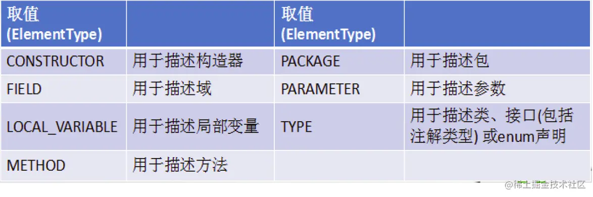
3. `@Documented`:表示所修饰的注解在被javadoc解析时，保留下来。
4. `@Inherited`:被它修饰的 Annotation 将具继承性。

类比：元数据的概念：`String name = "Tom"`;对现有数据的修饰

### 5. 如何获取注解信息:

通过发射来进行获取、调用。

前提：要求此注解的元注解Retention中声明的生命周期状态为：RUNTIME.

### 6. JDK 8.0中注解的新特性：

可重复注解、类型注解

#### 6.1 可重复注解：

① 在MyAnnotation上声明 `@Repeatable`，成员值为 `MyAnnotations.class`

② MyAnnotation的Target和Retention等元注解与MyAnnotations相同。

#### 6.2 类型注解：

`ElementType.TYPE_PARAMETER` 表示该注解能写在类型变量的声明语句中（如：泛型声明。）

`ElementType.TYPE_USE` 表示该注解能写在使用类型的任何语句中。

# Java之集合

## 一、集合与数组

### 1. 集合与数组存储数据概述：

集合、数组都是对多个数据进行存储操作的结构，简称Java容器。 说明：此时的存储，主要指的是内存层面的存储，不涉及到持久化的存储（.txt,.jpg,.avi，数据库中)

### 2. 数组存储的特点：

一旦初始化以后，其长度就确定了。 数组一旦定义好，其元素的类型也就确定了。我们也就只能操作指定类型的数据了。

比如：`String[] arr`、`int[] arr1`、`Object[] arr2`

### 3. 数组存储的弊端：

1. 一旦初始化以后，其长度就不可修改。
2. 数组中提供的方法非常限，对于添加、删除、插入数据等操作，非常不便，同时效率不高。
3. 获取数组中实际元素的个数的需求，数组没有现成的属性或方法可用
4. 数组存储数据的特点：有序、可重复。对于无序、不可重复的需求，不能满足。

### 4. 集合存储的优点：

解决数组存储数据方面的弊端。

### 5. 集合的分类

Java集合可分为Collection和Map两种体系

- Collection接口：单列数据，定义了存取一组对象的方法的集合 
  - List：元素有序、可重复的集合
  - Set：元素无序、不可重复的集
- Map接口：双列数据，保存具有映射关系“key-value对”的集合

### 6. 集合的框架结构

```txt
|----Collection接口：单列集合，用来存储一个一个的对象
     |----List接口：存储有序的、可重复的数据。  -->“动态”数组
           |----ArrayList：作为List接口的主要实现类，线程不安全的，效率高;底层采用Object[] elementData数组存储
           |----LinkedList：对于频繁的插入删除操作，使用此类效率比ArrayList效率高底层采用双向链表存储
           |----Vector：作为List的古老实现类，线程安全的，效率低;底层采用Object[]数组存储
           
     |----Set接口：存储无序的、不可重复的数据   -->数学概念上的“集合”
           |----HashSet：作为Set接口主要实现类;线程不安全;可以存null值
           		|----LinkedHashSet：作为HashSet的子类;遍历其内部数据时，可以按照添加顺序遍历;对于频繁的遍历操作，LinkedHashSet效率高于HashSet.
           |----TreeSet：可以按照添加对象的指定属性，进行排序。


|----Map:双列数据，存储key-value对的数据   ---类似于高中的函数：y = f(x)
     |----HashMap:作为Map的主要实现类；线程不安全的，效率高；存储null的key和value
          |----LinkedHashMap:保证在遍历map元素时，可以照添加的顺序实现遍历。
                    原因：在原的HashMap底层结构基础上，添加了一对指针，指向前一个和后一个元素。
                    对于频繁的遍历操作，此类执行效率高于HashMap。
     |----TreeMap:保证照添加的key-value对进行排序，实现排序遍历。此时考虑key的自然排序或定制排序
                      底层使用红黑树
     |----Hashtable:作为古老的实现类；线程安全的，效率低；不能存储null的key和value
          |----Properties:常用来处理配置文件。key和value都是String类型

```

## 二、Collection接口

- Collection接口是List、Set和Queue接口的父接口，该接口里定义的方法既可用于操作Set集合，也可用于操作List和 Queue集合。
- JDK不提供此接口的任何直接实现，而是提供更具体的子接口（如：Set和List）实现。
- 在JDK 5.0之前，Java集合会丢失容器中所有对象的数据类型，把所有对象都当成 Object类型处理；从JDK 5.0增加了泛型以后，Java集合可以记住容器中对象的数据类型。

### 1. 单列集合框架结构

```txt
|----Collection接口：单列集合，用来存储一个一个的对象
     |----List接口：存储有序的、可重复的数据。  -->“动态”数组
           |----ArrayList：作为List接口的主要实现类，线程不安全的，效率高;底层采用Object[] elementData数组存储
           |----LinkedList：对于频繁的插入删除操作，使用此类效率比ArrayList效率高底层采用双向链表存储
           |----Vector：作为List的古老实现类，线程安全的，效率低;底层采用Object[]数组存储
           
     |----Set接口：存储无序的、不可重复的数据   -->数学概念上的“集合”
           |----HashSet：作为Set接口主要实现类;线程不安全;可以存null值
           		|----LinkedHashSet：作为HashSet的子类;遍历其内部数据时，可以按照添加顺序遍历;对于频繁的遍历操作，LinkedHashSet效率高于HashSet.
           |----TreeSet：可以按照添加对象的指定属性，进行排序。

```

图示：


### 2. Collection接口常用方法：

1. 添加 
   - `add(Object obj)`
   - `addAll(Collection coll)`
2. 获取有效元素个数 
   - `int size()`
3. 清空集合 
   - `void clear()`
4. 是否为空集合 
   - `boolean isEmpty()`
5. 是否包含某个元素 
   - `boolean contains(Object obj)`:是通过元素的equals方法来判断是否是同一个对象
   - `boolean containsAll(Collection c)`:也是调用元素的equals方法来比较的。用两个两个集合的元素逐一比较
6. 删除 
   - `boolean remove(Object obj)`:通过元素的equals方法判断是否是要删除的那个元素。只会删除找到的第一个元素
   - `boolean removeAll(Collection coll)`:取当前集合的差集
7. 取两个集合的交集 
   - `boolean retainAll(Collection c)`:把交集的结果存在当前的集合中，不影响c
8. 集合是否相等 
   - `boolean equals(Object obj)`
9. 转换成对象数组 
   - `Object [] toArray()`
10. 获取集合对象的哈希值

`hashCode()`

1. 遍历

 `iterator()`:返回迭代器对象，用于集合遍历

代码示例：

```java
@Test
public void test1() {
    Collection collection = new ArrayList();
    //1.add(Object e):将元素添加到集合中
    collection.add("ZZ");
    collection.add("AA");
    collection.add("BB");
    collection.add(123);
    collection.add(new Date());
    //2.size():获取添加元素的个数
    System.out.println(collection.size());//5
    //3.addAll(Collection coll1):将coll1集合中的元素添加到当前集合中
    Collection collection1 = new ArrayList();
    collection1.add("CC");
    collection1.add(213);
    collection.addAll(collection1);
    System.out.println(collection.size());//9
    //调用collection1中的toString()方法输出
    System.out.println(collection);//[ZZ, AA, BB, 123, Tue Apr 28 09:22:34 CST 2020, 213, 213]
    //4.clear():清空集合元素
    collection1.clear();
    System.out.println(collection1.size());//0
    System.out.println(collection1);//[]
    //5.isEmpty():判断当前集合是否为空
    System.out.println(collection1.isEmpty());//true
}

@Test
public void test2() {
    Collection coll = new ArrayList();
    coll.add(123);
    coll.add(456);
    coll.add(new Person("Tom", 23));
    coll.add(new Person("Jarry", 34));
    coll.add(false);
    //6.contains(Object obj):判断当前集合中是否包含obj
    //判断时需要调用obj对象所在类的equals()方法
    System.out.println(coll.contains(123));//true
    System.out.println(coll.contains(new Person("Tom", 23)));//true
    System.out.println(coll.contains(new Person("Jarry", 23)));//false
    //7.containsAll(Collection coll1):判断形参coll1中的元素是否都存在当前集合中
    Collection coll1 = Arrays.asList(123, 4566);
    System.out.println(coll.containsAll(coll1));//flase
    //8.remove(Object obj):从当前集合中移除obj元素
    coll.remove(123);
    System.out.println(coll);//[456, Person{name='Tom', age=23}, Person{name='Jarry', age=34}, false]
    //9.removeAll(Collection coll1):差集：从当前集合中和coll1中所有的元素
    Collection coll2 = Arrays.asList(123, 456, false);
    coll.removeAll(coll2);
    System.out.println(coll);//[Person{name='Tom', age=23}, Person{name='Jarry', age=34}]
}

@Test
public void test3() {
    Collection coll = new ArrayList();
    coll.add(123);
    coll.add(456);
    coll.add(new Person("Tom", 23));
    coll.add(new Person("Jarry", 34));
    coll.add(false);
    //10.retainAll(Collection coll1):交集：获取当前集合和coll1集合的交集，并返回给当前集合
    Collection coll1 = Arrays.asList(123, 345, 456);
    boolean b = coll.retainAll(coll1);
    System.out.println(b);//true
    System.out.println(coll);//[123, 456]
    //11.equals(Object obj):返回true需要当前集合和形参集合的元素相同
    Collection coll2 = new ArrayList();
    coll2.add(123);
    coll2.add(456);
    System.out.println(coll.equals(coll2));//true
    //12.hashCode():返回当前对象的哈希值
    System.out.println(coll.hashCode());//5230
    //13.集合--->数组:toArray()
    Object[] array = coll.toArray();
    for (Object obj : array) {
        System.out.println(obj);
    }
    //14.数组--->集合:调用Arrays类的静态方法asList()
    List<int[]> ints = Arrays.asList(new int[]{123, 345});
    System.out.println(ints.size());//1
    List<String> strings = Arrays.asList("AA", "BB", "CC");
    System.out.println(strings);//[AA, BB, CC]
    //15.iteratoriterator():返回Iterator接口的实例，用于遍历集合元素。
}

```

### 3. Collection集合与数组间的转换

```java
//集合 --->数组：toArray()
Object[] arr = coll.toArray();
for(int i = 0;i < arr.length;i++){
    System.out.println(arr[i]);
}

//拓展：数组 --->集合:调用Arrays类的静态方法asList(T ... t)
List<String> list = Arrays.asList(new String[]{"AA", "BB", "CC"});
System.out.println(list);

List arr1 = Arrays.asList(new int[]{123, 456});
System.out.println(arr1.size());//1

List arr2 = Arrays.asList(new Integer[]{123, 456});
System.out.println(arr2.size());//2

```

> 使用 Collection 集合存储对象，要求对象所属的类满足：
>
> 向 Collection 接口的实现类的对象中添加数据 obj 时，要求 obj 所在类要重写 `equals()`。

## 三、Iterator接口与foreach循环

### 1. 遍历Collection的两种方式：

① 使用迭代器Iterator

② foreach循环（或增强for循环）

### 2. java.utils包下定义的迭代器接口：Iterator

#### 2.1说明：

Iterator对象称为迭代器(设计模式的一种)，主要用于遍历 Collection 集合中的元素。 GOF给迭代器模式的定义为：提供一种方法访问一个容器(container)对象中各个元素，而又不需暴露该对象的内部细节。迭代器模式，就是为容器而生。

#### 2.2作用：

遍历集合Collectiton元素

#### 2.3如何获取实例：

`coll.iterator()` 返回一个迭代器实例

#### 2.4遍历的代码实现：

```java
Iterator iterator = coll.iterator();
//hasNext():判断是否还下一个元素
while(iterator.hasNext()){
    //next():①指针下移 ②将下移以后集合位置上的元素返回
    System.out.println(iterator.next());
}

```

#### 2.5图示说明：


#### 2.6 iterator中remove()方法的使用：

- 测试Iterator中的 `remove()`
- 如果还未调用 `next()` 或在上一次调用 `next()` 方法之后已经调用了 `remove()` 方法，再调用 remove 都会报 `IllegalStateException`。
- 内部定义了 `remove()`,可以在遍历的时候，删除集合中的元素。此方法不同于集合直接调用`remove()`

代码示例：

```java
@Test
public void test3(){
    Collection coll = new ArrayList();
    coll.add(123);
    coll.add(456);
    coll.add(new Person("Jerry",20));
    coll.add("Tom"
            );
    coll.add(false);

    //删除集合中"Tom"
    Iterator iterator = coll.iterator();
    while (iterator.hasNext()){
        //            iterator.remove();
        Object obj = iterator.next();
        if("Tom".equals(obj)){
            iterator.remove();
            //                iterator.remove();
        }

    }
    //将指针重新放到头部，遍历集合
    iterator = coll.iterator();
    while (iterator.hasNext()){
        System.out.println(iterator.next());
    }
}

```

### 3. JDK 5.0新特性--增强for循环：(foreach循环)

#### 3.1 遍历集合举例：

```java
@Test
public void test1(){
    Collection coll = new ArrayList();
    coll.add(123);
    coll.add(456);
    coll.add(new Person("Jerry",20));
    coll.add(new String("Tom"));
    coll.add(false);

    //for(集合元素的类型 局部变量 : 集合对象)
    
    for(Object obj : coll){
        System.out.println(obj);
    }
}

```

> 说明：内部仍然调用了迭代器。

#### 3.2. 遍历数组举例：

```java
@Test
public void test2(){
    int[] arr = new int[]{1,2,3,4,5,6};
    //for(数组元素的类型 局部变量 : 数组对象)
    for(int i : arr){
        System.out.println(i);
    }
}

```

## 四、Collection子接口：List接口

### 1. 存储的数据特点：

存储序有序的、可重复的数据。

- 鉴于Java中数组用来存储数据的局限性，我们通常使用List替代数组
- List集合类中元素有序、且可重复，集合中的每个元素都有其对应的顺序索引。
- List容器中的元素都对应一个整数型的序号记载其在容器中的位置，可以根据序号存取容器中的元素。
- JDK AP中List接口的实现类常用的有：ArrayList、LinkedList和 Vector.

### 2. 常用方法：

List除了从 Collection集合继承的方法外，List集合里添加了一些根据索引来操作集合元素的方法。

- `void add(int index, Object ele)`:在index位置插入ele元素
- `boolean addAll(int index, Collection eles)`:从index位置开始将eles中的所有元素添加进来
- `Object get(int index)`:获取指定index位置的元素
- `int indexOf(Object obj)`:返回obj在集合中首次出现的位置
- `int lastIndexOf(Object obj)`:返回obj在当前集合中末次出现的位置
- `Object remove(int index)`:移除指定index位置的元素，并返回此元素
- `Object set(int index, Object ele)`:设置指定index位置的元素为ele
- `List subList(int fromIndex, int toIndex)`:返回从fromIndex到toIndex位置的子集合

总结：

- 增：`add(Object obj)`
- 删：`remove(int index)` / `remove(Object obj)`
- 改：`set(int index, Object ele)`
- 查：`get(int index)`
- 插：`add(int index, Object ele)`
- 长度：`size()`
- 遍历： ① Iterator迭代器方式 ② foreach（增强for循环） ③ 普通的循环

代码示例：

```java
@Test
public void test2(){
    ArrayList list = new ArrayList();
    list.add(123);
    list.add(456);
    list.add("AA");
    list.add(new Person("Tom",12));
    list.add(456);
    //int indexOf(Object obj):返回obj在集合中首次出现的位置。如果不存在，返回-1.
    int index = list.indexOf(4567);
    System.out.println(index);

    //int lastIndexOf(Object obj):返回obj在当前集合中末次出现的位置。如果不存在，返回-1.
    System.out.println(list.lastIndexOf(456));

    //Object remove(int index):移除指定index位置的元素，并返回此元素
    Object obj = list.remove(0);
    System.out.println(obj);
    System.out.println(list);

    //Object set(int index, Object ele):设置指定index位置的元素为ele
    list.set(1,"CC");
    System.out.println(list);

    //List subList(int fromIndex, int toIndex):返回从fromIndex到toIndex位置的左闭右开区间的子集合
    List subList = list.subList(2, 4);
    System.out.println(subList);
    System.out.println(list);
}


@Test
public void test1(){
    ArrayList list = new ArrayList();
    list.add(123);
    list.add(456);
    list.add("AA");
    list.add(new Person("Tom",12));
    list.add(456);

    System.out.println(list);

    //void add(int index, Object ele):在index位置插入ele元素
    list.add(1,"BB");
    System.out.println(list);

    //boolean addAll(int index, Collection eles):从index位置开始将eles中的所有元素添加进来
    List list1 = Arrays.asList(1, 2, 3);
    list.addAll(list1);
    //        list.add(list1);
    System.out.println(list.size());//9

    //Object get(int index):获取指定index位置的元素
    System.out.println(list.get(0));

}

```

### 3. 常用实现类：

```text
3. 常用实现类：
|----Collection接口：单列集合，用来存储一个一个的对象
  |----List接口：存储序的、可重复的数据。  -->“动态”数组,替换原的数组
      |----ArrayList：作为List接口的主要实现类；线程不安全的，效率高；底层使用Object[] elementData存储
      |----LinkedList：对于频繁的插入、删除操作，使用此类效率比ArrayList高；底层使用双向链表存储
      |----Vector：作为List接口的古老实现类；线程安全的，效率低；底层使用Object[] elementData存储

```

#### 3.1 ArrayList

- ArrayList是List接口的典型实现类、主要实现类
- 本质上，ArrayList是对象引用的一个”变长”数组
- Array Listi的JDK 1.8之前与之后的实现区别？ 
  - JDK 1.7：ArrayList像饿汉式，直接创建一个初始容量为10的数组
  - JDK 1.8：ArrayList像懒汉式，一开始创建一个长度为0的数组，当添加第一个元素时再创建一个始容量为10的数组
- `Arrays.asList(...)`方法返回的List集合，既不是 ArrayList实例，也不是Vector实例。`Arrays.asList(...)`返回值是一个固定长度的List集合

代码示例：

```java
@Test
public void test1() {
    Collection coll = new ArrayList();
    coll.add(123);
    coll.add(345);
    coll.add(new User("Tom", 34));
    coll.add(new User("Tom"));
    coll.add(false);
    //iterator()遍历ArrayList集合
    Iterator iterator = coll.iterator();
    while (iterator.hasNext()) {
        System.out.println(iterator.next());
    }
}

```

#### 3.2 linkedList

- 对与对于频繁的插入和删除元素操作，建议使用LinkedList类，效率更高
- 新增方法：
  - `void addFirst(Object obj)`
  - `void addLast(Object obj)`
  - `Object getFirst()`
  - `Object getlast)()`
  - `Object removeFirst()`
  - `Object removeLast()`
- Linkedlist：双向链表，内部没有声明数组，而是定义了Node类型的frst和last，用于记录首末元素。同时，定义内部类Node，作为 Linkedlist中保存数据的基本结构。Node除了保存数据，还定义了两个变量：
  - prev：变量记录前一个元素的位置
  - next：变量记录下一个元素的位置


代码示例：

```java
@Test
public void test3(){
    LinkedList linkedList = new LinkedList();
    linkedList.add(123);
    linkedList.add(345);
    linkedList.add(2342);
    linkedList.add("DDD");
    linkedList.add("AAA");
    
    Iterator iterator = linkedList.iterator();
    while (iterator.hasNext()){
        System.out.println(iterator.next());
    }
}

```

### 4. 源码分析(难点)

#### 4.1 ArrayList的源码分析：

4.1.1 JDK 7.0情况下

```java
ArrayList list = new ArrayList();//底层创建了长度是10的Object[]数组elementData
list.add(123);//elementData[0] = new Integer(123);
...
list.add(11);//如果此次的添加导致底层elementData数组容量不够，则扩容。
```

- 默认情况下，扩容为原来的容量的1.5倍，同时需要将原有数组中的数据复制到新的数组中。
- 结论：建议开发中使用带参的构造器：`ArrayList list = new ArrayList(int capacity)`

4.1.2 JDK 8.0中ArrayList的变化：

```java
ArrayList list = new ArrayList();//底层Object[] elementData初始化为{}.并没创建长度为10的数组
list.add(123);//第一次调用add()时，底层才创建了长度10的数组，并将数据123添加到elementData[0]
...
```

后续的添加和扩容操作与JDK 7.0 无异。

4.1.3 小结：

JDK 7.0中的ArrayList的对象的创建类似于单例的饿汉式，而JDK 8.0中的ArrayList的对象的创建类似于单例的懒汉式，延迟了数组的创建，节省内存。

#### 4.2 LinkedList的源码分析：

```java
LinkedList list = new LinkedList(); //内部声明了Node类型的first和last属性，默认值为null
list.add(123);//将123封装到Node中，创建了Node对象。

//其中，Node定义为：体现了LinkedList的双向链表的说法
private static class Node<E> {
    E item;
    Node<E> next;
    Node<E> prev;

    Node(Node<E> prev, E element, Node<E> next) {
        this.item = element;
        this.next = next;
        this.prev = prev;
    }
}

```

#### 4.3 Vector的源码分析：

- Vector是一个古老的集合，JDK 1.0就有了。大多数操作与ArrayList相同，区别在于Vector是线程安全的
- 在各种list中，最好把ArrayList作为缺省选择。当插入、删除频繁时，使用LinkedList；Vector总是比ArrayList慢，所以尽量避免选择使用。
- JDK 7.0和JDK 8.0中通过Vector()构造器创建对象时，底层都创建了长度为10的数组。
- 在扩容方面，默认扩容为原来的数组长度的2倍。

### 5. 存储的元素的要求：

添加的对象，所在的类要重写equals()方法

### 6. 面试题

请问 ArrayList/LinkedList/Vector的异同？谈谈你的理解？ArrayList底层是什么？扩容机制？ Vector和 ArrayList的最大区别？

- ArrayList和 Linkedlist的异同：

  二者都线程不安全，相比线程安全的 Vector，ArrayList执行效率高。 此外，ArrayList是实现了基于动态数组的数据结构，Linkedlist基于链表的数据结构。对于随机访问get和set，ArrayList觉得优于Linkedlist，因为Linkedlist要移动指针。对于新增和删除操作add（特指插入）和 remove，Linkedlist比较占优势，因为 ArrayList要移动数据。

- ArrayList和 Vector的区别：

  Vector和ArrayList几乎是完全相同的，唯一的区别在于Vector是同步类(synchronized)，属于强同步类。因此开销就比 ArrayList要大，访问要慢。正常情况下，大多数的Java程序员使用ArrayList而不是Vector，因为同步完全可以由程序员自己来控制。Vector每次扩容请求其大小的2倍空间，而ArrayList是1.5倍。Vector还有一个子类Stack.

## 五、Collection子接口：Set接口概述

- Set接口是Collection的子接口，set接口没有提供额外的方法
- Set集合不允许包含相同的元素，如果试把两个相同的元素加入同一个Set集合中，则添加操作失败。（多用于过滤操作，去掉重复数据）
- Set判断两个对象是否相同不是使用==运算符，而是根据equals()方法

### 1.存储的数据特点：

用于存放无序的、不可重复的元素

以HashSet为例说明：

1. 无序性：不等于随机性。存储的数据在底层数组中并非照数组索引的顺序添加，而是根据数据的哈希值决定的。
2. 不可重复性：保证添加的元素照equals()判断时，不能返回true.即：相同的元素只能添加一个。

### 2. 元素添加过程：(以HashSet为例)

我们向HashSet中添加元素a,首先调用元素a所在类的hashCode()方法，计算元素a的哈希值，此哈希值接着通过某种算法计算出在HashSet底层数组中的存放位置（即为：索引位置），判断

数组此位置上是否已经有元素：

- 如果此位置上没有其他元素，则元素a添加成功。 --->情况1
- 如果此位置上有其他元素b(或以链表形式存在的多个元素），则比较元素a与元素b的hash值： 
  - 如果hash值不相同，则元素a添加成功。--->情况2
  - 如果hash值相同，进而需要调用元素a所在类的equals()方法： 
    - equals()返回true,元素a添加失败
    - equals()返回false,则元素a添加成功。--->情况3

对于添加成功的情况2和情况3而言：元素a 与已经存在指定索引位置上数据以链表的方式存储。

JDK 7.0 :元素a放到数组中，指向原来的元素。

JDK 8.0 :原来的元素在数组中，指向元素a

总结：七上八下

HashSet底层：数组+链表的结构。（JDK 7.0以前）


### 3. 常用方法

Set接口中没额外定义新的方法，使用的都是Collection中声明过的方法。

#### 3.1 重写hashCode()的基本方法

- 在程序运行时，同一个对象多次调用 `hashCode()` 方法应该返回相同的值。
- 当两个对象的 `equals()` 方法比较返回true时，这两个对象的 `hashCode()` 方法的返回值也应相等。
- 对象中用作 `equals()` 方法比较的Field，都应该用来计算hashCode值。

#### 3.2 重写 `equals()` 方法基本原则

- 以自定义的 Customer类为例，何时需要重写 `equals()`？
- 当一个类有自己特有的“逻辑相等”概念，当改写equals()的时候，总是要改写 `hash Code()`，根据一个类的 equals方法(改写后)，两个截然不同的实例有可能在逻辑上是相等的，但是，根据 `Object.hashCode()` 方法，它们仅仅是两个对象。
- 因此，违反了**相等的对象必须具有相等的散列码**.
- 结论：复写equals方法的时候一般都需要同时复写 hashCode 方法。通常参与计算 hashCode的对象的属性也应该参与到 `equals()` 中进行计算。

#### 3.3 Eclipse/IDEA工具里hashCode()重写

以Eclipse/DEA为例，在自定义类中可以调用工具自动重写 `equals()` 和 `hashCode()`

问题：为什么用 Eclipse/IDEA复写 hash Code方法，有31这个数字？

- 选择系数的时候要选择尽量大的系数。因为如果计算出来的hash地址越大，所谓的“冲突”就越少，查找起来效率也会提高。（减少冲突）
- 并且31只占用5bits，相乘造成数据溢出的概率较小。
- 31可以由i*31==(<<5)-1来表示，现在很多虚拟机里面都有做相关优化。（提高算法效率）
- 31是一个素数，素数作用就是如果我用一个数字来乘以这个素数，那么最终出来的结果只能被素数本身和被乘数还有1来整除！（减少冲突）

代码示例：

```java
@Override
public boolean equals(Object o) {
    System.out.println("User equals()....");
    if (this == o) return true;
    if (o == null || getClass() != o.getClass()) return false;

    User user = (User) o;

    if (age != user.age) return false;
    return name != null ? name.equals(user.name) : user.name == null;
}

@Override
public int hashCode() { //return name.hashCode() + age;
    int result = name != null ? name.hashCode() : 0;
    result = 31 * result + age;
    return result;
}

```

### 4. 常用实现类：

```txt
 |----Collection接口：单列集合，用来存储一个一个的对象
      |----Set接口：存储无序的、不可重复的数据   -->高中讲的“集合”
           |----HashSet：作为Set接口的主要实现类；线程不安全的；可以存储null值
                |----LinkedHashSet：作为HashSet的子类；遍历其内部数据时，可以按照添加的顺序遍历，对于频繁的遍历操作，LinkedHashSet效率高于HashSet.
           |----TreeSet：可以按照添加对象的指定属性，进行排序。

```

#### 4.1 HashSet

- Hashset是Set接口的典型实现，大多数时候使用Set集合时都使用这个实现类。
- HashSet按Hash算法来存储集合中的元素，因此具有很好的存取、查找、删除性能。
- HashSet具有以下特点： 
  - 不能保证元素的排列顺序
  - HashSet不是线程安全的
  - 集合元素可以是nul
- HashSet集合判断两个元素相等的标准：两个对象通过hashCode()方法比较相等，并且两个对象的equals()方法返回值也相等。
- 对于存放在Set容器中的对象，对应的类一定要重写equals()和hashCode(Object obj)方法，以实现对象相等规则。即：“相等的对象必须具有相等的散列码”

代码示例：

```java
@Test
//HashSet使用
public void test1(){
    Set set = new HashSet();
    set.add(454);
    set.add(213);
    set.add(111);
    set.add(123);
    set.add(23);
    set.add("AAA");
    set.add("EEE");
    set.add(new User("Tom",34));
    set.add(new User("Jarry",74));

    Iterator iterator = set.iterator();
    while (iterator.hasNext()){
        System.out.println(iterator.next());
    }
}

```

#### 4.2 LinkedHashSet

- LinkedhashSet是HashSet的子类
- LinkedhashSet根据元素的hashCode值来决定元素的存储位置但它同时使用双向链表维护元素的次序，这使得元素看起来是以插入顺序保存的。
- LinkedhashSet插入性能略低于HashSet，但在迭代访问Set里的全部元素时有很好的性能。
- LinkedhashSet不允许集合元素重复。

图示：


代码示例：

```java
@Test
//LinkedHashSet使用
public void test2(){
    Set set = new LinkedHashSet();
    set.add(454);
    set.add(213);
    set.add(111);
    set.add(123);
    set.add(23);
    set.add("AAA");
    set.add("EEE");
    set.add(new User("Tom",34));
    set.add(new User("Jarry",74));

    Iterator iterator = set.iterator();
    while (iterator.hasNext()){
        System.out.println(iterator.next());
    }
}

```

#### 4.3 TreeSet

- Treeset是SortedSet接口的实现类，TreeSet可以确保集合元素处于排序状态。
- TreeSet底层使用红黑树结构存储数据
- 新增的方法如下：（了解）
  - `Comparator comparator()`
  - `Object first()`
  - `Object last()`
  - `Object lower(object e)`
  - `Object higher(object e)`
  - `SortedSet subSet(fromElement， toElement)`
  - `SortedSet headSet(toElement)`
  - `SortedSet tailSet(fromElement)`
- TreeSet两种排序方法：自然排序和定制排序。默认情况下，TreeSet采用自然排序。

红黑树图示：


红黑树的特点：有序，查询效率比List快

详细介绍：[www.cnblogs.com/LiaHon/p/11…](https://link.juejin.cn?target=https%3A%2F%2Fwww.cnblogs.com%2FLiaHon%2Fp%2F11203229.html)

代码示例：

```java
@Test
public void test1(){
    Set treeSet = new TreeSet();
    treeSet.add(new User("Tom",34));
    treeSet.add(new User("Jarry",23));
    treeSet.add(new User("mars",38));
    treeSet.add(new User("Jane",56));
    treeSet.add(new User("Jane",60));
    treeSet.add(new User("Bruce",58));

    Iterator iterator = treeSet.iterator();
    while (iterator.hasNext()){
        System.out.println(iterator.next());
    }
}

```

### 5. 存储对象所在类的要求：

#### 5.1HashSet/LinkedHashSet:

- 要求：向Set(主要指：HashSet、LinkedHashSet)中添加的数据，其所在的类一定要重写hashCode()和equals()
- 要求：重写的hashCode()和equals()尽可能保持一致性：相等的对象必须具有相等的散列码

> 重写两个方法的小技巧：对象中用作 equals() 方法比较的 Field，都应该用来计算 hashCode 值。

#### 5.2 TreeSet:

1. 自然排序中，比较两个对象是否相同的标准为：`compareTo()` 返回0.不再是 `equals()`
2. 定制排序中，比较两个对象是否相同的标准为：`compare()` 返回0.不再是 `equals()`

### 6. TreeSet的使用

#### 6.1 使用说明:

1. 向TreeSet中添加的数据，要求是相同类的对象。
2. 两种排序方式：自然排序（实现Comparable接口 和 定制排序（Comparator）

#### 6.2 常用的排序方式:

方式一：自然排序

- 自然排序：TreeSet会调用集合元素的 `compareTo(object obj)` 方法来比较元素之间的大小关系，然后将集合元素按升序（默认情况）排列
- 如果试图把一个对象添加到Treeset时，则该对象的类必须实现Comparable接口。
  - 实现Comparable的类必须实现 `compareTo(Object obj)` 方法，两个对象即通过`compareTo(Object obj)` 方法的返回值来比较大小
- Comparable的典型实现:
  - BigDecimal、BigInteger以及所有的数值型对应的包装类：按它们对应的数值大小进行比较
  - Character：按字符的unic！ode值来进行比较
  - Boolean：true对应的包装类实例大于fase对应的包装类实例
  - String：按字符串中字符的unicode值进行比较
  - Date、Time：后边的时间、日期比前面的时间、日期大
- 向TreeSet中添加元素时，只有第一个元素无须比较 `compareTo()` 方法，后面添加的所有元素都会调用 `compareTo()` 方法进行比较。
- 因为只有相同类的两个实例才会比较大小，所以向 TreeSet中添加的应该是同一个类的对象。 对于TreeSet集合而言，它判断两个对象是否相等的唯一标准是：两个对象通过 `compareTo(Object obj)` 方法比较返回值。
- 当需要把一个对象放入TreeSet中，重写该对象对应的equals()方法时，应保证该方法与 `compareTo(Object obj)` 方法有一致的结果：如果两个对象通过equals()方法比较返回true，则通过 `compareTo(object ob)` 方法比较应返回0。否则，让人难以理解。

```java
@Test
public void test1(){
    TreeSet set = new TreeSet();

    //失败：不能添加不同类的对象
    //        set.add(123);
    //        set.add(456);
    //        set.add("AA");
    //        set.add(new User("Tom",12));

    //举例一：
    //        set.add(34);
    //        set.add(-34);
    //        set.add(43);
    //        set.add(11);
    //        set.add(8);

    //举例二：
    set.add(new User("Tom",12));
    set.add(new User("Jerry",32));
    set.add(new User("Jim",2));
    set.add(new User("Mike",65));
    set.add(new User("Jack",33));
    set.add(new User("Jack",56));


    Iterator iterator = set.iterator();
    while(iterator.hasNext()){
        System.out.println(iterator.next());
    }

}

```

方式二：定制排序

- TreeSet的自然排序要求元素所属的类实现Comparable接口，如果元素所属的类没有实现 Comparable接口，或不希望按照升序（默认情况）的方式排列元素或希望按照其它属性大小进行排序，则考虑使用定制排序。定制排序，通过 Comparator接口来实现。需要重写 compare(T o1，T o2)方法。
- 利用 `int compare(T o1，T o2)` 方法，比较o1和o2的大小：如果方法返回正整数，则表示o1大于o2；如果返回0，表示相等；返回负整数，表示o1小于o2。
- 要实现定制排序，需要将实现Comparator接口的实例作为形参传递给TreeSet的构造器。
- 此时，仍然只能向Treeset中添加类型相同的对象。否则发生 `ClassCastException` 异常
- 使用定制排序判断两个元素相等的标准是：通过 Comparator比较两个元素返回了0

```java
@Test
public void test2(){
    Comparator com = new Comparator() {
        //照年龄从小到大排列
        @Override
        public int compare(Object o1, Object o2) {
            if(o1 instanceof User && o2 instanceof User){
                User u1 = (User)o1;
                User u2 = (User)o2;
                return Integer.compare(u1.getAge(),u2.getAge());
            }else{
                throw new RuntimeException("输入的数据类型不匹配");
            }
        }
    };

    TreeSet set = new TreeSet(com);
    set.add(new User("Tom",12));
    set.add(new User("Jerry",32));
    set.add(new User("Jim",2));
    set.add(new User("Mike",65));
    set.add(new User("Mary",33));
    set.add(new User("Jack",33));
    set.add(new User("Jack",56));

    Iterator iterator = set.iterator();
    while(iterator.hasNext()){
        System.out.println(iterator.next());
    }
}

```

## 六、Map接口

- Map与Collection并列存在。用于保存具有映射关系的数据:key-value
- Map中的key和value都可以是任何引用类型的数据
- Map中的key用set来存放，不允许重复，即同一个Map对象所对应的类，须重写 `hashCode()` 和 `equals()` 方法
- 常用 String类作为Map的“键”
- key和value之间存在单向一对一关系，即通过指定的key总能找到唯一的、确定的value
- Map接口的常用实现类:HashMap、TreeMap、LinkedHashMap和Properties。其中，HashMap是Map接口使用频率最高的实现类

### 1. 常见实现类结构


```txt
|----Map:双列数据，存储key-value对的数据   ---类似于高中的函数：y = f(x)
     |----HashMap:作为Map的主要实现类；线程不安全的，效率高；存储null的key和value
          |----LinkedHashMap:保证在遍历map元素时，可以照添加的顺序实现遍历。
                    原因：在原的HashMap底层结构基础上，添加了一对指针，指向前一个和后一个元素。
                    对于频繁的遍历操作，此类执行效率高于HashMap。
     |----TreeMap:保证照添加的key-value对进行排序，实现排序遍历。此时考虑key的自然排序或定制排序
                      底层使用红黑树
     |----Hashtable:作为古老的实现类；线程安全的，效率低；不能存储null的key和value
          |----Properties:常用来处理配置文件。key和value都是String类型


HashMap的底层： 数组+链表  （JDK 7.0及之前)
               数组+链表+红黑树 （JDK 8.0以后)

```

#### 1.1 HashMap

- HashMap是Map接口使用频率最高的实现类。
- 允许使用null键和null值，与 HashSet一样，不保证映射的顺序。
- 所有的key构成的集合是set：无序的、不可重复的。所以，key所在的类要重写equals()和 hashCode()
- 所有的value构成的集合是Collection：无序的、可以重复的。所以，value所在的类要重写:equals()
- 一个key-value构成一个entry
- 所有的entry构成的集合是Set：无序的、不可重复的
- HashMap判断两个key相等的标准是：两个key通过 `equals()` 方法返回true，hashCode值也相等。
- HashMap判断两个value相等的标准是：两个value通过 `equals()` 方法返回true.

代码示例：

```java
@Test
public void test1(){
    Map map = new HashMap();

    map.put(null,123);

}

```

#### 1.2 LinkedHashMap

- LinkedHashMap底层使用的结构与HashMap相同，因为LinkedHashMap继承于HashMap.
- 区别就在于：LinkedHashMap内部提供了Entry，替换HashMap中的Node.
- 与Linkedhash Set类似，LinkedHashMap可以维护Map的迭代顺序：迭代顺序与Key-value对的插入顺序一致

代码示例：

```java
@Test
public void test2(){
    Map map = new LinkedHashMap();
    map.put(123,"AA");
    map.put(345,"BB");
    map.put(12,"CC");

    System.out.println(map);
} 

```

#### 1.3 TreeMap

- TreeMap存储Key-Value对时，需要根据key-value对进行排序。TreeMap可以保证所有的 Key-Value对处于有序状态。
- TreeSet底层使用红黑树结构存储数据
- TreeMap的Key的排序:
  - 自然排序： TreeMap的所有的Key必须实现Comparable接口，而且所有的Key应该是同一个类的对象，否则将会抛出ClasssCastEXception()
  - 定制排序：创建 TreeMap时，传入一个 Comparator对象，该对象负责对TreeMap中的所有key进行排序。此时不需要Map的Key实现Comparable接口
- TreeMap判断两个key相等的标准：两个key通过 compareTo()方法或者compare()方法返回0.

#### 1.4 Hashtable

- Hashtable是个古老的Map实现类，JDK1.0就提供了。不同于 HashMap，Hashtable是线程安全的.
- Hashtable实现原理和HashMap相同，功能相同。底层都使用哈希表结构，查询速度快，很多情况下可以互用
- 与HashMap.不同，Hashtable不允许使用null作为key和value.
- 与HashMap一样，Hashtable也不能保证其中Key-value对的顺序.
- Hashtable判断两个key相等、两个value相等的标准，与HashMap-致.

#### 1.5 Properties

- Properties类是Hashtable的子类，该对象用于处理属性文件
- 由于属性文件里的key、value都是字符串类型，所以Properties里的key和value都是字符串类型
- 存取数据时，建议使用 `setProperty(String key,String value)` 方法和 `getProperty(String key)` 方法

代码示例：

```java
//Properties:常用来处理配置文件。key和value都是String类型
public static void main(String[] args)  {
    FileInputStream fis = null;
    try {
        Properties pros = new Properties();

        fis = new FileInputStream("jdbc.properties");
        pros.load(fis);//加载流对应的文件

        String name = pros.getProperty("name");
        String password = pros.getProperty("password");

        System.out.println("name = " + name + ", password = " + password);
    } catch (IOException e) {
        e.printStackTrace();
    } finally {
        if(fis != null){
            try {
                fis.close();
            } catch (IOException e) {
                e.printStackTrace();
            }

        }
    }

}

```

### 2. 存储结构的理解：

- Map中的key:无序的、不可重复的，使用Set存储所的key ---> key所在的类要重写equals()和hashCode() （以HashMap为例)
- Map中的value:无序的、可重复的，使用Collection存储所的value --->value所在的类要重写equals()
- 一个键值对：key-value构成了一个Entry对象。
- Map中的entry:无序的、不可重复的，使用Set存储所的entry


### 3. 常用方法

#### 3.1添加、删除、修改操作：

- ` Object put(Object key,Object value)`：将指定key-value添加到(或修改)当前map对象中
- `void putAll(Map m)`:将m中的所有key-value对存放到当前map中
- `Object remove(Object key)`：移除指定key的key-value对，并返回value
- `void clear()`：清空当前map中的所有数据

代码示例：

```java
@Test
public void test1() {
    Map map = new HashMap();
    //Object put(Object key,Object value)：将指定key-value添加到(或修改)当前map对象中
    map.put("AA",123);
    map.put("ZZ",251);
    map.put("CC",110);
    map.put("RR",124);
    map.put("FF",662);
    System.out.println(map);//{AA=123, ZZ=251, CC=110, RR=124, FF=662}

    //Object put(Object key,Object value)：将指定key-value添加到(或修改)当前map对象中
    map.put("ZZ",261);
    System.out.println(map);//{AA=123, ZZ=261, CC=110, RR=124, FF=662}

    //void putAll(Map m):将m中的所有key-value对存放到当前map中
    HashMap map1 = new HashMap();
    map1.put("GG",435);
    map1.put("DD",156);
    map.putAll(map1);
    System.out.println(map);//{AA=123, ZZ=261, CC=110, RR=124, FF=662, GG=435, DD=156}

    //Object remove(Object key)：移除指定key的key-value对，并返回value
    Object value = map.remove("GG");
    System.out.println(value);//435
    System.out.println(map);//{AA=123, ZZ=261, CC=110, RR=124, FF=662, DD=156}

    //void clear()：清空当前map中的所有数据
    map.clear();
    System.out.println(map.size());//0  与map = null操作不同
    System.out.println(map);//{}
}

```

#### 3.2元素查询的操作：

- `Object get(Object key)`：获取指定key对应的value
- `boolean containsKey(Object key)`：是否包含指定的key
- `boolean containsValue(Object value)`：是否包含指定的value
- `int size()`：返回map中key-value对的个数
- `boolean isEmpty()`：判断当前map是否为空
- `boolean equals(Object obj)`：判断当前map和参数对象obj是否相等

代码示例：

```java
@Test
public void test2() {
    Map map = new HashMap();
    map.put("AA", 123);
    map.put("ZZ", 251);
    map.put("CC", 110);
    map.put("RR", 124);
    map.put("FF", 662);
    System.out.println(map);//{AA=123, ZZ=251, CC=110, RR=124, FF=662}
    //Object get(Object key)：获取指定key对应的value
    System.out.println(map.get("AA"));//123

    //boolean containsKey(Object key)：是否包含指定的key
    System.out.println(map.containsKey("ZZ"));//true

    //boolean containsValue(Object value)：是否包含指定的value
    System.out.println(map.containsValue(123));//true

    //int size()：返回map中key-value对的个数
    System.out.println(map.size());//5

    //boolean isEmpty()：判断当前map是否为空
    System.out.println(map.isEmpty());//false

    //boolean equals(Object obj)：判断当前map和参数对象obj是否相等
    Map map1 = new HashMap();
    map1.put("AA", 123);
    map1.put("ZZ", 251);
    map1.put("CC", 110);
    map1.put("RR", 124);
    map1.put("FF", 662);
    System.out.println(map.equals(map1));//true
}

```

#### 3.3 元视图操作的方法：

- `Set keySet()`：返回所有key构成的Set集合
- `Collection values()`：返回所有value构成的Collection集合
- `Set entrySet()`：返回所有key-value对构成的Set集合

代码示例：

```java
@Test
public void test3() {
    Map map = new HashMap();
    map.put("AA", 123);
    map.put("ZZ", 251);
    map.put("CC", 110);
    map.put("RR", 124);
    map.put("FF", 662);
    System.out.println(map);//{AA=123, ZZ=251, CC=110, RR=124, FF=662}
    //遍历所有的key集:Set keySet()：返回所有key构成的Set集合
    Set set = map.keySet();
    Iterator iterator = set.iterator();
    while (iterator.hasNext()) {
        System.out.println(iterator.next());
    }
    System.out.println("--------------");
    //遍历所有的value集：Collection values()：返回所有value构成的Collection集合
    Collection values = map.values();
    for (Object obj :
         values) {
        System.out.println(obj);
    }
    System.out.println("---------------");
    //Set entrySet()：返回所有key-value对构成的Set集合
    Set entrySet = map.entrySet();
    Iterator iterator1 = entrySet.iterator();
    //方式一：
    while (iterator1.hasNext()) {
        Object obj = iterator1.next();
        //entrySet集合中的元素都是entry
        Map.Entry entry = (Map.Entry) obj;
        System.out.println(entry.getKey() + "-->" + entry.getValue());
    }
    System.out.println("--------------");

    //方式二：
    Set keySet = map.keySet();
    Iterator iterator2 = keySet.iterator();
    while (iterator2.hasNext()) {
        Object key = iterator2.next();
        Object value = map.get(key);
        System.out.println(key + "==" + value);
    }
}

```

#### 总结：常用方法：

- 添加：`put(Object key,Object value)`
- 删除：`remove(Object key)`
- 修改：`put(Object key,Object value)`
- 查询：`get(Object key)`
- 长度：`size()`
- 遍历：`keySet()` / `values()` / `entrySet()`

### 4. 内存结构说明：（难点）

#### 4.1 HashMap在JDK 7.0中实现原理：

**4.1.1 HashMap的存储结构：**

JDK 7.0及以前的版本：HashMap是数组+链表结构（地址链表法）

JDK 8.0版本以后：HashMap是数组+链表+红黑树实现


**4.1.2 对象创建和添加过程：**

`HashMap map = new HashMap()`:

在实例化以后，底层创建了长度是16的一维数组 `Entry[] table`。

>  ...可能已经执行过多次put...

`map.put(key1,value1)`:

- 首先，调用key1所在类的 `hashCode()` 计算key1哈希值，此哈希值经过某种算法计算以后，得到在Entry数组中的存放位置。
- 如果此位置上的数据为空，此时的key1-value1添加成功。 ----情况1
- 如果此位置上的数据不为空，(意味着此位置上存在一个或多个数据(以链表形式存在)),比较key1和已经存在的一个或多个数据的哈希值： 
  - 如果key1的哈希值与已经存在的数据的哈希值都不相同，此时key1-value1添加成功。----情况2
  - 如果key1的哈希值和已经存在的某一个数据(key2-value2)的哈希值相同，继续比较：调用key1所在类的equals(key2)方法，比较： 
    - 如果 `equals()` 返回false:此时key1-value1添加成功。----情况3
    - 如果 `equals()` 返回true:使用value1替换value2。

> 补充：关于情况2和情况3：此时key1-value1和原来的数据以链表的方式存储。

在不断的添加过程中，会涉及到扩容问题，当超出临界值(且要存放的位置非空)时，扩容。默认的扩容方式：扩容为原来容量的2倍，并将原有的数据复制过来。

**4.1.3 HashMap的扩容**

当HashMap中的元素越来越多的时候，hash冲突的几率也就越来越高，因为数组的长度是固定的。所以为了提高查询的效率，就要对 HashMap的数组进行扩容，而在HashMap数组扩容之后，原数组中的数据必须重新计算其在新数组中的位置，并放进去，这就是 resize。

**4.1.4 HashMap扩容时机**

当HashMap中的元素个数超过数组大小（数组总大小 length，不是数组中个数）* loadFactor时，就会进行数组扩容，loadFactor的默认值(`DEFAULT_LOAD_ FACTOR`)为0.75，这是一个折中的取值。也就是说，默认情况下，数组大小(`DEFAULT INITIAL CAPACITY`)为16，那么当 HashMap中元素个数超过16 * 0.75=12（这个值就是代码中的 threshold值，也叫做临界值）的时候，就把数组的大小扩展为2 * 16=32，即扩大一倍，然后重新计算每个元素在数组中的位置，而这是一个非常消耗性能的操作，所以如果我们已经预知 HashMap中元素的个数，那么预设元素的个数能够有效的提高HashMap的性能。

#### 4.2 HashMap在JDK 8.0底层实现原理：

**4.2.1 HashMap的存储结构：**

HashMap的内部存储结构其实是数组+链表+红黑树的组合。


**4.2.2 HashMap添加元素的过程：**

当实例化一个HashMap时，会初始化 initialCapacity和loadFactor，在put第一对映射关系时，系统会创建一个长度为 initialCapacity的Node数组，这个长度在哈希表中被称为容量（Capacity），在这个数组中可以存放元素的位置我们称之为“桶”（ bucket），每个bucket都有自己的索引，系统可以根据索引快速的查找bucket中的元素。

每个 bucket中存储一个元素，即一个Node对象，但每一个Noe对象可以带个引用变量next，用于指向下一个元素，因此，在一个桶中，就有可能生成一个Node链。也可能是一个一个 TreeNode对象，每一个Tree node对象可以有两个叶子结点left和right，因此，在一个桶中，就有可能生成一个TreeNode树。而新添加的元素作为链表的last，或树的叶子结点。

**4.2.3 HashMap的扩容机制:**

- 当HashMapl中的其中一个链的对象个数没有达到8个和JDK 7.0以前的扩容方式一样。
- 当HashMapl中的其中一个链的对象个数如果达到了8个，此时如果 capacity没有达到64，那么HashMap会先扩容解决，如果已经达到了64，那么这个链会变成树，结点类型由Node变成 Tree Node类型。当然，如果当映射关系被移除后，下次resize方法时判断树的结点个数低于6个，也会把树再转为链表。

**4.2.4 JDK 8.0与JDK 7.0中HashMap底层的变化：**

1. `new HashMap()`:底层没有创建一个长度为16的数组
2. JDK 8.0底层的数组是：`Node[]`,而非 `Entry[]`
3. 首次调用put()方法时，底层创建长度为16的数组
4. JDK 7.0底层结构只有：数组+链表。JDK 8.0中底层结构：数组+链表+红黑树。
   - 形成链表时，七上八下（jdk7:新的元素指向旧的元素。jdk8：旧的元素指向新的元素）
   - 当数组的某一个索引位置上的元素以链表形式存在的数据个数 > 8 且当前数组的长度 > 64时，此时此索引位置上的所数据改为使用红黑树存储。

#### 4.3 HashMap底层典型属性的属性的说明：

- `DEFAULT_INITIAL_CAPACITY` : HashMap的默认容量，16
- `DEFAULT_LOAD_FACTOR`：HashMap的默认加载因子：0.75
- `threshold`：扩容的临界值，= 容量*填充因子：16 * 0.75 => 12
- `TREEIFY_THRESHOLD`：Bucket中链表长度大于该默认值，转化为红黑树:JDK 8.0引入
- `MIN_TREEIFY_CAPACITY`：桶中的Node被树化时最小的hash表容量:64

#### 4.4 LinkedHashMap的底层实现原理

- LinkedHashMap底层使用的结构与HashMap相同，因为LinkedHashMap继承于HashMap.
- 区别就在于：LinkedHashMap内部提供了Entry，替换HashMap中的Node.
- 与Linkedhash Set类似，LinkedHashMap可以维护Map的迭代顺序：迭代顺序与Key-value对的插入顺序一致

HashMap中内部类Node源码：

```java
static class Node<K,V> implements Map.Entry<K,V>{
    final int hash;
    final K key;
    V value;
    Node<K,V> next;
}
```

LinkedHashM中内部类Entry源码：

```java
static class Entry<K,V> extends HashMap.Node<K,V> {
    Entry<K,V> before, after;//能够记录添加的元素的先后顺序
    Entry(int hash, K key, V value, Node<K,V> next) {
        super(hash, key, value, next);
    }
}

```

### 5. TreeMap的使用

向TreeMap中添加key-value，要求key必须是由同一个类创建的对象 要照key进行排序：自然排序 、定制排序

代码示例：

```java
//自然排序
@Test
public void test() {
    TreeMap map = new TreeMap();
    User u1 = new User("Tom", 23);
    User u2 = new User("Jarry", 18);
    User u3 = new User("Bruce", 56);
    User u4 = new User("Davie", 23);

    map.put(u1, 98);
    map.put(u2, 16);
    map.put(u3, 92);
    map.put(u4, 100);

    Set entrySet = map.entrySet();
    Iterator iterator = entrySet.iterator();
    while (iterator.hasNext()) {
        Object obj = iterator.next();
        Map.Entry entry = (Map.Entry) obj;
        System.out.println(entry.getKey() + "=" + entry.getValue());
    }
}

//定制排序：按照年龄大小排
@Test
public void test2() {
    TreeMap map = new TreeMap(new Comparator() {
        @Override
        public int compare(Object o1, Object o2) {
            if (o1 instanceof User && o2 instanceof User) {
                User u1 = (User) o1;
                User u2 = (User) o2;
                return Integer.compare(u1.getAge(), u2.getAge());
            }
            throw new RuntimeException("输入数据类型错误");
        }
    });
    User u1 = new User("Tom", 23);
    User u2 = new User("Jarry", 18);
    User u3 = new User("Bruce", 56);
    User u4 = new User("Davie", 23);

    map.put(u1, 98);
    map.put(u2, 16);
    map.put(u3, 92);
    map.put(u4, 100);

    Set entrySet = map.entrySet();
    Iterator iterator = entrySet.iterator();
    while (iterator.hasNext()) {
        Object obj = iterator.next();
        Map.Entry entry = (Map.Entry) obj;
        System.out.println(entry.getKey() + "=" + entry.getValue());
    }
}

```

### 6.使用Properties读取配置文件

代码示例：

```java
//Properties:常用来处理配置文件。key和value都是String类型
public static void main(String[] args)  {
    FileInputStream fis = null;
    try {
        Properties pros = new Properties();

        fis = new FileInputStream("jdbc.properties");
        pros.load(fis);//加载流对应的文件

        String name = pros.getProperty("name");
        String password = pros.getProperty("password");

        System.out.println("name = " + name + ", password = " + password);
    } catch (IOException e) {
        e.printStackTrace();
    } finally {
        if(fis != null){
            try {
                fis.close();
            } catch (IOException e) {
                e.printStackTrace();
            }

        }
    }

}

```

### 7.面试题

1. HashMap的底层实现原理？
2. HashMap 和 Hashtable的异同？
3. CurrentHashMap 与 Hashtable的异同？
4. 负载因子值的大小，对HashMap的影响？ 
   - 负载因子的大小决定了HashMap的数据密度。
   - 负载因子越大密度越大，发生碰撞的几率越高，数组中的链表越容易长，造成査询或插入时的比较次数增多，性能会下降
   - 负载因子越小，就越容易触发扩容，数据密度也越小，意味着发生碰撞的几率越小，数组中的链表也就越短，查询和插入时比较的次数也越小，性能会更高。但是会浪费一定的内容空间。而且经常扩容也会影响性能，建议初始化预设大一点的空间
   - 按照其他语言的参考及研究经验，会考虑将负载因子设置为0.7~0.75，此时平均检索长度接近于常数。

## 七、Collection工具类的使用

### 1.作用：

Collections是一个操作Set、Lit和Map等集合的工具类

Collections中提供了一系列静态的方法对集合元素进行排序、査询和修改等操作，还提供了对集合对象设置不可变、对集合对象实现同步控制等方法

### 2.常用方法：

#### 2.1排序操作

- `reverse(List)`：反转 List 中元素的顺序
- `shuffle(List)`：对 List 集合元素进行随机排序
- `sort(List)`：根据元素的自然顺序对指定 List 集合元素升序排序
- `sort(List，Comparator)`：根据指定的 Comparator 产生的顺序对 List 集合元素进行排序
- `swap(List，int， int)`：将指定 list 集合中的 i 处元素和 j 处元素进行交换

代码示例：

```java
@Test
public void test1() {
    List list = new ArrayList();
    list.add(123);
    list.add(43);
    list.add(765);
    list.add(-97);
    list.add(0);
    System.out.println(list);//[123, 43, 765, -97, 0]

    //reverse(List)：反转 List 中元素的顺序
    Collections.reverse(list);
    System.out.println(list);//[0, -97, 765, 43, 123]

    //shuffle(List)：对 List 集合元素进行随机排序
    Collections.shuffle(list);
    System.out.println(list);//[765, -97, 123, 0, 43]

    //sort(List)：根据元素的自然顺序对指定 List 集合元素按升序排序
    Collections.sort(list);
    System.out.println(list);//[-97, 0, 43, 123, 765]

    //swap(List，int， int)：将指定 list 集合中的 i 处元素和 j 处元素进行交换
    Collections.swap(list,1,4);
    System.out.println(list);//[-97, 765, 43, 123, 0]
}

```

#### 2.2查找、替换

- `Object max(Collection)`：根据元素的自然顺序，返回给定集合中的最大元素
- `Object max(Collection，Comparator)`：根据 Comparator 指定的顺序，返回给定集合中的最大元素
- `Object min(Collection)`
- `Object min(Collection，Comparator)`
- `int frequency(Collection，Object)`：返回指定集合中指定元素的出现次数
- `void copy(List dest,List src)`：将src中的内容复制到dest中
- `boolean replaceAll(List list，Object oldVal，Object newVal)`：使用新值替换 List 对象的所旧值

代码示例：

```java
@Test
public void test2(){
    List list = new ArrayList();
    list.add(123);
    list.add(123);
    list.add(123);
    list.add(43);
    list.add(765);
    list.add(-97);
    list.add(0);
    System.out.println(list);//[123, 43, 765, -97, 0]
    //Object max(Collection)：根据元素的自然顺序，返回给定集合中的最大元素
    Comparable max = Collections.max(list);
    System.out.println(max);//765

    //Object min(Collection)
    Comparable min = Collections.min(list);
    System.out.println(min);//-97

    //int frequency(Collection，Object)：返回指定集合中指定元素的出现次数
    int frequency = Collections.frequency(list,123);
    System.out.println(frequency);//3

    //void copy(List dest,List src)：将src中的内容复制到dest中
    List dest = Arrays.asList(new Object[list.size()]);
    System.out.println(dest.size());//7
    Collections.copy(dest,list);
    System.out.println(dest);//[123, 123, 123, 43, 765, -97, 0]
    //boolean replaceAll(List list，Object oldVal，Object newVal)：使用新值替换 List 对象的所有旧值
}

```

#### 2.3 同步控制

Collections 类中提供了多个 `synchronizedXxx()` 方法，该方法可使将指定集合包装成线程同步的集合，从而可以解决多线程并发访问集合时的线程安全问题

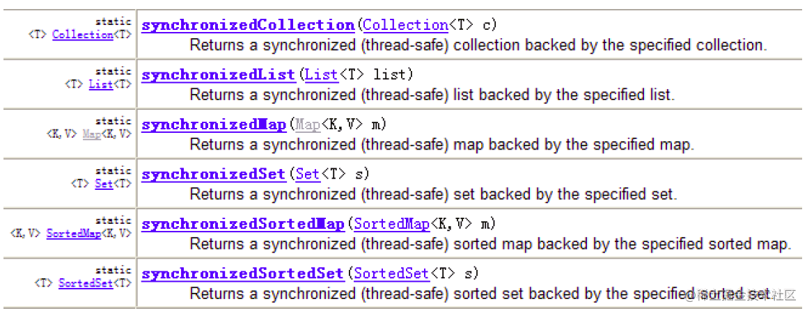

代码示例：

```java
@Test
public void test3() {
    List list = new ArrayList();
    list.add(123);
    list.add(123);
    list.add(123);
    list.add(43);
    list.add(765);
    list.add(-97);
    list.add(0);
    System.out.println(list);//[123, 43, 765, -97, 0]
    //返回的list1即为线程安全的List
    List list1 = Collections.synchronizedList(list);
    System.out.println(list1);//[123, 123, 123, 43, 765, -97, 0]
}

```

## 八、数据结构简述

计划后续专门开一个系列来聊一下数据结构的那些事

### 1. 数据结构概述

数据结构（Data Structure）是一门和计算机硬件与软件都密切相关的学科，它的研究重点是在计算机的程序设计领域中探讨如何在计算机中组织和存储数据并进行高效率的运用，涉及的内容包含：数据的逻辑关系、数据的存储结构、排序算法（Algorithm）、查找（或搜索）等。

### 2. 数据结构与算法的理解

程序能否快速而高效地完成预定的任务，取决于是否选对了数据结构，而程序是否能清楚而正确地把问题解决，则取决于算法。

所以大家认为：“Algorithms + Data Structures = Programs”（出自：Pascal之父Nicklaus Wirth）

总结：算法是为了解决实际问题而设计的，数据结构是算法需要处理的问题载体。

### 3. 数据结构的研究对象

#### 3.1 数据间的逻辑结构

集合结构


一对一：线性结构


一对多：树形结构


多对多：图形结构


#### 3.2 数据的存储结构：

线性表（顺序表、链表、栈、队列） 树 图

> 说明： 习惯上把顺序表和链表看做基本数据结构（或真实数据结构） 习惯上把栈、队列、树、图看做抽象数据类型，简称ADT

### 4.思维导图：

思维导图下载地址：[gitee.com/realbruce/b…](https://link.juejin.cn?target=https%3A%2F%2Fgitee.com%2Frealbruce%2FblogImage.git)

#### 数据结构与算法：


# Java之泛型

## 一、泛型简介

### 1.泛型的概念

- 所谓泛型，就是允许在定义类、接口时通过一个标识表示类中某个属性的类型或者是某个方法的返 回值及参数类型。这个类型参数将在使用时（例如，继承或实现这个接口，用这个类型声明变量、 创建对象时确定（即传入实际的类型参数，也称为类型实参）。
- 从JDK 5.0以后，Java引入了“参数化类型(Parameterized type)”的概念，允许我们在创建集合时再指定集合元素的类型，正如:List，这表明该List只能保存字符串类型的对象。
- JDK 5.0改写了集合框架中的全部接口和类，为这些接口、类增加了泛型支持，从而可以在声明集合变量、创建集合对象时传入类型实参。

### 2.泛型的引入背景

集合容器类在设计阶段/声明阶段不能确定这个容器到底实际存的是什么类型的对象，所以在JDK1.5之前只能把元素类型设计为Object，JDK1.5之后使用泛型来解决。因为这个时候除了元素的类型不确定，其他的部分是确定的，例如关于这个元素如何保存，如何管理等是确定的，因此此时把元素的类型设计成一个参数，这个类型参数叫做泛型。Collection，List，ArrayList 这个就是类型参数，即泛型。

### 3.引入泛型的目的

1. 解决元素存储的安全性问题，好比商品、药品标签，不会弄错。
2. 解决获取数据元素时，需要类型强制转换的问题，好比不用每回拿商品、药品都要辨别。

> Java泛型可以保证如果程序在编译时没有发岀警告，运行时就不会产生 `ClassCastException` 异常。同时，代码更加简洁、健壮。

## 二、泛型在集合中的应用

### 1. 在集合中没有使用泛型的例子

```java
@Test
public void test1(){
    ArrayList list = new ArrayList();
    //需求：存放学生的成绩
    list.add(78);
    list.add(76);
    list.add(89);
    list.add(88);
    //问题一：类型不安全
    //        list.add("Tom");

    for(Object score : list){
        //问题二：强转时，可能出现ClassCastException
        int stuScore = (Integer) score;

        System.out.println(stuScore);

    }

}
```

图示：


### 2. 在集合中使用泛型的例子1

```java
//在集合中使用泛型，以ArrayList为例
@Test
public void test1(){
    ArrayList<String> list = new ArrayList<>();
    list.add("AAA");
    list.add("BBB");
    list.add("FFF");
    list.add("EEE");
    list.add("CCC");
	//遍历方式一：
    Iterator<String> iterator = list.iterator();
    while (iterator.hasNext()){
        System.out.println(iterator.next());
    }
    System.out.println("-------------");
    //便利方式二：
    for (String str:
         list) {
        System.out.println(str);
    }
}

```

图示：


### 3. 在集合中使用泛型例子2

```java
@Test
//在集合中使用泛型的情况：以HashMap为例
public void test2(){
    Map<String,Integer> map = new HashMap<>();//jdk7新特性：类型推断
    map.put("Tom",26);
    map.put("Jarry",30);
    map.put("Bruce",28);
    map.put("Davie",60);
    //嵌套循环
    Set<Map.Entry<String, Integer>> entries = map.entrySet();
    Iterator<Map.Entry<String, Integer>> iterator = entries.iterator();

    while (iterator.hasNext()){
        Map.Entry<String, Integer> entry = iterator.next();
        String key = entry.getKey();
        Integer value = entry.getValue();
        System.out.println(key+"="+value);
    }

}

```

### 4. 集合中使用泛型总结：

① 集合接口或集合类在JDK 5.0时都修改为带泛型的结构。

② 在实例化集合类时，可以指明具体的泛型类型

③ 指明完以后，在集合类或接口中凡是定义类或接口时，内部结构（比如：方法、构造器、属性等）使用到类的泛型的位置，都指定为实例化的泛型类型。

  比如：`add(E e)` --->实例化以后：`add(Integer e)`

④ 注意点：泛型的类型必须是类，不能是基本数据类型。需要用到基本数据类型的位置，拿包装类替换

⑤ 如果实例化时，没有指明泛型的类型。默认类型为 `java.lang.Object` 类型。

## 三、自定义泛型结构

泛型类、泛型接口、泛型方法

### 1. 泛型的声明

- `interface  List<T>`  和  `class GenTest<K,V>`  其中，T，K，V，不代表值，而是表示类型。这里使用任意字母都可以。
- 常用T表示，是Type的缩写。

### 2. 泛型的实例化：

一定要在类名后面指定类型参数的值（类型）。如：

```
List<String> strList =new ArrayList<String>();
Iterator<Customer> iterator = customers.iterator();
```

- T只能是类，不能用基本数据类型填充。但可以使用包装类填充
- 把一个集合中的内容限制为一个特定的数据类型，这就是 generics背后的核心思想

```java
//JDK 5.0以前
Comparable c = new Date();
System.out.println(c.comparaTo("red");
                   
//JDK 5.0以后
Comparable <Date> c = new Date();
System.out.println(c.comparaTo("red");                   

```

> 总结：使用泛型的主要优点在于能够在编译时而不是在运行时检测错误

### 3. 注意点

1. 泛型类可能有多个参数，此时应将多个参数一起放在尖括号内。比如<E1,E2,E3>

2. 泛型类的构造器如下： `public GenericClass(){}`

   而下面是错误的： `public GenericClass<E>{}`

3. 实例化后，操作原来泛型位置的结构必须与指定的泛型类型一致。

4. 泛型不同的引用不能相互赋值。

   > 尽管在编译时 ArrayList和ArrayList是两种类型，但是，在运行时只有一个ArrayList被加载到JVM中。

5. 泛型如果不指定，将被擦除，泛型对应的类型均按照Object处理，但不等价于Object。

   > 建议：泛型要使用一路都用。要不用，一路都不要用。

6. 如果泛型结构是一个接口或抽象类，则不可创建泛型类的对象。

7. JDK 7.0，泛型的简化操作： ` ArrayList<Fruit> first= new ArrayList<>();` （类型推断）

8. 泛型的指定中不能使用基本数据类型，可以使用包装类替换。

9. 在类/接口上声明的泛型，在本类或本接口中即代表某种类型，可以作为非静态属性的类型、非静态方法的参数类型、非静态方法的返回值类型。但在静态方法中不能使用类的泛型。

10. 异常类不能是泛型的。

11. 不能使用 `new E[]`。但是可以：`E[] elements= (E[])new Object[capacity];`

```css
参考:ArrayList源码中声明: `Object[] elementData`,而非泛型参数类型数组.
```

1. 父类有泛型，子类可以选择保留泛型也可以选择指定泛型类型：

```diff
//-   子类不保留父类的泛型：按需实现
      -   没有类型---擦除
      -   具体类型
//-   子类保留父类的泛型：泛型子类
      -   全部保留
      -   部分保留
//-   结论：子类必须是“富二代”，子类除了指定或保留父类的泛型，还可以增加自己的泛型
```

代码示例：

```java
class Father<T1, T2> {
}

/**
 * 定义泛型子类Son
 * 情况一：继承泛型父类后不保留父类的泛型
 */
//1.没有指明类型  擦除
class Son1<A, B> extends Father {//等价于class Son1 extends Father<Object,Odject>{}
}

//2.指定具体类型
class Son2<A, B> extends Father<Integer, String> {
}

/**
 * 定义泛型子类Son
 * 情况二：继承泛型父类后保留泛型类型
 */
//1.全部保留
class Son3<T1, T2, A, B> extends Father<T1, T2> {
}

//2.部分保留
class Son4<T2, A, B> extends Father<Integer,T2>{
}

```

### 4. 自定义泛型结构

#### 4.1自定义泛型类

代码示例：

```java
/**
 * 自定义泛型类Order
 */
class Order<T> {
    private String orderName;
    private int orderId;
    //使用T类型定义变量
    private T orderT;

    public Order() {
    }
    //使用T类型定义构造器
    public Order(String orderName, int orderId, T orderT) {
        this.orderName = orderName;
        this.orderId = orderId;
        this.orderT = orderT;
    }

    //这个不是泛型方法
    public T getOrderT() {
        return orderT;
    }
    //这个不是泛型方法
    public void setOrderT(T orderT) {
        this.orderT = orderT;
    }
    //这个不是泛型方法
    @Override
    public String toString() {
        return "Order{" +
                "orderName='" + orderName + '\'' +
                ", orderId=" + orderId +
                ", orderT=" + orderT +
                '}';
    }
//    //静态方法中不能使用类的泛型。
//    public static void show(T orderT){
//        System.out.println(orderT);
//    }

//    //try-catch中不能是泛型的。
//    public void show(){
//        try {
//
//        }catch (T t){
//
//        }
//    }

    //泛型方法：在方法中出现了泛型的结构，泛型参数与类的泛型参数没有任何关系。
    //换句话说，泛型方法所属的类是不是泛型类都没有关系。
    //泛型方法，可以声明为静态的。
    // 原因：泛型参数是在调用方法时确定的。并非在实例化类时确定。
    public static <E> List<E> copyFromArryToList(E[] arr) {
        ArrayList<E> list = new ArrayList<>();
        for (E e :
                list) {
            list.add(e);
        }
        return list;
    }
}

```

自定义泛型类Order的使用

```java
@Test
public void test1() {
    //如果定义了泛型类，实例化没有指明类的泛型，则认为此泛型类型为Object类型
    //要求：如果大家定义了类是带泛型的，建议在实例化时要指明类的泛型。
    Order order = new Order();
    order.setOrderT(123);
    System.out.println(order.getOrderT());

    order.setOrderT("abc");
    System.out.println(order.getOrderT());

    //建议：实例化时指明类的泛型
    Order<String> order1 = new Order<>("Tom", 16, "male");
    order1.setOrderT("AA:BBB");
    System.out.println(order1.getOrderT());
}

@Test
//调用泛型方法
public void test2(){
    Order<String> order = new Order<>();
    Integer [] arr = new Integer[]{1,2,3,4,5,6};

    List<Integer> list = order.copyFromArryToList(arr);
    System.out.println(list);
}

```

#### 4.2自定义泛型接口

代码示例：

```java
/**
 * 自定义泛型接口
 */
public interface DemoInterface <T> {
    void show();
    int size();
}

//实现泛型接口
public class Demo implements DemoInterface {
    @Override
    public void show() {
        System.out.println("hello");
    }

    @Override
    public int size() {
        return 0;
    }
}

@Test
//测试泛型接口
public void test3(){
    Demo demo = new Demo();
    demo.show();
}

```

#### 4.3自定义泛型方法

- 方法，也可以被泛型化，不管此时定义在其中的类是不是泛型类。在泛型方法中可以定义泛型参数，此时，参数的类型就是传入数据的类型。
- 泛型方法的格式： `[访问权限]<泛型>返回类型 方法名(泛型标识 参数名称])抛出的异常`
- 泛型方法声明泛型时也可以指定上限

代码示例：

```java
//泛型方法：在方法中出现了泛型的结构，泛型参数与类的泛型参数没有任何关系。
//换句话说，泛型方法所属的类是不是泛型类都没有关系。
//泛型方法，可以声明为静态的。
// 原因：泛型参数是在调用方法时确定的。并非在实例化类时确定。
public static <E> List<E> copyFromArryToList(E[] arr) {
    ArrayList<E> list = new ArrayList<>();
    for (E e :
         list) {
        list.add(e);
    }
    return list;
}

```

#### 4.4总结：

- 泛型实际上就是标签，声明时不知道类型，再使用时指明
- 定义泛型结构，即：泛型类、接口、方法、构造器时贴上泛型的标签
- 用泛型定义类或借口是放到类名或接口名后面，定义泛型方法时在方法名前加上

### 5.泛型的应用场景

`DAO.java`：定义了操作数据库中的表的通用操作。 ORM思想(数据库中的表和Java中的类对应)

```java
public class DAO<T> {//表的共性操作的DAO

    //添加一条记录
    public void add(T t){

    }

    //删除一条记录
    public boolean remove(int index){

        return false;
    }

    //修改一条记录
    public void update(int index,T t){

    }

    //查询一条记录
    public T getIndex(int index){

        return null;
    }

    //查询多条记录
    public List<T> getForList(int index){

        return null;
    }

    //泛型方法
    //举例：获取表中一共有多少条记录？获取最大的员工入职时间？
    public <E> E getValue(){

        return null;
    }

}

```

`CustomerDAO.java`:

```java
public class CustomerDAO extends DAO<Customer>{//只能操作某一个表的DAO
}

```

`StudentDAO.java`:

```java
public class StudentDAO extends DAO<Student> {//只能操作某一个表的DAO
}
```

## 四、泛型在继承上的体现

泛型在继承方面的体现：

虽然类A是类B的父类，但是 `G<A>` 和 `G<B>` 二者不具备子父类关系，二者是并列关系。

补充：类A是类B的父类，`A<G>` 是 `B<G>` 的父类

代码示例：

```java
@Test
public void test1(){

    Object obj = null;
    String str = null;
    obj = str;

    Object[] arr1 = null;
    String[] arr2 = null;
    arr1 = arr2;
    //编译不通过
    //        Date date = new Date();
    //        str = date;
    List<Object> list1 = null;
    List<String> list2 = new ArrayList<String>();
    //此时的list1和list2的类型不具子父类关系
    //编译不通过
    //        list1 = list2;
    /*
        反证法：
        假设list1 = list2;
           list1.add(123);导致混入非String的数据。出错。

         */

    show(list1);
    show1(list2);
}

public void show1(List<String> list){

}

public void show(List<Object> list){

}

@Test
public void test2(){

    AbstractList<String> list1 = null;
    List<String> list2 = null;
    ArrayList<String> list3 = null;

    list1 = list3;
    list2 = list3;

    List<String> list4 = new ArrayList<>();

}

```

## 五、通配符

### 1.通配符的使用

- 使用类型通配符：`?`

  比如：`List<?>`， `Map<?,?> `

  `List<?>` 是 `List<String>`、`List<Object>` 等各种泛型 List 的父类。

- 读取 `List<?>` 的对象list中的元素时，永远是安全的，因为不管list的真实类型是什么，它包含的都是Object

- 写入list中的元素时，不可以。因为我们不知道c的元素类型，我们不能向其中添加对象。 除了添加null之外。

**说明：**

- 将任意元素加入到其中不是类型安全的

  `Collection<?> c = new ArrayList<String>()`

  `c.add(new Object());`//编译时错误

  因为我们不知道c的元素类型，我们不能向其中添加对象。add 方法有类型参数 E 作为集合的元素类型。我们传给add的任何参数都必须是一个已知类型的子类。因为我们不知道那是什么类型，所以我们无法传任何东西进去。

- 唯一的例外的是 null，它是所有类型的成员。

- 我们可以调用 `get()` 方法并使用其返回值。返回值是一个未知的类型，但是我们知道，它总是一个Object。

代码示例:

```java
@Test
public void test3(){
    List<Object> list1 = null;
    List<String> list2 = null;

    List<?> list = null;

    list = list1;
    list = list2;
    //编译通过
    //        print(list1);
    //        print(list2);

    //
    List<String> list3 = new ArrayList<>();
    list3.add("AA");
    list3.add("BB");
    list3.add("CC");
    list = list3;
    //添加(写入)：对于List<?>就不能向其内部添加数据。
    //除了添加null之外。
    //        list.add("DD");
    //        list.add('?');

    list.add(null);

    //获取(读取)：允许读取数据，读取的数据类型为Object。
    Object o = list.get(0);
    System.out.println(o);
}

public void print(List<?> list){
    Iterator<?> iterator = list.iterator();
    while(iterator.hasNext()){
        Object obj = iterator.next();
        System.out.println(obj);
    }
}

```

### 2.注意点

```java
//注意点1：编译错误：不能用在泛型方法声明上，返回值类型前面<>不能使用?
public static <?> void test(ArrayList<?> list){
    
}

//注意点2：编译错误：不能用在泛型类的声明上
class GenericTypeClass<?>{
    
}

//注意点3：编译错误：不能用在创建对象上，右边属于创建集合对象
ArrayList<> list2 new ArrayList<?>();

```

### 3.有限制的通配符

- `<?>`：允许所有泛型的引用调用

- 通配符指定上限

  上限 `extends`：使用时指定的类型必须是继承某个类，或者实现某个接口，即 `<=`

- 通配符指定下限

  下限 `super`：使用时指定的类型不能小于操作的类，即 `>=`

- 举例：

  - `<?extends Number>（无穷小， Number\] `

    只允许泛型为Number及Number子类的引用调用

  -  `<?super Number> [Number，无穷大） `

    只允许泛型为Number及Number父类的引用调用

  -  `<? extends Comparable>`

    只允许泛型为实现 Comparable接口的实现类的引用调用

代码示例：

```java
@Test
public void test4(){

    List<? extends Person> list1 = null;
    List<? super Person> list2 = null;

    List<Student> list3 = new ArrayList<Student>();
    List<Person> list4 = new ArrayList<Person>();
    List<Object> list5 = new ArrayList<Object>();

    list1 = list3;
    list1 = list4;
    //        list1 = list5;

    //        list2 = list3;
    list2 = list4;
    list2 = list5;

    //读取数据：
    list1 = list3;
    Person p = list1.get(0);
    //编译不通过
    //Student s = list1.get(0);

    list2 = list4;
    Object obj = list2.get(0);
    ////编译不通过
    //        Person obj = list2.get(0);

    //写入数据：
    //编译不通过
    //        list1.add(new Student());

    //编译通过
    list2.add(new Person());
    list2.add(new Student());

}
```

# Java之IO流

## 一、File类的使用

### 1. File类的理解

- File类的一个对象，代表一个文件或一个文件目录(俗称：文件夹)。
- File类声明在 `java.io` 包下：文件和文件路径的抽象表示形式，与平台无关。
- File类中涉及到关于文件或文件目录的创建、删除、重命名、修改时间、文件大小等方法，并未涉及到写入或读取文件内容的操作。如果需要读取或写入文件内容，必须使用IO流来完成。
- 想要在 Java 程序中表示一个真实存在的文件或目录，那么必须有一个 File 对象，但是 Java程序中的一个 File 对象，可能没有一个真实存在的文件或目录。
- 后续 File 类的对象常会作为参数传递到流的构造器中，指明读取或写入的"终点"。

### 2. File的实例化

#### 2.1 常用构造器

- `File(String filePath)`
- `File(String parentPath,String childPath)`
- `File(File parentFile,String childPath)`

**代码示例**：

```java
@Test
public void test1() {
    //构造器1
    File file1 = new File("hello.txt");
    File file2 = new File("E:\\workspace_idea\\JavaSenic\\IO\\hello.txt");
    System.out.println(file1);
    System.out.println(file2);

    //构造器2
    File file3 = new File("E:\\workspace_idea\\JavaSenior", "hello.txt");
    System.out.println(file3);

    //构造器3
    File file4 = new File(file3, "hi.txt");
    System.out.println(file4);
}
```

#### 2.2 路径分类

- 相对路径：相较于某个路径下，指明的路径。
- 绝对路径：包含盘符在内的文件或文件目录的路径。

**说明**：

- IDEA中： 
  - 如果使用JUnit中的单元测试方法测试，相对路径即为当前Module下。
  - 如果使用main()测试，相对路径即为当前的Project下。
- Eclipse中： 
  - 不管使用单元测试方法还是使用main()测试，相对路径都是当前的Project下。

#### 2.3 路径分隔符

- windows和DOS系统默认使用 `\` 来表示

- UNIX和URL使用 `/` 来表示

- Java程序支持跨平台运行，因此路径分隔符要慎用。

- 为了解决这个隐患，File类提供了一个常量： `public static final String separator`。根据操作系统，动态的提供分隔符。

  举例：

  ```java
  //windows和DOS系统
  File file1 = new File("E:\\io\\test.txt");
  //UNIX和URL
  File file = new File("E:/io/test.txt");
  //java提供的常量
  File file = new File("E:"+File.separator+"io"+File.separator+"test.txt");
  ```

### 3. File类的常用方法

#### 3.1 File类的获取功能

- `public String getAbsolutePath()`：获取绝对路径
- `public String getPath()`：获取路径
- `public String getName()` ：获取名称
- `public String getParent()`：获取上层文件目录路径。若无，返回 `null`
- `public long length()` ：获取文件长度（即：字节数）。不能获取目录的长度。
- `public long lastModified()` ：获取最后一次的修改时间，毫秒值
- 如下的两个方法适用于文件目录：
- `public String[] list()` ：获取指定目录下的所有文件或者文件目录的名称数组
- `public File[] listFiles()` ：获取指定目录下的所有文件或者文件目录的File数组

**代码示例：**

```java
@Test
public void test2(){
    File file1 = new File("hello.txt");
    File file2 = new File("d:\\io\\hi.txt");

    System.out.println(file1.getAbsolutePath());
    System.out.println(file1.getPath());
    System.out.println(file1.getName());
    System.out.println(file1.getParent());
    System.out.println(file1.length());
    System.out.println(new Date(file1.lastModified()));

    System.out.println();

    System.out.println(file2.getAbsolutePath());
    System.out.println(file2.getPath());
    System.out.println(file2.getName());
    System.out.println(file2.getParent());
    System.out.println(file2.length());
    System.out.println(file2.lastModified());
}
@Test
public void test3(){
    File file = new File("D:\\workspace_idea1\\JavaSenior");

    String[] list = file.list();
    for(String s : list){
        System.out.println(s);
    }

    System.out.println();

    File[] files = file.listFiles();
    for(File f : files){
        System.out.println(f);
    }

}
```

#### 3.2 File类的重命名功能

- ` public boolean renameTo(File dest)`:把文件重命名为指定的文件路径
- 注意：`file1.renameTo(file2)`为例：要想保证返回 `true` ,需要file1在硬盘中是存在的，且file2不能在硬盘中存在。

**代码示例：**

```java
@Test
public void test4(){
    File file1 = new File("hello.txt");
    File file2 = new File("D:\\io\\hi.txt");

    boolean renameTo = file2.renameTo(file1);
    System.out.println(renameTo);

}
```

#### 3.3 File类的判断功能

- `public boolean isDirectory()`：判断是否是文件目录
- `public boolean isFile()` ：判断是否是文件
- `public boolean exists()` ：判断是否存在
- `public boolean canRead()` ：判断是否可读
- `public boolean canWrite()` ：判断是否可写
- `public boolean isHidden()` ：判断是否隐藏

**代码示例：**

```java
@Test
public void test5(){
    File file1 = new File("hello.txt");
    file1 = new File("hello1.txt");

    System.out.println(file1.isDirectory());
    System.out.println(file1.isFile());
    System.out.println(file1.exists());
    System.out.println(file1.canRead());
    System.out.println(file1.canWrite());
    System.out.println(file1.isHidden());

    System.out.println();

    File file2 = new File("d:\\io");
    file2 = new File("d:\\io1");
    System.out.println(file2.isDirectory());
    System.out.println(file2.isFile());
    System.out.println(file2.exists());
    System.out.println(file2.canRead());
    System.out.println(file2.canWrite());
    System.out.println(file2.isHidden());

}
```

#### 3.4 Flie类的创建功能

- 创建硬盘中对应的文件或文件目录
- `public boolean createNewFile()` ：创建文件。若文件存在，则不创建，返回false
- `public boolean mkdir()` ：创建文件目录。如果此文件目录存在，就不创建了。如果此文件目录的上层目录不存在，也不创建。
- `public boolean mkdirs()` ：创建文件目录。如果此文件目录存在，就不创建了。如果上层文件目录不存在，一并创建

**代码示例：**

```java
@Test
public void test6() throws IOException {
    File file1 = new File("hi.txt");
    if(!file1.exists()){
        //文件的创建
        file1.createNewFile();
        System.out.println("创建成功");
    }else{//文件存在
        file1.delete();
        System.out.println("删除成功");
    }


}
@Test
public void test7(){
    //文件目录的创建
    File file1 = new File("d:\\io\\io1\\io3");

    boolean mkdir = file1.mkdir();
    if(mkdir){
        System.out.println("创建成功1");
    }

    File file2 = new File("d:\\io\\io1\\io4");

    boolean mkdir1 = file2.mkdirs();
    if(mkdir1){
        System.out.println("创建成功2");
    }
    //要想删除成功，io4文件目录下不能有子目录或文件
    File file3 = new File("D:\\io\\io1\\io4");
    file3 = new File("D:\\io\\io1");
    System.out.println(file3.delete());
}
```

#### 3.5 File类的删除功能

- 删除磁盘中的文件或文件目录
- `public boolean delete()`：删除文件或者文件夹
- 删除注意事项：Java中的删除不走回收站。

### 4. 内存解析


### 5. 小练习

利用 File 构造器，`new` 一个文件目录file

1）在其中创建多个文件和目录

2）编写方法，实现删除fle中指定文件的操作

```java
@Test
public void test1() throws IOException {
    File file = new File("E:\\io\\io1\\hello.txt");
    //创建一个与file同目录下的另外一个文件，文件名为：haha.txt
    File destFile = new File(file.getParent(),"haha.txt");
    boolean newFile = destFile.createNewFile();
    if(newFile){
        System.out.println("创建成功！");
    }
}

```

判断指定目录下是否有后缀名为 `.jpg` 的文件，如果有，就输出该文件名称

```java
public class FindJPGFileTest {

    @Test
    public void test1(){
        File srcFile = new File("d:\\code");

        String[] fileNames = srcFile.list();
        for(String fileName : fileNames){
            if(fileName.endsWith(".jpg")){
                System.out.println(fileName);
            }
        }
    }
    @Test
    public void test2(){
        File srcFile = new File("d:\\code");

        File[] listFiles = srcFile.listFiles();
        for(File file : listFiles){
            if(file.getName().endsWith(".jpg")){
                System.out.println(file.getAbsolutePath());
            }
        }
    }
    /*
	 * File类提供了两个文件过滤器方法
	 * public String[] list(FilenameFilter filter)
	 * public File[] listFiles(FileFilter filter)

	 */
    @Test
    public void test3(){
        File srcFile = new File("d:\\code");

        File[] subFiles = srcFile.listFiles(new FilenameFilter() {

            @Override
            public boolean accept(File dir, String name) {
                return name.endsWith(".jpg");
            }
        });

        for(File file : subFiles){
            System.out.println(file.getAbsolutePath());
        }
    }

}

```

遍历指定目录所有文件名称，包括子文件目录中的文件。

拓展1：并计算指定目录占用空间的大小

拓展2：删除指定文件目录及其下的所有文件

```java
public class ListFileTest {

    public static void main(String[] args) {
        // 递归:文件目录
        /** 打印出指定目录所有文件名称，包括子文件目录中的文件 */

        //1.创建目录对象
        File file = new File("E:\\test");

        //2.打印子目录
        printSubFile(file);

    }

    /**
     * 递归方法遍历所有目录下的文件
     *
     * @param dir
     */
    public static void printSubFile(File dir) {
        //打印子目录
        File[] files = dir.listFiles();
        for (File f : files) {
            if (f.isDirectory()) {//如果为文件目录，则递归调用自身
                printSubFile(f);
            } else {
                System.out.println(f.getAbsolutePath());//输出绝对路径
            }
        }
    }

    // 拓展1：求指定目录所在空间的大小
    // 求任意一个目录的总大小
    public long getDirectorySize(File file) {
        // file是文件，那么直接返回file.length()
        // file是目录，把它的下一级的所有大小加起来就是它的总大小
        long size = 0;
        if (file.isFile()) {
            size += file.length();
        } else {
            File[] allFiles = file.listFiles();// 获取file的下一级
            // 累加all[i]的大小
            for (File f : allFiles) {
                size += getDirectorySize(f);//f的大小
            }
        }
        return size;
    }

    /**
     * 拓展2：删除指定的目录
     */
    public void deleteDirectory(File file) {
        // 如果file是文件，直接delete
        // 如果file是目录，先把它的下一级干掉，然后删除自己
        if (file.isDirectory()) {
            File[] allFiles = file.listFiles();
            //递归调用删除file下一级
            for (File f : allFiles) {
                deleteDirectory(f);
            }
        } else {
            //删除文件
            file.delete();
        }
    }
}
```

## 二、IO流概述

### 1. 简述

- IO 是 Input/Output 的缩写，I/O 技术是非常实用的技术，用于处理设备之间的数据传输。如读/写文件，网络通讯等。
- Java程序中，对于数据的输入输出操作以 “流(stream)” 的方式进行。
- `Java.IO` 包下提供了各种“流”类和接口，用以获取不同种类的数据，并通过标准的方法输入或输出数据。

### 2. 流的分类

**操作数据单位：字节流、字符流**

- 对于文本文件(`.txt,.java,.c,.cpp`)，使用字符流处理
- 对于非文本文件(`.jpg,.mp3,.mp4,.avi,.doc,.ppt,...`)，使用字节流处理

**数据的流向：输入流、输出流**

- 输入 input:读取外部数据（磁盘、光盘等存储设备的数据）到程序（内存）中。
- 输出 output:将程序（内存）数据输出到磁盘、光盘等存储设备中。

**流的角色：节点流、处理流**

节点流：直接从数据源或目的地读写数据。


处理流：不直接连接到数据源或目的地，而是“连接”在已存在的流（节点流或处理流）之上，通过对数据的处理为程序提供更为强大的读写功能。


**图示：**


### 3. IO流的体系分类

#### 3.1 总体分类


> 红框为抽象基类，蓝框为常用IO流

#### 3.2 常用的几个IO流结构

| 抽象基类    | 节点流（或文件流）                             | 缓冲流（处理流的一种）                                       |
| ----------- | ---------------------------------------------- | ------------------------------------------------------------ |
| InputStream | `FileInputStream (read(byte[] buffer))`        | `BufferedInputStream (read(byte[] buffer))`                  |
| OutputSteam | `FileOutputStream (write(byte[] buffer,0,len)` | `BufferedOutputStream (write(byte[] buffer,0,len)` / `flush()` |
| Reader      | `FileReader (read(char[] cbuf))`               | `BufferedReader (read(char[] cbuf)` / `readLine()`           |
| Writer      | `FileWriter (write(char[] cbuf,0,len)`         | `BufferedWriter (write(char[] cbuf,0,len)` / `flush()`       |

#### 3.3 对抽象基类的说明：

| 抽象基类 | 字节流      | 字符流 |
| -------- | ----------- | ------ |
| 输入流   | InputSteam  | Reader |
| 输出流   | OutputSteam | Writer |

- 说明：Java的lO流共涉及40多个类，实际上非常规则，都是从如下4个抽象基类派生的。
- 由这四个类派生出来的子类名称都是以其父类名作为子类名后缀。

3.3.1InputSteam & Reader

- InputStream和Reader是所有输入流的基类。
- InputStream（典型实现：FileInputStream）
  - `int read()`
  - `int read(byte[] b)`
  - `int read(byte[] b,int off,int len)`
- Reader（典型实现：FileReader）
  - `int read()`
  - `int read(char[] c)`
  - `int read(char[] c,int off,int len)`
- 程序中打开的文件IO资源不属于内存里的资源，垃圾回收机制无法回收该资源，所以应该显式关闭文件IO资源。
- FileInputStream 从文件系统中的某个文件中获得输入字节。FileInputStream 用于读取非文本数据之类的原始字节流。要读取字符流，需要使用 FileReader。

**InputSteam：**

- `int read()`

  从输入流中读取数据的下一个字节。返回0到255范围内的int字节值。如果因为已经到达流末尾而没有可用的字节，则返回值-1。

- `int read(byte[] b)`

  从此输入流中将最多b.length个字节的数据读入一个byte数组中。如果因为已经到达流末尾而没有可用的字节，则返回值-1.否则以整数形式返回实际读取的字节数。

- `int read(byte[] b,int off,int len)`

  将输入流中最多len个数据字节读入byte数组。尝试读取len个字节，但读取的字节也可能小于该值。以整数形式返回实际读取的字节数。如果因为流位于文件末尾而没有可用的字节，则返回值-1。

- `public void close throws IOException`

  关闭此输入流并释放与该流关联的所有系统资源。

**Reader：**

- `int read()`

  读取单个字符。作为整数读取的字符，范围在0到65535之间（0x00-0xffff）(2个字节的 Unicode码)，如果已到达流的末尾，则返回-1。

- `int read（char[] cbuf)`

  将字符读入数组。如果已到达流的末尾，则返回-1。否则返回本次读取的字符数。

- `int read（char[] cbuf,int off,int len)`

  将字符读入数组的某一部分。存到数组cbuf中，从off处开始存储，最多读len个字符。如果已到达流的末尾，则返回-1。否则返回本次读取的字符数。

- `public void close throws IOException`

  关闭此输入流并释放与该流关联的所有系统资源

3.3.2 OutputSteam & Writer

- OutputStream 和 Writer也非常相似： 
  - `void write(int b/int c);`
  - `void write(byte[] b/char[] cbuf);`
  - `void write(byte[] b/char[] buff,int off,int len);`
  - `void flush();`
  - ` void close();//需要先刷新，再关闭此流`
- 因为字符流直接以字符作为操作单位，所以 Writer可以用字符串来替换字符数组，即以 String对象作为参数 
  - `void write(String str);`
  - `void write(String str,int off,int len);`
- FileOutputStream 从文件系统中的某个文件中获得输出字节。FileOutputstream 用于写出非文本数据之类的原始字节流。要写出字符流，需要使用 FileWriter

**OutputStream:**

- `void write(int b)`

  将指定的字节写入此输出流。 write的常规协定是：向输出流写入一个字节。要写入的字节是参数b的八个低位。b的24个高位将被忽略。即写入0~255范围的

- `void write（byte[] b)`

  将 `b.length` 个字节从指定的byte数组写入此输出流。`write(b)`的常规协定是：应该与调用`wite(b,0,b.length)`的效果完全相同。

- `void write(byte[] b,int off,int len)`

  将指定byte数组中从偏移量off开始的len个字节写入此输出流。

- `public void flush()throws IOException`

  刷新此输出流并强制写出所有缓冲的输出字节，调用此方法指示应将这些字节立即写入它们预期的目标。

- `public void close throws IOException`

  关闭此输岀流并释放与该流关联的所有系统资源。

**Writer:**

- `void write(int c)`

  写入单个字符。要写入的字符包含在给定整数值的16个低位中，16高位被忽略。即写入0到65535之间的 Unicode码。

- `void write(char[] cbuf)`

  写入字符数组

- `void write(char[] cbuf,int off,int len)`

  写入字符数组的某一部分。从off开始，写入len个字符

- `void write(String str)`

  写入字符串。

- `void write(String str,int off,int len)`

  写入字符串的某一部分。

- `void flush()`

  刷新该流的缓冲，则立即将它们写入预期目标。

- `public void close throws IOException`

  关闭此输出流并释放与该流关联的所有系统资源

### 4. 输入、输出标准化过程

#### 4.1 输入过程：

① 创建 File 类的对象，指明读取的数据的来源。（要求此文件一定要存在）

② 创建相应的输入流，将 File 类的对象作为参数，传入流的构造器中

③ 具体的读入过程：创建相应的 `byte[]` 或 `char[]`。

④ 关闭流资源

说明：程序中出现的异常需要使用 `try-catch-finally` 处理。

#### 4.2 输出过程：

① 创建 File 类的对象，指明写出的数据的位置。（不要求此文件一定要存在）

② 创建相应的输出流，将 File 类的对象作为参数，传入流的构造器中

③ 具体的写出过程：`write(char[]/byte[] buffer,0,len)`

④ 关闭流资源

说明：程序中出现的异常需要使用 `try-catch-finally` 处理。

## 三、节点流（文件流）

### 1. 文件字符流 FileReader 和 FileWriter 的使用

#### 1.1文件的输入

从文件中读取到内存（程序）中

**步骤：**

1. 建立一个流对象，将已存在的一个文件加载进流 `FileReader fr = new FileReader(new File("Test. txt"));`
2. 创建一个临时存放数据的数组 `char[] ch = new char[1024];`
3. 调用流对象的读取方法将流中的数据读入到数组中。 `fr.read(ch);`
4. 关闭资源。 `fr.close();`

**代码示例：**

```java
@Test
public void testFileReader1()  {
    FileReader fr = null;
    try {
        //1.File类的实例化
        File file = new File("hello.txt");

        //2.FileReader流的实例化
        fr = new FileReader(file);

        //3.读入的操作
        //read(char[] cbuf):返回每次读入cbuf数组中的字符的个数。如果达到文件末尾，返回-1
        char[] cbuf = new char[5];
        int len;
        while((len = fr.read(cbuf)) != -1){
            String str = new String(cbuf,0,len);
            System.out.print(str);
        }
    } catch (IOException e) {
        e.printStackTrace();
    } finally {
        if(fr != null){
            //4.资源的关闭
            try {
                fr.close();
            } catch (IOException e) {
                e.printStackTrace();
            }

        }
    }

}
```

**注意点：**

1. `read()` 的理解：返回读入的一个字符。如果达到文件末尾，返回-1
2. 异常的处理：为了保证流资源一定可以执行关闭操作。需要使用 `try-catch-finally` 处理
3. 读入的文件一定要存在，否则就会报 `FileNotFoundException`。

#### 1.2 文件的输出

从内存（程序）到硬盘文件中

**步骤：**

1. 创建流对象，建立数据存放文件 `File Writer fw = new File Writer(new File("Test.txt"))`
2. 调用流对象的写入方法，将数据写入流 `fw.write("HelloWord")`
3. 关闭流资源，并将流中的数据清空到文件中。 `fw.close();`

**代码示例：**

```java
@Test
public void testFileWriter() {
    FileWriter fw = null;
    try {
        //1.提供File类的对象，指明写出到的文件
        File file = new File("hello1.txt");

        //2.提供FileWriter的对象，用于数据的写出
        fw = new FileWriter(file,false);

        //3.写出的操作
        fw.write("I have a dream!\n");
        fw.write("you need to have a dream!");
    } catch (IOException e) {
        e.printStackTrace();
    } finally {
        //4.流资源的关闭
        if(fw != null){

            try {
                fw.close();
            } catch (IOException e) {
                e.printStackTrace();
            }
        }
    }
}
```

#### 1.3 小练习

实现文本文件的复制操作

```java
@Test
public void testFileReaderFileWriter() {
    FileReader fr = null;
    FileWriter fw = null;
    try {
        //1.创建File类的对象，指明读入和写出的文件
        File srcFile = new File("hello.txt");
        File destFile = new File("hello2.txt");

        //不能使用字符流来处理图片等字节数据
        //            File srcFile = new File("test.jpg");
        //            File destFile = new File("test1.jpg");

        //2.创建输入流和输出流的对象
        fr = new FileReader(srcFile);
        fw = new FileWriter(destFile);

        //3.数据的读入和写出操作
        char[] cbuf = new char[5];
        int len;//记录每次读入到cbuf数组中的字符的个数
        while((len = fr.read(cbuf)) != -1){
            //每次写出len个字符
            fw.write(cbuf,0,len);

        }
    } catch (IOException e) {
        e.printStackTrace();
    } finally {
        //4.关闭流资源
        try {
            if(fw != null)
                fw.close();
        } catch (IOException e) {
            e.printStackTrace();
        }

        try {
            if(fr != null)
                fr.close();
        } catch (IOException e) {
            e.printStackTrace();
        }

    }

}
```

### 2. 文件字节流 FileInputSteam 和 FileOutputSteam 的使用

文件字节流操作与字符流操作类似，只是实例化对象操作和数据类型不同。

**代码示例：**

```java
//使用字节流FileInputStream处理文本文件，可能出现乱码。
@Test
public void testFileInputStream() {
    FileInputStream fis = null;
    try {
        //1. 造文件
        File file = new File("hello.txt");

        //2.造流
        fis = new FileInputStream(file);

        //3.读数据
        byte[] buffer = new byte[5];
        int len;//记录每次读取的字节的个数
        while((len = fis.read(buffer)) != -1){

            String str = new String(buffer,0,len);
            System.out.print(str);

        }
    } catch (IOException e) {
        e.printStackTrace();
    } finally {
        if(fis != null){
            //4.关闭资源
            try {
                fis.close();
            } catch (IOException e) {
                e.printStackTrace();
            }

        }
    }

}
```

**小练习**

实现图片文件复制操作

```java
@Test
public void testFileInputOutputStream()  {
    FileInputStream fis = null;
    FileOutputStream fos = null;
    try {
        //1.创建File对象
        File srcFile = new File("test.jpg");
        File destFile = new File("test2.jpg");

        //2.创建操流
        fis = new FileInputStream(srcFile);
        fos = new FileOutputStream(destFile);

        //3.复制的过程
        byte[] buffer = new byte[5];
        int len;
        while((len = fis.read(buffer)) != -1){
            fos.write(buffer,0,len);
        }

    } catch (IOException e) {
        e.printStackTrace();
    } finally {
        //4.关闭流
        if(fos != null){
            //
            try {
                fos.close();
            } catch (IOException e) {
                e.printStackTrace();
            }
        }
        if(fis != null){
            try {
                fis.close();
            } catch (IOException e) {
                e.printStackTrace();
            }

        }
    }

}
```

### 3. 注意点

- 定义路径时，可以用 `/` 或 `\\`。
- 输出操作，对应的 File 可以不存在的。并不会报异常。
- File 对应的硬盘中的文件如果不存在，在输出的过程中，会自动创建此文件。
- File 对应的硬盘中的文件如果存在：
  - 如果流使用的构造器是：`FileWriter(file,false)` / `FileWriter(file)`:对原有文件的覆盖。
  - 如果流使用的构造器是：`FileWriter(file,true)`:不会对原有文件覆盖，而是在原有文件基础上追加内容。
- 读取文件时，必须保证文件存在，否则会报异常。
- 对于文本文件(`.txt,.java,.c,.cpp`)，使用字符流处理
- 对于非文本文件(`.jpg,.mp3,.mp4,.avi,.doc,.ppt,...`)，使用字节流处理

## 四、缓冲流

### 1. 缓冲流涉及到的类：

- `BufferedInputStream`
- `BufferedOutputStream`
- `BufferedReader`
- `BufferedWriter`

### 2. 引入目的：

- 作用：提供流的读取、写入的速度

- 提高读写速度的原因：内部提供了一个缓冲区。默认情况下是8kb

  

**处理流与节点流的对比图示**


### 3. 使用说明

- 当读取数据时，数据按块读入缓冲区，其后的读操作则直接访问缓冲区。
- 当使用 `BufferedInputStream` 读取字节文件时，`BufferedInputStream` 会一次性从文件中读取8192个(8Kb)，存在缓冲区中，直到缓冲区装满了，才重新从文件中读取下一个8192个字节数组。
- 向流中写入字节时，不会直接写到文件，先写到缓冲区中直到缓冲区写满，`BufferedOutputStream` 才会把缓冲区中的数据一次性写到文件里。使用方法 `flush()` 可以强制将缓冲区的内容全部写入输出流。
- 关闭流的顺序和打开流的顺序相反。只要关闭最外层流即可，关闭最外层流也会相应关闭内层节点流。
- `flush()` 方法的使用：手动将 buffer 中内容写入文件。
- 如果是带缓冲区的流对象的 `close()` 方法，不但会关闭流，还会在关闭流之前刷新缓冲区，关闭后不能再写出。

**代码示例：**

#### 3.1使用 BufferInputStream 和 BufferOutputStream 实现非文本文件的复制

```java
@Test
public void testBufferedStream(){
    BufferedInputStream bis = null;
    BufferedOutputStream bos = null;
    try {
        //1.造文件
        File srcFile = new File("test.jpg");
        File destFile = new File("test4.jpg");
        //2.造流
        //2.1造节点流
        FileInputStream fis = new FileInputStream(srcFile);
        FileOutputStream fos = new FileOutputStream(destFile);
        //2.2造缓冲流，可以合并书写
        bis = new BufferedInputStream(fis);
        bos = new BufferedOutputStream(fos);

        //3.文件读取、写出操作
        byte[] buffer = new byte[1024];
        int len;
        while ((len = bis.read(buffer)) != -1){
            bos.write(buffer,0,len);
        }
    } catch (IOException e) {
        e.printStackTrace();
    } finally {
        //4.关闭流
        if (bos != null){
            try {
                bos.close();
            } catch (IOException e) {
                e.printStackTrace();
            }
        }
        if (bis != null){

            try {
                bis.close();
            } catch (IOException e) {
                e.printStackTrace();
            }
        }
    }
}
```

#### 3.2 使用 BufferedReader 和 BufferedWriter 实现文本文件的复制

```java
@Test
public void testBufferedReaderBufferedWriter(){
    BufferedReader br = null;
    BufferedWriter bw = null;
    try {
        //创建文件和相应的流
        br = new BufferedReader(new FileReader(new File("dbcp.txt")));
        bw = new BufferedWriter(new FileWriter(new File("dbcp1.txt")));

        //读写操作
        //方式一：使用char[]数组
        //            char[] cbuf = new char[1024];
        //            int len;
        //            while((len = br.read(cbuf)) != -1){
        //                bw.write(cbuf,0,len);
        //    //            bw.flush();
        //            }

        //方式二：使用String
        String data;
        while((data = br.readLine()) != null){
            //方法一：
            //                bw.write(data + "\n");//data中不包含换行符
            //方法二：
            bw.write(data);//data中不包含换行符
            bw.newLine();//提供换行的操作

        }


    } catch (IOException e) {
        e.printStackTrace();
    } finally {
        //关闭资源
        if(bw != null){

            try {
                bw.close();
            } catch (IOException e) {
                e.printStackTrace();
            }
        }
        if(br != null){
            try {
                br.close();
            } catch (IOException e) {
                e.printStackTrace();
            }

        }
    }

}
```

### 4. 小练习

#### 4.1测试缓冲流和节点流文件复制速度

节点流实现复制方法

```java
//指定路径下文件的复制
public void copyFile(String srcPath,String destPath){
    FileInputStream fis = null;
    FileOutputStream fos = null;
    try {
        //1.造文件
        File srcFile = new File(srcPath);
        File destFile = new File(destPath);

        //2.造流
        fis = new FileInputStream(srcFile);
        fos = new FileOutputStream(destFile);

        //3.复制的过程
        byte[] buffer = new byte[1024];
        int len;
        while((len = fis.read(buffer)) != -1){
            fos.write(buffer,0,len);
        }

    } catch (IOException e) {
        e.printStackTrace();
    } finally {
        if(fos != null){
            //4.关闭流
            try {
                fos.close();
            } catch (IOException e) {
                e.printStackTrace();
            }
        }
        if(fis != null){
            try {
                fis.close();
            } catch (IOException e) {
                e.printStackTrace();
            }

        }
    }
}
```

缓冲流实现复制操作

```java
//实现文件复制的方法
public void copyFileWithBuffered(String srcPath,String destPath){
    BufferedInputStream bis = null;
    BufferedOutputStream bos = null;

    try {
        //1.造文件
        File srcFile = new File(srcPath);
        File destFile = new File(destPath);
        //2.造流
        //2.1 造节点流
        FileInputStream fis = new FileInputStream((srcFile));
        FileOutputStream fos = new FileOutputStream(destFile);
        //2.2 造缓冲流
        bis = new BufferedInputStream(fis);
        bos = new BufferedOutputStream(fos);

        //3.复制的细节：读取、写入
        byte[] buffer = new byte[1024];
        int len;
        while((len = bis.read(buffer)) != -1){
            bos.write(buffer,0,len);
        }
    } catch (IOException e) {
        e.printStackTrace();
    } finally {
        //4.资源关闭
        //要求：先关闭外层的流，再关闭内层的流
        if(bos != null){
            try {
                bos.close();
            } catch (IOException e) {
                e.printStackTrace();
            }

        }
        if(bis != null){
            try {
                bis.close();
            } catch (IOException e) {
                e.printStackTrace();
            }

        }
    }
}
```

测试二者速度

```java
@Test
public void testCopyFileWithBuffered(){
    long start = System.currentTimeMillis();

    String srcPath = "C:\\Users\\Administrator\\Desktop\\01-视频.avi";
    String destPath = "C:\\Users\\Administrator\\Desktop\\03-视频.avi";

    copyFileWithBuffered(srcPath,destPath);

    long end = System.currentTimeMillis();

    System.out.println("复制操作花费的时间为：" + (end - start));//618 - 176
}
```

#### 4.2实现图片加密操作

加密操作

- 将图片文件通过字节流读取到程序中
- 将图片的字节流逐一进行 `^` 操作
- 将处理后的图片字节流输出

```java
//图片的加密
@Test
public void test1() {

    FileInputStream fis = null;
    FileOutputStream fos = null;
    try {
        fis = new FileInputStream("test.jpg");
        fos = new FileOutputStream("testSecret.jpg");

        byte[] buffer = new byte[20];
        int len;
        while ((len = fis.read(buffer)) != -1) {

            for (int i = 0; i < len; i++) {
                buffer[i] = (byte) (buffer[i] ^ 5);
            }

            fos.write(buffer, 0, len);
        }
    } catch (IOException e) {
        e.printStackTrace();
    } finally {
        if (fos != null) {
            try {
                fos.close();
            } catch (IOException e) {
                e.printStackTrace();
            }

        }
        if (fis != null) {
            try {
                fis.close();
            } catch (IOException e) {
                e.printStackTrace();
            }

        }
    }
}
```

解密操作

- 将加密后图片文件通过字节流读取到程序中
- 将图片的字节流逐一进行 `^` 操作（原理：`A^B^B = A`）
- 将处理后的图片字节流输出

```java
//图片的解密
@Test
public void test2() {

    FileInputStream fis = null;
    FileOutputStream fos = null;
    try {
        fis = new FileInputStream("testSecret.jpg");
        fos = new FileOutputStream("test4.jpg");

        byte[] buffer = new byte[20];
        int len;
        while ((len = fis.read(buffer)) != -1) {
          
            for (int i = 0; i < len; i++) {
                buffer[i] = (byte) (buffer[i] ^ 5);
            }

            fos.write(buffer, 0, len);
        }
    } catch (IOException e) {
        e.printStackTrace();
    } finally {
        if (fos != null) {
            try {
                fos.close();
            } catch (IOException e) {
                e.printStackTrace();
            }

        }
        if (fis != null) {
            try {
                fis.close();
            } catch (IOException e) {
                e.printStackTrace();
            }

        }
    }
}
```

#### 4.3 统计文本字符出现次数

实现思路：

1. 遍历文本每一个字符
2. 字符出现的次数存在Map中
3. 把map中的数据写入文件

```java
@Test
public void testWordCount() {
    FileReader fr = null;
    BufferedWriter bw = null;
    try {
        //1.创建Map集合
        Map<Character, Integer> map = new HashMap<Character, Integer>();

        //2.遍历每一个字符,每一个字符出现的次数放到map中
        fr = new FileReader("dbcp.txt");
        int c = 0;
        while ((c = fr.read()) != -1) {
            //int 还原 char
            char ch = (char) c;
            // 判断char是否在map中第一次出现
            if (map.get(ch) == null) {
                map.put(ch, 1);
            } else {
                map.put(ch, map.get(ch) + 1);
            }
        }

        //3.把map中数据存在文件count.txt
        //3.1 创建Writer
        bw = new BufferedWriter(new FileWriter("wordcount.txt"));

        //3.2 遍历map,再写入数据
        Set<Map.Entry<Character, Integer>> entrySet = map.entrySet();
        for (Map.Entry<Character, Integer> entry : entrySet) {
            switch (entry.getKey()) {
                case ' ':
                    bw.write("空格=" + entry.getValue());
                    break;
                case '\t'://\t表示tab 键字符
                    bw.write("tab键=" + entry.getValue());
                    break;
                case '\r'://
                    bw.write("回车=" + entry.getValue());
                    break;
                case '\n'://
                    bw.write("换行=" + entry.getValue());
                    break;
                default:
                    bw.write(entry.getKey() + "=" + entry.getValue());
                    break;
            }
            bw.newLine();
        }
    } catch (IOException e) {
        e.printStackTrace();
    } finally {
        //4.关流
        if (fr != null) {
            try {
                fr.close();
            } catch (IOException e) {
                e.printStackTrace();
            }

        }
        if (bw != null) {
            try {
                bw.close();
            } catch (IOException e) {
                e.printStackTrace();
            }

        }
    }
}
```

## 五、转换流

### 1. 简介

- 转换流提供了在字节流和字符流之间的转换
- Java API提供了两个转换流：
  - `InputstreamReader`：将 `Inputstream` 转换为 `Reader`
  - `OutputStreamWriter`：将 `Writer` 转换为 `OutputStream`
- 字节流中的数据都是字符时，转成字符流操作更高效。
- 很多时候我们使用转换流来处理文件乱码问题。实现编码和解码的功能。

#### 1.1 InputStreamReader

InputStreamReader 将一个字节的输入流转换为字符的输入流

解码：字节、字节数组 --->字符数组、字符串

构造器：

- `public InputStreamReader(InputStream in)`
- `public InputStreamReader(Inputstream in,String charsetName)//可以指定编码集`

#### 1.2 OutputStreamWriter

OutputStreamWriter 将一个字符的输出流转换为字节的输出流

编码：字符数组、字符串 ---> 字节、字节数组

构造器：

- `public OutputStreamWriter(OutputStream out)`
- `public OutputStreamWriter(Outputstream out,String charsetName)//可以指定编码集`

**图示：**


### 2.代码示例：

```java
/**
综合使用InputStreamReader和OutputStreamWriter
     */
@Test
public void test1() {
    InputStreamReader isr = null;
    OutputStreamWriter osw = null;
    try {
        //1.造文件、造流
        File file1 = new File("dbcp.txt");
        File file2 = new File("dbcp_gbk.txt");

        FileInputStream fis = new FileInputStream(file1);
        FileOutputStream fos = new FileOutputStream(file2);

        isr = new InputStreamReader(fis, "utf-8");
        osw = new OutputStreamWriter(fos, "gbk");

        //2.读写过程
        char[] cbuf = new char[20];
        int len;
        while ((len = isr.read(cbuf)) != -1){
            osw.write(cbuf,0,len);
        }
    } catch (IOException e) {
        e.printStackTrace();
    } finally {
        //3.关流
        if (isr != null){

            try {
                isr.close();
            } catch (IOException e) {
                e.printStackTrace();
            }
        }
        if (osw != null){
            try {
                osw.close();
            } catch (IOException e) {
                e.printStackTrace();
            }

        }
    }
}
```

> 说明：文件编码的方式（比如：GBK），决定了解析时使用的字符集（也只能是GBK）。

### 3. 编码集

#### 3.1 常见的编码表

- ASCII：美国标准信息交换码。用一个字节的7位可以表示。
- ISO8859-1：拉丁码表。欧洲码表用一个字节的8位表示。
- GB2312：中国的中文编码表。最多两个字节编码所有字符
- GBK：中国的中文编码表升级，融合了更多的中文文字符号。最多两个字节编码
- Unicode：国际标准码，融合了目前人类使用的所字符。为每个字符分配唯一的字符码。所有的文字都用两个字节来表示。
- UTF-8：变长的编码方式，可用1-4个字节来表示一个字符。


**说明：**

- 面向传输的众多UTF(UCS Transfer Format)标准出现了，顾名思义，UTF-8就是每次8个位传输数据，而UTF-16就是每次16个位。这是为传输而设计的编码，并使编码无国界，这样就可以显示全世界上所有文化的字符了。
- Unicode只是定义了一个庞大的、全球通用的字符集，并为每个字符规定了唯确定的编号，具体存储成什么样的字节流，取决于字符编码方案。推荐的Unicode编码是UTF-8和UTF-16。

**UTF-8变长编码表示**


#### 3.2 编码应用

- 编码：字符串-->字节数组
- 解码：字节数组-->字符串
- 转换流的编码应用
  - 可以将字符按指定编码格式存储
  - 可以对文本数据按指定编码格式来解读
  - 指定编码表的动作由构造器完成

**使用要求：**

客户端/浏览器端 <----> 后台(java,GO,Python,Node.js,php) <----> 数据库

要求前前后后使用的字符集都要统一：UTF-8.

## 六、标准输入、输出流

### 1.简介

`System.in`:标准的输入流，默认从键盘输入

`System.out`:标准的输出流，默认从控制台输出

### 2. 主要方法

`System` 类的 `setIn(InputStream is)` 方式重新指定输入的流

`System` 类的 `setOut(PrintStream ps)` 方式重新指定输出的流。

### 3. 使用示例

从键盘输入字符串，要求将读取到的整行字符串转成大写输出。然后继续进行输入操作，

直至当输入 `e` 或者 `exit` 时，退出程序。

**设计思路**

方法一：使用 `Scanner` 实现，调用 `next()` 返回一个字符串

方法二：使用 `System.in` 实现。`System.in` ---> 转换流 --->` BufferedReader`的`readLine()`

```java
public static void main(String[] args) {
    BufferedReader br = null;
    try {
        InputStreamReader isr = new InputStreamReader(System.in);
        br = new BufferedReader(isr);

        while (true) {
            System.out.println("请输入字符串：");
            String data = br.readLine();
            if ("e".equalsIgnoreCase(data) || "exit".equalsIgnoreCase(data)) {
                System.out.println("程序结束");
                break;
            }

            String upperCase = data.toUpperCase();
            System.out.println(upperCase);

        }
    } catch (IOException e) {
        e.printStackTrace();
    } finally {
        if (br != null) {
            try {
                br.close();
            } catch (IOException e) {
                e.printStackTrace();
            }

        }
    }
}

```

### 4. 小练习

设计实现 Scanner 类

```java
public class MyInput {
    // Read a string from the keyboard
    public static String readString() {
        BufferedReader br = new BufferedReader(new InputStreamReader(System.in));

        // Declare and initialize the string
        String string = "";

        // Get the string from the keyboard
        try {
            string = br.readLine();

        } catch (IOException ex) {
            System.out.println(ex);
        }

        // Return the string obtained from the keyboard
        return string;
    }

    // Read an int value from the keyboard
    public static int readInt() {
        return Integer.parseInt(readString());
    }

    // Read a double value from the keyboard
    public static double readDouble() {
        return Double.parseDouble(readString());
    }

    // Read a byte value from the keyboard
    public static double readByte() {
        return Byte.parseByte(readString());
    }

    // Read a short value from the keyboard
    public static double readShort() {
        return Short.parseShort(readString());
    }

    // Read a long value from the keyboard
    public static double readLong() {
        return Long.parseLong(readString());
    }

    // Read a float value from the keyboard
    public static double readFloat() {
        return Float.parseFloat(readString());
    }
}

```

## 七、打印流

`PrintStream` 和 `PrintWriter` **说明：**

- 提供了一系列重载的 `print()` 和 `println()` 方法，用于多种数据类型的输出
- `System.out` 返回的是 `PrintStream` 的实例

```java
@Test
public void test2() {
    PrintStream ps = null;
    try {
        FileOutputStream fos = new FileOutputStream(new File("D:\\IO\\text.txt"));
        // 创建打印输出流,设置为自动刷新模式(写入换行符或字节 '\n' 时都会刷新输出缓冲区)
        ps = new PrintStream(fos, true);
        if (ps != null) {// 把标准输出流(控制台输出)改成文件
            System.setOut(ps);
        }


        for (int i = 0; i <= 255; i++) { // 输出ASCII字符
            System.out.print((char) i);
            if (i % 50 == 0) { // 每50个数据一行
                System.out.println(); // 换行
            }
        }


    } catch (FileNotFoundException e) {
        e.printStackTrace();
    } finally {
        if (ps != null) {
            ps.close();
        }
    }

}

```

## 八、数据流

`DataInputStream` 和 `DataOutputStream` **作用：** 用于读取或写出基本数据类型的变量或字符串

**示例代码：**

将内存中的字符串、基本数据类型的变量写出到文件中。

```java
@Test
public void test3(){
    //1.造对象、造流
    DataOutputStream dos = null;
    try {
        dos = new DataOutputStream(new FileOutputStream("data.txt"));
        //数据输出
        dos.writeUTF("Bruce");
        dos.flush();//刷新操作，将内存的数据写入到文件
        dos.writeInt(23);
        dos.flush();
        dos.writeBoolean(true);
        dos.flush();
    } catch (IOException e) {
        e.printStackTrace();
    } finally {
        //3.关闭流
        if (dos != null){
            try {
                dos.close();
            } catch (IOException e) {
                e.printStackTrace();
            }
        }
    }
}

```

将文件中存储的基本数据类型变量和字符串读取到内存中，保存在变量中。

```java
/*
注意点：读取不同类型的数据的顺序要与当初写入文件时，保存的数据的顺序一致！
 */
@Test
public void test4(){
    DataInputStream dis = null;
    try {
        //1.造对象、造流
        dis = new DataInputStream(new FileInputStream("data.txt"));
        //2.从文件读入数据
        String name = dis.readUTF();
        int age = dis.readInt();
        boolean isMale = dis.readBoolean();

        System.out.println("name:"+name);
        System.out.println("age:"+age);
        System.out.println("isMale:"+isMale);
    } catch (IOException e) {
        e.printStackTrace();
    } finally {
        //3.关闭流
        if (dis != null){

            try {
                dis.close();
            } catch (IOException e) {
                e.printStackTrace();
            }
        }
    }
}

```

## 九、对象流

### 1.对象流：

```
ObjectInputStream` 和 `ObjectOutputStream
```

### 2.作用：

- `ObjectOutputStream`:内存中的对象--->存储中的文件、通过网络传输出去：序列化过程
- `ObjectInputStream`:存储中的文件、通过网络接收过来 --->内存中的对象：反序列化过程

### 3. 对象的序列化

- 对象序列化机制允许把内存中的Java对象转换成平台无关的二进制流，从而允许把这种二进制流持久地保存在磁盘上，或通过网络将这种二进制流传输到另一个网络节点。//当其它程序获取了这种二进制流，就可以恢复成原来的Java对象。
- 序列化的好处在于可将任何实现了Serializable接口的对象转化为字节数据，使其在保存和传输时可被还原。
- 序列化是RMI(Remote Method Invoke-远程方法调用)过程的参数和返回值都必须实现的机制，RMI是JavaEE的基础。因此序列化机制是JavaEE平台的基础。
- 如果需要让某个对象支持序列化机制，则必须让对象所属的类及其属性是可序列化的，为了让某个类是可序列化的，该类必须实现如下两个接口之一。否则，会抛出 `NotserializableEXception` 异常
  - Serializable
  - Externalizable
- 凡是实现Serializable接口的类都有一个表示序列化版本标识符的静态变量：
  - `private static final long serialVersionUID;`
  - `serialVersionUID` 用来表明类的不同版本间的兼容性。简言之，其目的是以序列化对象进行版本控制，有关各版本反序列化时是否兼容
  - 如果类没有显示定义这个静态常量，它的值是Java运行时环境根据类的内部细节自动生成的。若类的实例变量做了修改，serialVersionUID可能发生变化。故建议显式声明。
- 简单来说，Java 的序列化机制是通过在运行时判断类的 `serialversionUID` 来验证版本一致性的。在进行反序列化时，JVM 会把传来的字节流中的 `serialversionUID` 与本地相应实体类的  `serialversionUID` 进行比较，如果相同就认为是一致的，可以进行反序列化，否则就会出现序列化版本不一致的异常。(`InvalidCastException`)

### 4.实现序列化的对象所属的类需要满足：

1. 需要实现接口：`Serializable`（标识接口）
2. 当前类提供一个全局常量：`serialVersionUID`（序列版本号）
3. 除了当前 `Person` 类需要实现 `Serializable` 接口之外，还必须保证其内部所属性也必须是可序列化的。（默认情况下，基本数据类型可序列化）

补充：`ObjectOutputStream` 和 `ObjectInputStream` 不能序列化 `static` 和 `transient` 修饰的成员变量

### 5. 对象流的使用

#### 5.1序列化代码实现

序列化：将对象写入磁盘或进行网络传输

要求被序列化对象必须实现序列化

```java
@Test
public void testObjectOutputStream(){
    ObjectOutputStream oos = null;

    try {
        //1.创建对象，创建流
        oos = new ObjectOutputStream(new FileOutputStream("object.dat"));
        //2.操作流
        oos.writeObject(new String("我爱北京天安门"));
        oos.flush();//刷新操作

        oos.writeObject(new Person("王铭",23));
        oos.flush();

        oos.writeObject(new Person("张学良",23,1001,new Account(5000)));
        oos.flush();

    } catch (IOException e) {
        e.printStackTrace();
    } finally {
        if(oos != null){
            //3.关闭流
            try {
                oos.close();
            } catch (IOException e) {
                e.printStackTrace();
            }

        }
    }

}

```

#### 5.2 反序列化代码实现

反序列化：将磁盘的对象数据源读出

```java
@Test
public void testObjectInputStream(){
    ObjectInputStream ois = null;
    try {
        ois = new ObjectInputStream(new FileInputStream("object.dat"));

        Object obj = ois.readObject();
        String str = (String) obj;

        Person p = (Person) ois.readObject();
        Person p1 = (Person) ois.readObject();

        System.out.println(str);
        System.out.println(p);
        System.out.println(p1);

    } catch (IOException e) {
        e.printStackTrace();
    } catch (ClassNotFoundException e) {
        e.printStackTrace();
    } finally {
        if(ois != null){
            try {
                ois.close();
            } catch (IOException e) {
                e.printStackTrace();
            }

        }
    }
}

```

## 十、任意存取文件流

`RandomAccessFile` 的使用

### 1.简介

- `RandomAccessFile` 直接继承于 `java.lang.Object` 类，实现了 `DataInput` `和DataOutput` 接口
- `RandomAccessFile` 既可以作为一个输入流，又可以作为一个输出流
- `RandomAccessFile` 类支持“随机访问”的方式，程序可以直接跳到文件的任意地方来读、写文件
  - 支持只访问文件的部分内容
  - 可以向已存在的文件后追加内容
- `RandomAccessFile` 对象包含一个记录指针，用以标示当前读写处的位置
- `RandomaccessFile` 类对象可以自由移动记录指针：
  - `long getFilePointer()`：获取文件记录指针的当前位置
  - ` void seek(long pos)`：将文件记录指针定位到 `pos` 位置

**构造器**

`public RandomAccessFile(File file,String mode)` ` `public RandomAccessFile(String name,String mode)

### 2.使用说明：

1. 如果 `RandomAccessFile` 作为输出流时，写出到的文件如果不存在，则在执行过程中自动创建。
2. 如果写出到的文件存在，则会对原文件内容进行覆盖。（默认情况下，从头覆盖）
3. 可以通过相关的操作，实现 `RandomAccessFile` **“插入”**数据的效果。借助 `seek(int pos)` 方法
4. 创建 RandomAccessFile类实例需要指定一个 mode参数，该参数指定RandomAccessFile的访问模式: 
   - r：以只读方式打开
   - rw：打开以便读取和写入
   - rwd：打开以便读取和写入；同步文件内容的更新
   - rws：打开以便读取和写入；同步文件内容和元数据的更新
5. 如果模式为只读 r ,则不会创建文件，而是会去读取一个已经存在的文件,读取的文件不存在则会出现异常。如果模式为 rw 读写,文件不存在则会去创建文件，存在则不会创建。

### 3. 使用示例

文件的读取和写出操作

```java
@Test
public void test1() {

    RandomAccessFile raf1 = null;
    RandomAccessFile raf2 = null;
    try {
        //1.创建对象，创建流
        raf1 = new RandomAccessFile(new File("test.jpg"),"r");
        raf2 = new RandomAccessFile(new File("test1.jpg"),"rw");
        //2.操作流
        byte[] buffer = new byte[1024];
        int len;
        while((len = raf1.read(buffer)) != -1){
            raf2.write(buffer,0,len);
        }
    } catch (IOException e) {
        e.printStackTrace();
    } finally {
        //3.关闭流
        if(raf1 != null){
            try {
                raf1.close();
            } catch (IOException e) {
                e.printStackTrace();
            }

        }
        if(raf2 != null){
            try {
                raf2.close();
            } catch (IOException e) {
                e.printStackTrace();
            }

        }
    }
}
```

使用 `RandomAccessFile` 实现数据的插入效果

```java
@Test
public void test2(){
    RandomAccessFile raf1 = null;
    try {
        raf1 = new RandomAccessFile(new File("hello.txt"), "rw");

        raf1.seek(3);//将指针调到角标为3的位置
        //            //方式一
        //            //保存指针3后面的所有数据到StringBuilder中
        //            StringBuilder builder = new StringBuilder((int) new File("hello.txt").length());
        //            byte[] buffer = new byte[20];
        //            int len;
        //            while ((len = raf1.read(buffer)) != -1){
        //                builder.append(new String(buffer,0,len));
        //            }

        //方式二
        ByteArrayOutputStream baos = new ByteArrayOutputStream();
        byte[] buffer = new byte[20];
        int len;
        while ((len = raf1.read(buffer)) != -1){
            baos.write(buffer);
        }
        //调回指针，写入“xyz”
        raf1.seek(3);
        raf1.write("xyz".getBytes());
        //将StringBuilder中的数据写入到文件中
        raf1.write(baos.toString().getBytes());
    } catch (IOException e) {
        e.printStackTrace();
    } finally {
        if (raf1 != null){
            try {
                raf1.close();
            } catch (IOException e) {
                e.printStackTrace();
            }
        }
    }


}
```

## 十一、流的基本应用总结

- 流是用来处理数据的。

- 处理数据时，一定要先明确数据源，与数据目的地数据源可以是文件，可以是键盘数据目的地可以是文件、显示器或者其他设备

- 而流只是在帮助数据进行传输，并对传输的数据进行处理，比如过滤处理、转换处理等

- 除去RandomAccessFile类外所有的流都继承于四个基本数据流抽象类InputSteam、OutputSteam、Reader、Writer

- 不同的操作流对应的后缀均为四个抽象基类中的某一个

  

- 不同处理流的使用方式都是标准操作：

  - 创建文件对象，创建相应的流
  - 处理流数据
  - 关闭流
  - 用try-catch-finally处理异常

## 十二、NIO

Path、Paths、Files的使用，介绍比较简单，后期会再抽时间详细写有关 `NIO` 的博客。

### 1.NIO的使用说明：

- Java NIO (New IO，Non-Blocking IO)是从Java 1.4版本开始引入的一套新的IO API，可以替代标准的Java IO AP。
- NIO 与原来的 IO 同样的作用和目的，但是使用的方式完全不同，NIO 支持面向缓冲区的(IO是面向流的)、基于通道的IO操作。
- NIO 将以更加高效的方式进行文件的读写操作。
- JDK 7.0对 NIO 进行了极大的扩展，增强了对文件处理和文件系统特性的支持，称他为 NIO.2。

```txt
Java API中提供了两套NIO，一套是针对标准输入输出NIO，另一套就是网络编程NIO
|-----java.nio.channels.Channel
      |---- FileChannel：处理本地文件
      |---- SocketChannel：TCP网络编程的客户端的Channel
      |---- ServerSocketChannel：TCP网络编程的服务器端的Channel
      |---- DatagramChannel：UDP网络编程中发送端和接收端的Channel
```

### 2.Path接口 ---JDK 7.0提供

- 早期的 Java 只提供了一个 `File` 类来访问文件系统，但 `File` 类的功能比较有限，所提供的方法性能也不高。而且，大多数方法在出错时仅返回失败，并不会提供异常信息。
- NIO.2为了弥补这种不足，引入了 `Path` 接口，代表一个平台无关的平台路径，描述了目录结构中文件的位置。`Path` 可以看成是 `File` 类的升级版本，实际引用的资源也可以不存在。

#### 2.1Path的说明：

Path替换原有的File类。

- 在以前IO操作都是这样写的： 
  - `import java.io.File`
  - `File file = new File("index.html");`
- 但在Java7中，我们可以这样写： 
  - `import java.nio.file.Path;`
  - `import java.nio.file.Paths;`
  - `Path path = Paths.get("index. html");`

#### 2.2 Paths的使用

- `Paths` 类提供的静态 `get()` 方法用来获取 `Path` 对象：
- `static Path get(String first， String….more)`：用于将多个字符串串连成路径
- `static Path get(URI uri)`：返回指定 uri 对应的 Path 路径

**代码示例**

```java
@Test
public void test1(){
    Path path1 = Paths.get("hello.txt");//new File(String filepath)

    Path path2 = Paths.get("E:\\", "test\\test1\\haha.txt");//new File(String parent,String filename);

    Path path3 = Paths.get("E:\\", "test");

    System.out.println(path1);
    System.out.println(path2);
    System.out.println(path3);

}
```

#### 2.3 常用方法

- `String toString()` ： 返回调用 `Path` 对象的字符串表示形式
- `boolean startsWith(String path)` : 判断是否以 `path` 路径开始
- `boolean endsWith(String path)` : 判断是否以 `path` 路径结束
- `boolean isAbsolute()` : 判断是否是绝对路径
- `Path getParent()` ：返回 `Path` 对象包含整个路径，不包含 `Path` 对象指定的文件路径
- `Path getRoot()` ：返回调用 `Path` 对象的根路径
- `Path getFileName()` : 返回与调用 `Path` 对象关联的文件名
- `int getNameCount()` : 返回 `Path` 根目录后面元素的数量
- `Path getName(int idx)` : 返回指定索引位置 `idx` 的路径名称
- `Path toAbsolutePath()` : 作为绝对路径返回调用 `Path` 对象
- `Path resolve(Path p)` :合并两个路径，返回合并后的路径对应的 `Path` 对象
- `File toFile()`: 将 `Path` 转化为 `File` 类的对象

**代码示例**

```java
@Test
public void test2() {
    Path path1 = Paths.get("d:\\", "nio\\nio1\\nio2\\hello.txt");
    Path path2 = Paths.get("hello.txt");

    //		String toString() ： 返回调用 Path 对象的字符串表示形式
    System.out.println(path1);

    //		boolean startsWith(String path) : 判断是否以 path 路径开始
    System.out.println(path1.startsWith("d:\\nio"));
    //		boolean endsWith(String path) : 判断是否以 path 路径结束
    System.out.println(path1.endsWith("hello.txt"));
    //		boolean isAbsolute() : 判断是否是绝对路径
    System.out.println(path1.isAbsolute() + "~");
    System.out.println(path2.isAbsolute() + "~");
    //		Path getParent() ：返回Path对象包含整个路径，不包含 Path 对象指定的文件路径
    System.out.println(path1.getParent());
    System.out.println(path2.getParent());
    //		Path getRoot() ：返回调用 Path 对象的根路径
    System.out.println(path1.getRoot());
    System.out.println(path2.getRoot());
    //		Path getFileName() : 返回与调用 Path 对象关联的文件名
    System.out.println(path1.getFileName() + "~");
    System.out.println(path2.getFileName() + "~");
    //		int getNameCount() : 返回Path 根目录后面元素的数量
    //		Path getName(int idx) : 返回指定索引位置 idx 的路径名称
    for (int i = 0; i < path1.getNameCount(); i++) {
        System.out.println(path1.getName(i) + "*****");
    }

    //		Path toAbsolutePath() : 作为绝对路径返回调用 Path 对象
    System.out.println(path1.toAbsolutePath());
    System.out.println(path2.toAbsolutePath());
    //		Path resolve(Path p) :合并两个路径，返回合并后的路径对应的Path对象
    Path path3 = Paths.get("d:\\", "nio");
    Path path4 = Paths.get("nioo\\hi.txt");
    path3 = path3.resolve(path4);
    System.out.println(path3);

    //		File toFile(): 将Path转化为File类的对象
    File file = path1.toFile();//Path--->File的转换

    Path newPath = file.toPath();//File--->Path的转换

}
```

### 3.Files类

`java.nio.file.Files` 用于操作文件或目录的工具类

#### 3.1 Files类常用方法

- `Path copy(Path src, Path dest, CopyOption … how)` : 文件的复制

  要想复制成功，要求 `path1` 对应的物理上的文件存在。`path1` 对应的文件没有要求。

- `Files.copy(path1, path2, StandardCopyOption.REPLACE_EXISTING);`

- `Path createDirectory(Path path, FileAttribute … attr)` : 创建一个目录

  要想执行成功，要求 `path` 对应的物理上的文件目录不存在。一旦存在，抛出异常。

- `Path createFile(Path path, FileAttribute … arr)` : 创建一个文件

- 要想执行成功，要求 `path` 对应的物理上的文件不存在。一旦存在，抛出异常。

- `void delete(Path path)` : 删除一个文件/目录，如果不存在，执行报错

- `void deleteIfExists(Path path)` : `Path` 对应的文件/目录如果存在，执行删除.如果不存在，正常执行结束

- `Path move(Path src, Path dest, CopyOption…how)` : 将 `src` 移动到 `dest` 位置

  要想执行成功，`src` 对应的物理上的文件需要存在，`dest` 对应的文件没有要求。

- `long size(Path path)` : 返回 `path` 指定文件的大小

**代码示例**

```java
@Test
public void test1() throws IOException{
    Path path1 = Paths.get("d:\\nio", "hello.txt");
    Path path2 = Paths.get("atguigu.txt");

    //		Path copy(Path src, Path dest, CopyOption … how) : 文件的复制
    //要想复制成功，要求path1对应的物理上的文件存在。path1对应的文件没有要求。
    //		Files.copy(path1, path2, StandardCopyOption.REPLACE_EXISTING);

    //		Path createDirectory(Path path, FileAttribute<?> … attr) : 创建一个目录
    //要想执行成功，要求path对应的物理上的文件目录不存在。一旦存在，抛出异常。
    Path path3 = Paths.get("d:\\nio\\nio1");
    //		Files.createDirectory(path3);

    //		Path createFile(Path path, FileAttribute<?> … arr) : 创建一个文件
    //要想执行成功，要求path对应的物理上的文件不存在。一旦存在，抛出异常。
    Path path4 = Paths.get("d:\\nio\\hi.txt");
    //		Files.createFile(path4);

    //		void delete(Path path) : 删除一个文件/目录，如果不存在，执行报错
    //		Files.delete(path4);

    //		void deleteIfExists(Path path) : Path对应的文件/目录如果存在，执行删除.如果不存在，正常执行结束
    Files.deleteIfExists(path3);

    //		Path move(Path src, Path dest, CopyOption…how) : 将 src 移动到 dest 位置
    //要想执行成功，src对应的物理上的文件需要存在，dest对应的文件没有要求。
    //		Files.move(path1, path2, StandardCopyOption.ATOMIC_MOVE);

    //		long size(Path path) : 返回 path 指定文件的大小
    long size = Files.size(path2);
    System.out.println(size);

}

```


#### 3.2 Files类常用方法：用于判断

- `boolean exists(Path path, LinkOption … opts)` : 判断文件是否存在

- `boolean isDirectory(Path path, LinkOption … opts) `: 判断是否是目录

  不要求此 `path` 对应的物理文件存在。

- `boolean isRegularFile(Path path, LinkOption … opts) `: 判断是否是文件

- `boolean isHidden(Path path)` : 判断是否是隐藏文件

  要求此 `path` 对应的物理上的文件需要存在。才可判断是否隐藏。否则，抛异常。

- `boolean isReadable(Path path)` : 判断文件是否可读

- `boolean isWritable(Path path)` : 判断文件是否可写

- `boolean notExists(Path path, LinkOption … opts)` : 判断文件是否不存在

**代码示例**

```java
@Test
public void test2() throws IOException{
    Path path1 = Paths.get("d:\\nio", "hello.txt");
    Path path2 = Paths.get("atguigu.txt");
    //		boolean exists(Path path, LinkOption … opts) : 判断文件是否存在
    System.out.println(Files.exists(path2, LinkOption.NOFOLLOW_LINKS));

    //		boolean isDirectory(Path path, LinkOption … opts) : 判断是否是目录
    //不要求此path对应的物理文件存在。
    System.out.println(Files.isDirectory(path1, LinkOption.NOFOLLOW_LINKS));

    //		boolean isRegularFile(Path path, LinkOption … opts) : 判断是否是文件

    //		boolean isHidden(Path path) : 判断是否是隐藏文件
    //要求此path对应的物理上的文件需要存在。才可判断是否隐藏。否则，抛异常。
    //		System.out.println(Files.isHidden(path1));

    //		boolean isReadable(Path path) : 判断文件是否可读
    System.out.println(Files.isReadable(path1));
    //		boolean isWritable(Path path) : 判断文件是否可写
    System.out.println(Files.isWritable(path1));
    //		boolean notExists(Path path, LinkOption … opts) : 判断文件是否不存在
    System.out.println(Files.notExists(path1, LinkOption.NOFOLLOW_LINKS));
}
```

**补充：**

- `StandardOpenOption.READ`:表示对应的 `Channel` 是可读的。
- `StandardOpenOption.WRITE`：表示对应的 `Channel` 是可写的。
- `StandardOpenOption.CREATE`：如果要写出的文件不存在，则创建。如果存在，忽略
- `StandardOpenOption.CREATE_NEW`：如果要写出的文件不存在，则创建。如果存在，抛异常

#### 3.3 Files类常用方法：用于操作内容

- `InputStream newInputStream(Path path, OpenOption…how)`:获取 `InputStream` 对象
- `OutputStream newOutputStream(Path path, OpenOption…how)` : 获取 `OutputStream` 对象
- `SeekableByteChannel newByteChannel(Path path, OpenOption…how)` : 获取与指定文件的连接，`how` 指定打开方式。
- `DirectoryStream newDirectoryStream(Path path)` : 打开 `path` 指定的目录

**代码示例**

```java
@Test
public void test3() throws IOException{
    Path path1 = Paths.get("d:\\nio", "hello.txt");

    //		InputStream newInputStream(Path path, OpenOption…how):获取 InputStream 对象
    InputStream inputStream = Files.newInputStream(path1, StandardOpenOption.READ);

    //		OutputStream newOutputStream(Path path, OpenOption…how) : 获取 OutputStream 对象
    OutputStream outputStream = Files.newOutputStream(path1, StandardOpenOption.WRITE,StandardOpenOption.CREATE);


    //		SeekableByteChannel newByteChannel(Path path, OpenOption…how) : 获取与指定文件的连接，how 指定打开方式。
    SeekableByteChannel channel = Files.newByteChannel(path1, StandardOpenOption.READ,StandardOpenOption.WRITE,StandardOpenOption.CREATE);

    //		DirectoryStream<Path>  newDirectoryStream(Path path) : 打开 path 指定的目录
    Path path2 = Paths.get("e:\\teach");
    DirectoryStream<Path> directoryStream = Files.newDirectoryStream(path2);
    Iterator<Path> iterator = directoryStream.iterator();
    while(iterator.hasNext()){
        System.out.println(iterator.next());
    }
}
```


# Java之网络编程

`InternetAccess` 类的使用

## 一、概述

1. 计算机网络：
   - 把分布在不同地理区域的计算机与专门的外部设备用通信线路互连成一个规模大、功能强的网络系统，从而使众多的计算机可以方便地互相传递信息共享硬件、软件、数据信息等资源。
2. 网络编程的目的: 直接或间接地通过网络协议与其它计算机实现数据交换，进行通讯
3. 实现网络通信需要解决的两个问题:
   - 如何准确地定位网络上一台或多台主机；定位主机上的特定的应用
   - 找到主机后如何可靠高效地进行数据传输

## 二、网络通讯要素

- 解决问题一：IP 和端口号
- 解决问题二：提供网络通信协议：TCP/IP 参考模型（应用层、传输层、网络层、物理+数据链路层）

**网络通讯协议**


**通讯过程**


### 3. 通讯要素一：IP和端口号

#### 3.1 IP的理解

- IP:唯一的标识 Internet 上的计算机（通信实体）
- 在Java中使用InetAddress类代表IP
- IP分类：IPv4 和 IPv6 ; 万维网 和 局域网
- 域名: 通过域名解析服务器将域名解析为IP地址，如： [www.baidu.com](https://link.juejin.cn?target=http%3A%2F%2Fwww.baidu.com) [www.mi.com](https://link.juejin.cn?target=http%3A%2F%2Fwww.mi.com) [www.jd.com](https://link.juejin.cn?target=http%3A%2F%2Fwww.jd.com)
- 域名解析：域名容易记忆，当在连接网络时输入一个主机的域名后，域名服务器(DNS)负责将域名转化成IP地址，这样才能和主机建立连接。
- 本地回路地址：`127.0.0.1` 对应着：`localhost`

#### 3.2 端口号：

用于标识正在计算机上运行的进程。

- 要求：不同的进程不同的端口号
- 范围：被规定为一个 16 位的整数 0~65535。
- 分类： 
  - 公认端口：0~1023.被预先定义的服务通信占用（如：HTTP占用端口80，FTP占用端口21，TeInet占用端口23）。
  - 注册端口：1024~49151.分配给用户进程或应用程序。（如：Tomcat占用端口8080，MSQL占用端口3306，Oracle占用端口1521等）。
  - 动态私有端口：49152~65535。

#### 3.3 InetAddress类

此类的一个对象就代表着一个具体的IP地址

##### 3.2.1实例化

```
getByName(String host)` /`getLocalHost()
```

##### 3.2.2常用方法

```
getHostName()` / `getHostAddress()
public class InetAddressTest {
    public static void main(String[] args) {
        try {
            //File file = new File("hello.txt");
            InetAddress inet1 = InetAddress.getByName("192.168.10.14");

            System.out.println(inet1);

            InetAddress inet2 = InetAddress.getByName("www.baidu.com");
            System.out.println(inet2);

            InetAddress inet3 = InetAddress.getByName("127.0.0.1");
            System.out.println(inet3);

            //获取本地ip
            InetAddress inet4 = InetAddress.getLocalHost();
            System.out.println(inet4);

            //getHostName()
            System.out.println(inet2.getHostName());
            //getHostAddress()
            System.out.println(inet2.getHostAddress());

        } catch (UnknownHostException e) {
            e.printStackTrace();
        }
    }

```

### 4. 通信要素二：网络通信协议

#### 4.1分层模型

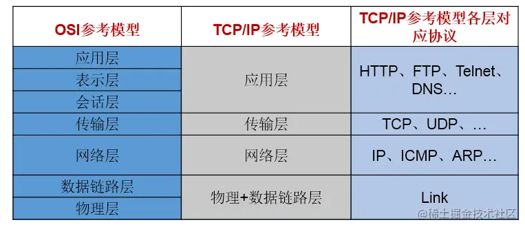

#### 4.2 TCP和UDP的区别

**TCP协议**：

- 使用TCP协议前，须先建立TCP连接，形成传输数据通道
- 传输前，采用“三次握手”方式，点对点通信，是可靠的
- TCP协议进行通信的两个应用进程：客户端、服务端。
- 在连接中可进行大数据量的传输
- 传输完毕，需释放已建立的连接，效率低

**UDP协议：**

- 将数据、源、目的封装成数据包，不需要建立连接
- 每个数据报的大小限制在64K内
- 发送不管对方是否准备好，接收方收到也不确认，故是不可靠的
- 可以广播发送
- 发送数据结束时无需释放资源，开销小，速度快

#### 4.3 TCP三次握手和四次挥手


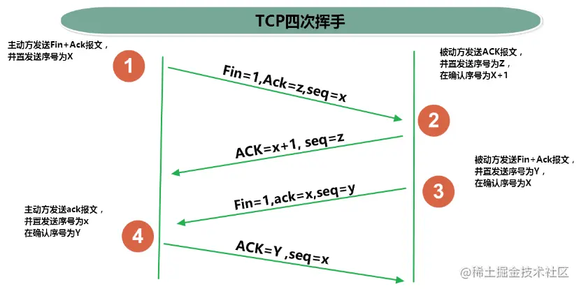

### 5. 套接字Socket

端口号与 IP 地址的组合得出一个网络套接字：`Socket`

- 利用套接字(`Socket`)开发网络应用程序早已被广泛的采用，以至于成为事实上的标准。
- 网络上具有唯一标识的 IP 地址和端口号组合在一起才能构成唯一能识别的标识符套接字。
- 通信的两端都要有 `Socket`，是两台机器间通信的端点。
- 网络通信其实就是 `Socket` 间的通信。
- `Socket` 允许程序把网络连接当成一个流，数据在两个 `Socket` 间通过 `IO` 传输。
- 一般主动发起通信的应用程序属客户端，等待通信请求的为服务端
- `Socket` 分类
  - 流套接字(`stream socket`)：使用TCP提供可依赖的字节流服务
  - 数据报套接字(`datagram socket`)：使用UDP提供“尽力而为”的数据报服务

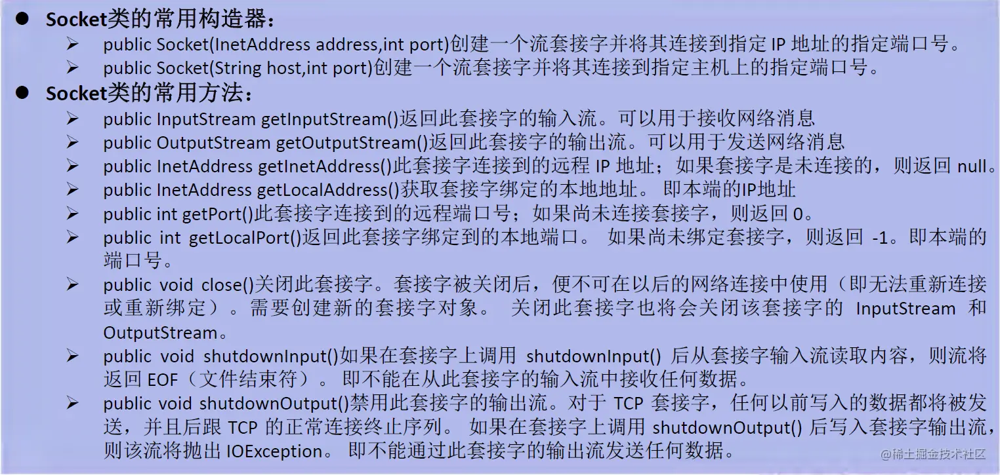

## 三、TCP网络编程

Java语言的基于套接字Socket编程分为客户端和服务端

**基于TCP的Socket通信模型**


### 1.基于Socke的TCP编程

#### 1.1客户端Socket的工作过程

- 创建 `Socket`：根据指定服务端的 IP地址或端口号构造 `Sσcket` 类对象。若服务器端响应，则建立客户端到服务器的通信线路。若连接失败，会出现异常。
- 打开连接到 `Socket` 的输入出流：使用 `getInputstream()` 方法获得输入流，使用`getOutputStream()` 方法获得输出流，进行数据传输
- 按照一定的协议对 `Socket` 进行读/写操作：通过输入流读取服务器放入线路的信息（但不能读取自己放入线路的信息），通过输出流将信息写入线程
- 关闭 `Socket`：断开客户端到服务器的连接，释放线路

**说明**：

- 客户端程序可以使用 `Socket` 类创建对象，创建的同时会自动向服务器方发起连接。
- `Socket` 的构造器是：
  - `Socket(String host，int port) throws UnknownHostException`，`EXCeption`：向服务器（域名是 `host`,端口号为 `port` ）发起 `TCP` 连接，若成功，则创建 `Socket` 对象，否则抛出异常。
  - `Socket(InetAddress address，int port)throws IOException`：根据 `InetAddress` 对象所表示的 `IP` 地址以及端口号 `port` 发起连接
- 客户端建立 socketAtClient对象的过程就是向服务器发出套接字连接请求

#### 1.2 服务器端Socket的工作过程：

- 调用 `ServerSocket(int port)`：创建一个服务器端套接字，并绑定到指定端口上。用于监听客户端的请求。
- 调用 `accept0()`：监听连接请求，如果客户端请求连接，则接受连接，返回通信套接字对象。
- 调用该 `Socket` 类对象的 `getOutputStream()` 和 `getInputStream()`：获取输出流和输入流，开始网络数据的发送和接收。
- 关闭 `ServerSocket` 和 `Socket` 对象：客户端访问结束，关闭通信套接字。

**说明：**

- `ServerSocket` 对象负责等待客户端请求建立套接字连接，类似邮局某个窗口中的业务员。也就是说，服务器必须事先建立一个等待客户请求建立套接字连接的 `Server Socket` 对象。
- 所谓“接收”客户的套接字请求，就是 `accept()` 方法会返回一个 `Socket` 对象

#### 1.3 代码示例

例子1：客户端发送信息给服务端，服务端将数据显示在控制台上

```java
public class TCPTest1 {

    //客户端
    @Test
    public void client()  {
        Socket socket = null;
        OutputStream os = null;
        try {
            //1.创建Socket对象，指明服务器端的ip和端口号
            InetAddress inet = InetAddress.getByName("192.168.14.100");
            socket = new Socket(inet,8899);
            //2.获取一个输出流，用于输出数据
            os = socket.getOutputStream();
            //3.写出数据的操作
            os.write("你好，我是客户端mm".getBytes());
        } catch (IOException e) {
            e.printStackTrace();
        } finally {
            //4.资源的关闭
            if(os != null){
                try {
                    os.close();
                } catch (IOException e) {
                    e.printStackTrace();
                }

            }
            if(socket != null){
                try {
                    socket.close();
                } catch (IOException e) {
                    e.printStackTrace();
                }

            }
        }
    }
    
    //服务端
    @Test
    public void server()  {

        ServerSocket ss = null;
        Socket socket = null;
        InputStream is = null;
        ByteArrayOutputStream baos = null;
        try {
            //1.创建服务器端的ServerSocket，指明自己的端口号
            ss = new ServerSocket(8899);
            //2.调用accept()表示接收来自于客户端的socket
            socket = ss.accept();
            //3.获取输入流
            is = socket.getInputStream();

            //不建议这样写，可能会有乱码
            //        byte[] buffer = new byte[1024];
            //        int len;
            //        while((len = is.read(buffer)) != -1){
            //            String str = new String(buffer,0,len);
            //            System.out.print(str);
            //        }
            //4.读取输入流中的数据
            baos = new ByteArrayOutputStream();
            byte[] buffer = new byte[5];
            int len;
            while((len = is.read(buffer)) != -1){
                baos.write(buffer,0,len);
            }

            System.out.println(baos.toString());

            System.out.println("收到了来自于：" + socket.getInetAddress().getHostAddress() + "的数据");

        } catch (IOException e) {
            e.printStackTrace();
        } finally {
            if(baos != null){
                //5.关闭资源
                try {
                    baos.close();
                } catch (IOException e) {
                    e.printStackTrace();
                }
            }
            if(is != null){
                try {
                    is.close();
                } catch (IOException e) {
                    e.printStackTrace();
                }
            }
            if(socket != null){
                try {
                    socket.close();
                } catch (IOException e) {
                    e.printStackTrace();
                }
            }
            if(ss != null){
                try {
                    ss.close();
                } catch (IOException e) {
                    e.printStackTrace();
                }
            }

        }
   }
}

```

例题2：客户端发送文件给服务端，服务端将文件保存在本地。

```java
public class TCPTest2 {

    /*
    这里涉及到的异常，应该使用try-catch-finally处理
     */
    @Test
    public void client() throws IOException {
        //1.
        Socket socket = new Socket(InetAddress.getByName("127.0.0.1"),9090);
        //2.
        OutputStream os = socket.getOutputStream();
        //3.
        FileInputStream fis = new FileInputStream(new File("beauty.jpg"));
        //4.
        byte[] buffer = new byte[1024];
        int len;
        while((len = fis.read(buffer)) != -1){
            os.write(buffer,0,len);
        }
        //5.
        fis.close();
        os.close();
        socket.close();
    }

    /*
    这里涉及到的异常，应该使用try-catch-finally处理
     */
    @Test
    public void server() throws IOException {
        //1.
        ServerSocket ss = new ServerSocket(9090);
        //2.
        Socket socket = ss.accept();
        //3.
        InputStream is = socket.getInputStream();
        //4.
        FileOutputStream fos = new FileOutputStream(new File("beauty1.jpg"));
        //5.
        byte[] buffer = new byte[1024];
        int len;
        while((len = is.read(buffer)) != -1){
            fos.write(buffer,0,len);
        }
        //6.
        fos.close();
        is.close();
        socket.close();
        ss.close();

    }
}

```

例题3：从客户端发送文件给服务端，服务端保存到本地。并返回“发送成功”给客户端。

```java
public class TCPTest3 {

    /*
        这里涉及到的异常，应该使用try-catch-finally处理
         */
    @Test
    public void client() throws IOException {
        //1.
        Socket socket = new Socket(InetAddress.getByName("127.0.0.1"),9090);
        //2.
        OutputStream os = socket.getOutputStream();
        //3.
        FileInputStream fis = new FileInputStream(new File("beauty.jpg"));
        //4.
        byte[] buffer = new byte[1024];
        int len;
        while((len = fis.read(buffer)) != -1){
            os.write(buffer,0,len);
        }
        //关闭数据的输出
        socket.shutdownOutput();

        //5.接收来自于服务器端的数据，并显示到控制台上
        InputStream is = socket.getInputStream();
        ByteArrayOutputStream baos = new ByteArrayOutputStream();
        byte[] bufferr = new byte[20];
        int len1;
        while((len1 = is.read(buffer)) != -1){
            baos.write(buffer,0,len1);
        }

        System.out.println(baos.toString());

        //6.
        fis.close();
        os.close();
        socket.close();
        baos.close();
    }

    /*
    这里涉及到的异常，应该使用try-catch-finally处理
     */
    @Test
    public void server() throws IOException {
        //1.
        ServerSocket ss = new ServerSocket(9090);
        //2.
        Socket socket = ss.accept();
        //3.
        InputStream is = socket.getInputStream();
        //4.
        FileOutputStream fos = new FileOutputStream(new File("beauty2.jpg"));
        //5.
        byte[] buffer = new byte[1024];
        int len;
        while((len = is.read(buffer)) != -1){
            fos.write(buffer,0,len);
        }

        System.out.println("图片传输完成");

        //6.服务器端给予客户端反馈
        OutputStream os = socket.getOutputStream();
        os.write("你好，美女，照片我已收到，非常漂亮！".getBytes());

        //7.
        fos.close();
        is.close();
        socket.close();
        ss.close();
        os.close();

    }
}

```

## 四、UDP网络编程

### 1. 简述

- 类 `DatagramSocket` 和 `DatagramPacket` 实现了基于 `UDP` 协议网络程序。
- `UDP` 数据报通过数据报套接字 `DatagramSocket` 发送和接收，系统不保证 `UDP` 数据报一定能够安全送到目的地，也不能确定什么时候可以抵达。
- `DatagramPacket` 对象封装了 `UDP` 数据报，在数据报中包含了发送端的 `IP` 地址和端口号以及接收端的 `IP` 地址和端口号
- `UDP` 协议中每个数据报都给出了完整的地址信息，因此无须建立发送方和接收方的连接。如同发快递包裹一样。

### 2. DatagramSocket 类常用方法


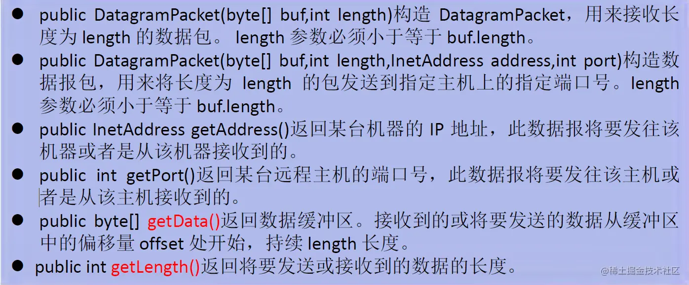

### 3. DatagramSocket 类的使用

流程：

1. `DatagramSocket` 与 `DatagramPacket`
2. 建立发送端，接收端
3. 建立数据包
4. 调用 `Socket` 的发送、接收方法
5. 关闭 `Socket`

注意：发送端与接收端是两个独立的运行程序

**代码示例：**

```java
public class UDPTest {

    //发送端
    @Test
    public void sender() throws IOException {

        DatagramSocket socket = new DatagramSocket();


        String str = "我是UDP方式发送的导弹";
        byte[] data = str.getBytes();
        InetAddress inet = InetAddress.getLocalHost();
        DatagramPacket packet = new DatagramPacket(data,0,data.length,inet,9090);

        socket.send(packet);

        socket.close();

    }
    //接收端
    @Test
    public void receiver() throws IOException {

        DatagramSocket socket = new DatagramSocket(9090);

        byte[] buffer = new byte[100];
        DatagramPacket packet = new DatagramPacket(buffer,0,buffer.length);

        socket.receive(packet);

        System.out.println(new String(packet.getData(),0,packet.getLength()));

        socket.close();
    }
}

```

## 五、URL编程

- `URL(Uniform Resource Locator)`：统一资源定位符，它表示 Internet 上某一资源的地址。

- 它是一种具体的 `URI`，即 `URL` 可以用来标识一个资源，而且还指明了如何 locate 这个资源。

- 通过 `URL` 我们可以访问 Internet 上的各种网络资源，比如最常见的 www，ftp站点。浏览器通过解析给定的 `URL` 可以在网络上查找相应的文件或其他资源

- URL的基本结构由5部分组成: <传输协议>：//<主机名>：<端口号>/<文件名>#片段名？参数列表

  例如： `http://192.168.1.100:8080/helloworld/indexjsp#a?username=shkstart&password=123`

  **#片段名**：即锚点，例如看小说，直接定位到章节

  **参数列表格式**：参数名=参数值&参数名=参数值...

### 1. URL类

#### 1.1 构造器

为了表示 `URL`，`java.net`中实现了类 `URL`。我们可以通过下面的构造器来初始化一个 `URL` 对象

- `public URL(String spec)`：通过一个表示 `URL` 地址的字符串可以构造一个 `URL` 对象。 例如：`URL url = new URL（"[http://www.baidu.com/](http://www.baidu.com/)");`

- `public URL(URL context,String spec)`：通过基URL和相对URL构造一个URL对象

  例如： `URL downloadeUrl = new URL(url,"download.html");`

- `public URL(String protocol,String host,String file);` `` 例如：`new URL("http","[www.baidu.com](http://www.baidu.com)",80,"download.html");`

- `public URL(String protocol,String host,int port,String file);`

  例如：`new URL("http","[www.baidu.com](http://www.baidu.com)",80,"download.html");`

注意：`URL` 类的构造器都声明抛出非运行时异常，必须要对这一异常进行处理，通常是用 `try-catch` 语句进行捕获。

#### 1.2 方法

- `public String getProtocol()` 获取该 `URL` 的协议名
- `public String getHost()` 获取该 `URL` 的主机名
- `public String getPort()` 获取该 `URL` 的端口号
- `public String getPath()` 获取该 `URL` 的文件路径
- `public String getFile()` 获取该 `URL` 的文件名
- `public String getQuery()` 获取该 `URL` 的查询名

**代码示例**

```java
public class URLTest {

    public static void main(String[] args) {

        try {

            URL url = new URL("http://localhost:8080/examples/beauty.jpg?username=Tom");

//            public String getProtocol(  )     获取该URL的协议名
            System.out.println(url.getProtocol());
//            public String getHost(  )           获取该URL的主机名
            System.out.println(url.getHost());
//            public String getPort(  )            获取该URL的端口号
            System.out.println(url.getPort());
//            public String getPath(  )           获取该URL的文件路径
            System.out.println(url.getPath());
//            public String getFile(  )             获取该URL的文件名
            System.out.println(url.getFile());
//            public String getQuery(   )        获取该URL的查询名
            System.out.println(url.getQuery());
        } catch (MalformedURLException e) {
            e.printStackTrace();
        }

    }
}

```

例子：通过URL下载

```java
public class URLTest1 {

    public static void main(String[] args) {

        HttpURLConnection urlConnection = null;
        InputStream is = null;
        FileOutputStream fos = null;
        try {
            URL url = new URL("http://localhost:8080/examples/beauty.jpg");

            urlConnection = (HttpURLConnection) url.openConnection();

            urlConnection.connect();

            is = urlConnection.getInputStream();
            fos = new FileOutputStream("beauty3.jpg");

            byte[] buffer = new byte[1024];
            int len;
            while((len = is.read(buffer)) != -1){
                fos.write(buffer,0,len);
            }

            System.out.println("下载完成");
        } catch (IOException e) {
            e.printStackTrace();
        } finally {
            //关闭资源
            if(is != null){
                try {
                    is.close();
                } catch (IOException e) {
                    e.printStackTrace();
                }
            }
            if(fos != null){
                try {
                    fos.close();
                } catch (IOException e) {
                    e.printStackTrace();
                }
            }
            if(urlConnection != null){
                urlConnection.disconnect();
            }
        }
    }
}
```


# Java之反射

## 一、反射的概述

### 1. 反射的简介

- Reflection（反射)是被视为动态语言的关键，反射机制允许程序在执行期借助于 `Reflection API` 取得任何类的内部信息，并能直接操作任意对象的内部属性及方法。
- 加载完类之后，在堆内存的方法区中就产生了一个 `Class` 类型的对象（一个类只有一个 `Class` 对象），这个对象就包含了完整的类的结构信息。我们可以通过这个对象看到类的结构。这个对象就像一面镜子，透过这个镜子看到类的结构，所以，我们形象的称之为：反射。

通常的方式：引入需要的“包类”名称---->通过 `new` 实例化---->获得实例化对象

反射的方式：实例化对象----> `getClass()` 方法---->得到完整的“包类”名称

框架 = 注解 + 反射 + 设计模式

### 2. 反射动态性体现

只有当程序运行时我们才能知道调用的类

```java
@Test
public void test2(){

    for(int i = 0;i < 100;i++){
        int num = new Random().nextInt(3);//0,1,2
        String classPath = "";
        switch(num){
            case 0:
                classPath = "java.util.Date";
                break;
            case 1:
                classPath = "java.lang.Object";
                break;
            case 2:
                classPath = "com.atguigu.java.Person";
                break;
        }

        try {
            Object obj = getInstance(classPath);
            System.out.println(obj);
        } catch (Exception e) {
            e.printStackTrace();
        }
    }
}

/*
    创建一个指定类的对象。
    classPath:指定类的全类名
     */
public Object getInstance(String classPath) throws Exception {
    Class clazz =  Class.forName(classPath);
    return clazz.newInstance();
}

```

### 3. 反射机制提供的功能

- 在运行时判断任意一个对象所属的类
- 在运行时构造任意一个类的对象
- 在运行时判断任意一个类所具有的成员变量和方法
- 在运行时获取泛型信息
- 在运行时调用任意一个对象的成员变量和方法
- 在运行时处理注解
- 生成动态代理

**代码示例**

```java
@Test
public void test1() throws Exception {
    Class<Person> clazz = Person.class;
    //1.通过反射，创建Person类对象
    Constructor<Person> cons = clazz.getConstructor(String.class, int.class);
    Person person = cons.newInstance("Tom", 12);
    System.out.println(person);//Person{name='Tom', age=12}

    //2.通过反射，调用对象指定的属性、方法
    //调用属性
    Field age = clazz.getDeclaredField("age");
    age.setAccessible(true);
    age.set(person, 10);
    System.out.println(person.toString());//Person{name='Tom', age=10}

    //调用方法
    Method show = clazz.getDeclaredMethod("show");
    show.invoke(person);//my name is Tom and age is 10

    System.out.println("===================================");
    //通过反射，可以调用Person类的私有结构的。比如：私有的构造器、方法、属性
    //调用私有的构造器
    Constructor<Person> cons1 = clazz.getDeclaredConstructor(String.class);
    cons1.setAccessible(true);
    Person p1 = cons1.newInstance("Bruce");
    System.out.println(p1);//Person{name='Bruce', age=0}

    //调用私有的属性
    Field name = clazz.getDeclaredField("name");
    name.setAccessible(true);
    name.set(p1, "Jarry");
    System.out.println(p1);

    //调用私有的方法
    Method nation = clazz.getDeclaredMethod("nation", String.class);
    nation.setAccessible(true);
    Object nation1 = (String) nation.invoke(p1, "China");//相当于String nation = p1.showNation("China")
    System.out.println(nation1);//I come from China
}

```

### 4. 相关API

- `java.lang.Class`：反射的源头
- `java.lang.reflect.Method`：反射方法
- `java.lang.reflect.Field`：反射参数
- `java.lang.reflect.Constructor`：反射构造器
- ....

## 二、Class类

### 1. Class简述

- 在 `Object` 类中定义了以下的方法，此方法将被所有子类继承：

```
 public final Class getClass()
```

- 以上的方法返回值的类型是一个 `Class` 类，此类是Java反射的源头，实际上所谓反射从程序的运行结果来看也很好理解，即可以通过对象反射求出类的名称。
- 对象使用反射后可以得到的信息：某个类的属性、方法和构造器、某个类到底实现了哪些接口。对于每个类而言，JRE都为其保留一个不变的Class类型的对象。一个Class对象包含了特定某个结构（ `class/interface/enum/annotation/primitive type/void/[]`）的有关信息。
  - `Class` 本身也是一个类
  - `Class` 对象只能由系统建立对象
  - 一个加载的类在 JVM 中只会有一个 `Class` 实例
  - 一个 `Class` 对象对应的是一个加载到 JVM 中的一个 `.class` 文件
  - 每个类的实例都会记得自己是由哪个 `Class` 实例所生成
  - 通过 `Class` 可以完整地得到一个类中的所有被加载的结构
  - `Class` 类是 Reflection 的根源，针对任何你想动态加载、运行的类，唯有先获得相应的 `Class` 对象

**类的加载过程：**

- 程序经过 `javac.exe` 命令以后，会生成一个或多个字节码文件(`.class` 结尾)。接着我们使用 `java.exe` 命令对某个字节码文件进行解释运行。相当于将某个字节码文件加载到内存中。此过程就称为类的加载。加载到内存中的类，我们就称为运行时类，此运行时类，就作为 `Class` 的一个实例。
- 换句话说，`Class` 的实例就对应着一个运行时类。
- 加载到内存中的运行时类，会缓存一定的时间。在此时间之内，我们可以通过不同的方式来获取此运行时类。

### 2. Class类的常用方法


**代码示例：**

```java
//创建Class的实例
String str = "test1.Person";
Class clazz = Class.forName(str);
//调用Class的空参构造器创建对象
Object obj = clazz.newInstance;
//获取clazz的name属性
Field field = clazz.getField("name");
field.set(obj,"Jarry");

Object name = filed.get(obj);
System.out.println(name);
//test1.Person为test1包下的Person类

```

### 3. 获取Class实例的几种方式：

1）已知具体的类，通过类的 `class` 属性获取，该方法最为安全可靠，程序性能最高 实例：`Class clazz = String.class;`

2）已知某个类的实例，调用该实例的 `getclass()` 方法获取 `Class` 对象 实例：`Class clazz=person.getclass(); `

3）已知一个类的全类名，且该类在类路径下，可通过 `Class` 类的静态方法 `forName()` 获取，可能抛出 `ClassNotFoundException`（比较常用）

实例：`Class clazz = Class.forName(String classPath)`

4）通过类加载器 `ClassLoader cl = this.getclass().getClassLoader();` `Class clazz = cl.loadClass("类的全类名");`

**代码示例**

```java
@Test
public void test2() throws ClassNotFoundException {
    //方式一：调用运行时类的属性：.class
    Class<Person> clazz1 = Person.class;
    System.out.println(clazz1);//class cn.bruce.java.Person

    //方式二：通过运行时类的对象,调用getClass()
    Person p1 = new Person();
    Class<? extends Person> clazz2 = p1.getClass();
    System.out.println(clazz2);//class cn.bruce.java.Person

    //方式三：调用Class的静态方法：forName(String classPath)
    Class<?> clazz3 = Class.forName("cn.bruce.java.Person");
    System.out.println(clazz3);//class cn.bruce.java.Person

    System.out.println(clazz1 == clazz2);//true
    System.out.println(clazz1 == clazz3);//true
    //方式四：使用类的加载器：ClassLoader  (了解)
    ClassLoader classLoader = ReflectionTest.class.getClassLoader();
    Class<?> clazz4 = classLoader.loadClass("cn.bruce.java.Person");
    System.out.println(clazz4);//class cn.bruce.java.Person
    System.out.println(clazz1 == clazz4);//true
}

```

#### 总结：创建类的对象的方式?

方式一：new + 构造器

方式二：要创建Xxx类的对象，可以考虑：Xxx、Xxxs、XxxFactory、XxxBuilder类中查看是否有静态方法的存在。可以调用其静态方法，创建Xxx对象。

方式三：通过反射

### 4. Class实例可以代表的结构

（1）`class`：外部类，成员（成员内部类，静态内部类），局部内部类，匿名内部类

（2）`interface`：接口

（3）`[]`：数组

（4）`enum`：枚举

（5）`annotation`：注解@interface

（6）`primitive type`：基本数据类型

（7）`void`：无返回值

> 在Java中万事万物皆对象

**代码示例**

```java
@Test
public void test3(){
    Class<Object> c1 = Object.class;
    Class<Comparable> c2 = Comparable.class;
    Class<String[]> c3 = String[].class;
    Class<int[][]> c4 = int[][].class;
    Class<ElementType> c5 = ElementType.class;
    Class<Override> c6 = Override.class;
    Class<Integer> c7 = int.class;
    Class<Void> c8 = void.class;
    Class<Class> c9 = Class.class;

    int[] i1 = new int[10];
    int[] i2 = new int[100];
    Class<? extends int[]> c10 = i1.getClass();
    Class<? extends int[]> c11 = i2.getClass();
    // 只要数组的元素类型与维度一样，就是同一个Class
    System.out.println(c10 == c11);//true
}

```

## 三、类的加载

### 1. 类的加载过程

当程序主动使用某个类时，如果该类还未被加载到内存中，则系统会通过以下三个步骤对该类进行初始化。


- 加载：将 `class` 文件字节码内容加载到内存中，并将这些静态数据转换成方法区的运行时数据结构，然后生成一个代表这个类的 `java.lang.Class` 对象，作为方法区中类数据的访问入口（即引用地址）。所有需要访问和使用类数据只能通过这个 `Class` 对象。这个加载的过程需要类加载器参与。
- 链接：将 Java类的二进制代码合并到JVM的运行状态之中的过程。 
  - 验证：确保加载的类信息符合JVM规范，例如：以 `cafe` 开头，没有安全方面的问题。
  - 准备：正式为类变量(`static`)分配内存并设置类变量默认初始值的阶段，这些内存都将在方法区中进行分配。
  - 解析：虚拟机常量池内的符号引用（常量名）替换为直接引用（地址）的过程。
- 初始化： 
  - 执行类构造器 `()` 方法的过程。类构造器 `()` 方法是由编译期自动收集类中所有类变量的赋值动作和静态代码块中的语句合并产生的。（类构造器是构造类信息的，不是构造该类对象的构造器）。
  - 当初始化一个类的时候，如果发现其父类还没有进行初始化，则需要先触发其父类的初始化。
  - 虚拟机会保证一个类的 `()` 方法在多线程环境中被正确加锁和同步。

**代码示例：**

```java
public class ClassLoadingTest{
    public static void main (String [] args){
        System.out.println(test.m);
    }
}

class test{
    static {
        m = 300;
    }
    static int m = 100;
}
//第一步：加载
//第二步：链接结束后m=0
//第三步：初始化结束后，m的值由<clinit>()方法执行决定
/*
这个test构造器<clinit>()方法由类变量的赋值和静态代码块中的语句按照顺序合并产生，类似于
<clinit>(){
m = 300;
m = 100;
}
*/

```

### 2. Java类编译、运行的执行的流程


### 3. 类的加载器的作用

- 将 `class` 文件字节码内容加载到内存中，并将这些静态数据转换成方法区的运行时数据结构，然后在堆中生成一个代表这个类的 `java.lang.Class` 对象，作为方法区中类数据的访问入口。
- 类缓存：标准的 `JavaSE` 类加载器可以按要求查找类，但一旦某个类被加载到类加载器中，它将维持加载（缓存）一段时间。不过JVM垃圾回收机制可以回收这些 `Class` 对象

### 4. 类的加载器的分类


```java
@Test
public void test1(){
    //对于自定义类，使用系统类加载器进行加载
    ClassLoader classLoader = ClassLoaderTest.class.getClassLoader();
    System.out.println(classLoader);
    //调用系统类加载器的getParent()：获取扩展类加载器
    ClassLoader classLoader1 = classLoader.getParent();
    System.out.println(classLoader1);
    //调用扩展类加载器的getParent()：无法获取引导类加载器
    //引导类加载器主要负责加载java的核心类库，无法加载自定义类的。
    ClassLoader classLoader2 = classLoader1.getParent();
    System.out.println(classLoader2);

    ClassLoader classLoader3 = String.class.getClassLoader();
    System.out.println(classLoader3);

}

```

### 5. 使用Classloader加载src目录下的配置文件

```java
@Test
public void test3(){
    Properties pros = new Properties();
    //        //读取配置文件的方式一：
    //        //此时的文件默认在当前的module下。
    //        FileInputStream fis = null;
    //        try {
    //            fis = new FileInputStream("jdbc1.properties");
    //            pros.load(fis);
    //        } catch (IOException e) {
    //            e.printStackTrace();
    //        } finally {
    //            if (fis != null) {
    //                try {
    //                    fis.close();
    //                } catch (IOException e) {
    //                    e.printStackTrace();
    //                }
    //            }
    //        }

    //读取配置文件的方式二：使用ClassLoader
    //配置文件默认识别为：当前module的src下
    ClassLoader classLoader = ClassLoaderTest.class.getClassLoader();
    InputStream is = classLoader.getResourceAsStream("jdbc1.properties");
    try {
        pros.load(is);
    } catch (IOException e) {
        e.printStackTrace();
    }

    String user = pros.getProperty("user");
    String password = pros.getProperty("password");
    System.out.println("user = " + user + " password =" + password);
}

```

## 四、反射的应用

### 1. 创建运行时类的对象

#### 1.1代码举例

```java
@Test
public void test1() throws Exception {
    //方式一
    Class<Person> clazz1 = Person.class;
    //方式二
    Class<Person> clazz2 = (Class<Person>) Class.forName("cn.bruce.java.Person");

    Person person1 = clazz1.newInstance();
    Person person2 = clazz2.newInstance();
    System.out.println(person1);
    System.out.println(person2);

}

```

#### 1.2 说明

`newInstance()`:调用此方法，创建对应的运行时类的对象。内部调用了运行时类的空参的构造器。

要想此方法正常的创建运行时类的对象，要求：

- 运行时类必须提供空参的构造器
- 空参的构造器的访问权限得够。通常，设置为 `public`。

在 `javabean` 中要求提供一个 `public` 的空参构造器。原因：

- 便于通过反射，创建运行时类的对象
- 便于子类继承此运行时类时，默认调用 `super()` 时，保证父类此构造器

### 2. 获取运行时类的完整结构

我们可以通过反射，获取对应的运行时类中所有的属性、方法、构造器、父类、接口、父类的泛型、包、注解、异常等。。。。

#### 2.1 使用反射可以取得：

1. 实现的全部接口： `public Class[] getInterfaces()` 确定此对象所表示的类或接口实现的接口。

2. 所继承的父类： `public Class getSuperclass()` 返回表示此 `Class` 所表示的实体（类、接口、基本类型）的父类的 `Class`。

3. 全部的构造器：

   `public Constructor[] getConstructors()`

   返回此 `Class` 对象所表示的类的所有 `public` 构造方法。

   `public Constructor[] getDeclaredConstructors()`

   返回此Class对象表示的类声明的所有构造方法。

   在Constructor类中:

   - 取得修饰符：`public int getModifiers();`
   - 取得方法名称： `public String getName();`
   - 取得参数的类型： `public Class getParameterTypes();`

4. 全部的方法：

   `public Method[] getDeclaredMethods()`

   返回此Class对象所表示的类或接口的全部方法

   `public Method[] getMethods()`

   返回此 `Class` 对象所表示的类或接口的 `public` 的方法

   `Method` 类中：

   - `public Class getReturnType()`：取得全部的返回值
   - `public Class[] getParameterTypes()`：取得全部的参数
   - `public int getModifiers()`：取得修饰符
   - `public Class [] getEXceptionTypes()`：取得异常信息

5. 全部的 `Field`:

   `public Field[] getFields()`

   返回此 `Class` 对象所表示的类或接口的 `public` 的 `Field`。

   `public Field[] getDeclaredFields()`

   返回此 `Class` 对象所表示的类或接口的全部 `Field`

   `Field` 方法中

   - `public int getModifiers()`：以整数形式返回此 `Field` 的修饰符
   - `public Class getType()`：得到 `Field` 的属性类型
   - `public String getName()`：返回 `Field` 的名称。

6. `Annotation` 相关

   `get Annotation(Class annotationClass)`

   `getDeclaredAnnotations()`

7. 泛型相关

   获取父类泛型类型：`Type getGenericSuperclass()`

   泛型类型：`ParameterizedType`

   获取实际的泛型类型参数数组：`getActualTypeArguments()`

8. 类所在的包 `Package getPackage()`

#### 2.2 代码示例

**获取属性 Fieled**

```java
public class FiledTest {
    @Test
    public void test1() {
        Class<Person> clazz = Person.class;
        //获取属性结构
        //getFields():获取当前运行时类及其父类中声明为public访问权限的属性
        Field[] fields = clazz.getFields();
        for (Field f :
             fields) {
            System.out.println(f);
        }
        System.out.println();
        //getDeclaredFields():获取当前运行时类中声明的所有属性。（不包含父类中声明的属性）
        Field[] declaredFields = clazz.getDeclaredFields();
        for (Field f :
             declaredFields) {
            System.out.println(f);
        }
    }

    //权限修饰符  数据类型 变量名
    @Test
    public void test2() throws ClassNotFoundException {
        Class<?> clazz = Class.forName("cn.bruce.java1.Person");
        Field[] declaredFields = clazz.getDeclaredFields();
        for (Field f :
             declaredFields) {
            //1.权限修饰符
            int modifiers = f.getModifiers();
            System.out.print(Modifier.toString(modifiers)+"\t");

            //2.数据类型
            Class<?> type = f.getType();
            System.out.print(type.getName()+"\t");

            //3.变量名
            String fName = f.getName();
            System.out.print(fName);

            System.out.println();
        }
    }
}

```

**获取方法 Method**

```java
public class MethodTest {
    @Test
    public void test1() {
        Class<Person> clazz = Person.class;
        //getMethods():获取当前运行时类及其所有父类中声明为public权限的方法
        Method[] methods = clazz.getMethods();
        for (Method m :
             methods) {
            System.out.println(m);
        }
        System.out.println("============");
        //getDeclaredMethods():获取当前运行时类中声明的所有方法。（不包含父类中声明的方法）
        Method[] declaredMethods = clazz.getDeclaredMethods();
        for (Method m :
             declaredMethods) {
            System.out.println(m);
        }
    }

    /*
    @Xxxx
    权限修饰符  返回值类型  方法名(参数类型1 形参名1,...) throws XxxException{}
     */
    @Test
    public void test2() throws ClassNotFoundException {
        Class<?> clazz = Class.forName("cn.bruce.java1.Person");
        Method[] declaredMethods = clazz.getDeclaredMethods();
        for (Method m :
             declaredMethods) {
            //1.获取方法声明的注解
            Annotation[] annos = m.getAnnotations();
            for (Annotation a :
                 annos) {
                System.out.println(a);
            }

            //2.权限修饰符
            System.out.print(Modifier.toString(m.getModifiers())+"\t");

            //3.返回值类型
            System.out.print(m.getReturnType().getName() + "\t");

            //4.方法名
            System.out.print(m.getName());
            System.out.print("(");

            //5.形参列表
            Class<?>[] parameterTypes = m.getParameterTypes();
            if (!(parameterTypes == null && parameterTypes.length == 0)) {
                for (int i = 0; i < parameterTypes.length; i++) {
                    if (i == parameterTypes.length - 1) {
                        System.out.print(parameterTypes[i].getName() + " args_" + i);
                        break;
                    }
                    System.out.print(parameterTypes[i].getName() + "args_" + i + ",");
                }
            }
            System.out.print(")");

            //6.抛出的异常
            Class<?>[] exceptionTypes = m.getExceptionTypes();
            if (exceptionTypes.length > 0){
                System.out.print("throws ");
                for (int i = 0; i < exceptionTypes.length; i++) {
                    if (i==exceptionTypes.length -1){
                        System.out.print(exceptionTypes[i].getName());
                        break;
                    }
                    System.out.print(exceptionTypes[i].getName()+",");
                }

                System.out.println();
            }


        }
    }
}

```

**获取其他结构**

```java
public class OtherTest {
    /*
    获取构造器结构
     */
    @Test
    public void test1() {
        Class<Person> clazz = Person.class;
        //getConstructors():获取当前运行时类中声明为public的构造器
        Constructor<?>[] constructors = clazz.getConstructors();
        for (Constructor c :
             constructors) {
            System.out.println(c);
        }
        System.out.println("================");
        //getDeclaredConstructors():获取当前运行时类中声明的所有的构造器
        Constructor<?>[] declaredConstructors = clazz.getDeclaredConstructors();
        for (Constructor c :
             declaredConstructors) {
            System.out.println(c);
        }
    }
    /*
    获取运行时类的父类
     */
    @Test
    public void test2(){
        Class<Person> clazz = Person.class;

        Class<? super Person> superclass = clazz.getSuperclass();
        System.out.println(superclass);
    }
    /*
    获取运行时类的带泛型的父类
     */
    @Test
    public void test3(){
        Class<Person> clazz = Person.class;

        Type genericSuperclass = clazz.getGenericSuperclass();
        System.out.println(genericSuperclass);
    }
    /*
    获取运行时类的带泛型的父类的泛型
    代码：逻辑性代码  vs 功能性代码
     */
    @Test
    public void test4(){
        Class clazz = Person.class;

        Type genericSuperclass = clazz.getGenericSuperclass();
        ParameterizedType paramType = (ParameterizedType) genericSuperclass;
        //获取泛型类型
        Type[] actualTypeArguments = paramType.getActualTypeArguments();
        //        System.out.println(actualTypeArguments[0].getTypeName());
        System.out.println(((Class)actualTypeArguments[0]).getName());
    }

    /*
    获取运行时类实现的接口
     */
    @Test
    public void test5(){
        Class clazz = Person.class;

        Class[] interfaces = clazz.getInterfaces();
        for(Class c : interfaces){
            System.out.println(c);
        }

        System.out.println();
        //获取运行时类的父类实现的接口
        Class[] interfaces1 = clazz.getSuperclass().getInterfaces();
        for(Class c : interfaces1){
            System.out.println(c);
        }

    }
    /*
        获取运行时类所在的包
     */
    @Test
    public void test6(){
        Class clazz = Person.class;

        Package pack = clazz.getPackage();
        System.out.println(pack);
    }

    /*
        获取运行时类声明的注解
     */
    @Test
    public void test7(){
        Class clazz = Person.class;

        Annotation[] annotations = clazz.getAnnotations();
        for(Annotation annos : annotations){
            System.out.println(annos);
        }
    }
}

```

### 3. 调用运行时类的指定结构

#### 3.1 调用指定的属性

在反射机制中，可以直接通过 `Field` 类操作类中的属性，通过 `Field` 类提供的 `set()` 和`get()` 方法就可以完成设置和取得属性内容的操作。

- `public Field getField(String name)` 返回此 `Class` 对象表示的类或接口的指定的 `public` 的 `Field`。

- `public Field getDeclaredField(String name)` 返回此 `Class` 对象表示的类或接口的指定的 `Field`。

  在 `Field` 中:

- `public Object get(object obj)` 取得指定对象 `obj` 上此 `Field` 的属性内容

- `public void set(Object obj,Object value)` 设置指定对象 `obj` 上此 `Field` 的属性内容

**代码示例**

```java
@Test
public void testField() throws Exception {
    Class clazz = Person.class;

    //创建运行时类的对象
    Person p = (Person) clazz.newInstance();

    //1. getDeclaredField(String fieldName):获取运行时类中指定变量名的属性
    Field name = clazz.getDeclaredField("name");

    //2.保证当前属性是可访问的
    name.setAccessible(true);
    //3.获取、设置指定对象的此属性值
    name.set(p,"Tom");

    System.out.println(name.get(p));
}

```

#### 3.2调用指定的方法（常用）

通过反射，调用类中的方法，通过 `Method` 类完成。步骤:

1. 通过 `Class` 类的 `getMethod(String name,Class… parameterTypes)` 方法取得一个 `Method` 对象，并设置此方法操作时所需要的参数类型。
2. 之后使用 `Object invoke(Object obj， Object[] args)` 进行调用，并向方法中传递要设置的 `obj` 对象的参数信息。


**Object invoke(object obj,Object... args)方法：**

1. `Object` 对应原方法的返回值，若原方法无返回值，此时返回 `null`
2. 若原方法若为静态方法，此时形参 `Object obj` 可为 `null`
3. 若原方法形参列表为空，则 `Object[] args` 为 `null`
4. 若原方法声明为 `private`，则需要在调用此 `invoke()` 方法前，显式调用方法对象的 `setAccessible(true)` 方法，将可访问 `private` 的方法。

**关于 setAccessible 方法的使用：**

- `Method` 和 `Field`、`Constructor` 对象都有 `setAccessible()` 方法。
- `setAccessible` 是启动和禁用访问安全检查的开关
- 参数值为 `true` 则指示反射的对象在使用时应该取消 Java 语言访问检査。
- 提高反射的效率。如果代码中必须用反射，而该句代码需要频繁的被调用，那么请设置为true. 使得原本无法访问的私有成员也可以访问
- 参数值为 `false` 则指示反射的对象应该实施 Java 语言访问检査。

**代码示例**

```java
@Test
public void testMethod() throws Exception {
    Class<Person> clazz = Person.class;

    //创建运行时类的对象
    Person person = clazz.newInstance();

    /*
        1.获取指定的某个方法
        getDeclaredMethod():参数1 ：指明获取的方法的名称  参数2：指明获取的方法的形参列表
         */
    Method show = clazz.getDeclaredMethod("show", String.class);

    //2.保证当前方法是可访问的
    show.setAccessible(true);

    /*
        3. 调用方法的invoke():参数1：方法的调用者  参数2：给方法形参赋值的实参
        invoke()的返回值即为对应类中调用的方法的返回值。
         */
    Object returnValue = show.invoke(person, "CHN");
    System.out.println(returnValue);

    System.out.println("*************如何调用静态方法*****************");

    Method showDesc = clazz.getDeclaredMethod("showDesc");
    showDesc.setAccessible(true);
    //如果调用的运行时类中的方法没有返回值，则此invoke()返回null
    //Object returnVal = showDesc.invoke(null);
    Object returnVal = showDesc.invoke(Person.class);
    System.out.println(returnVal);
}

```

#### 3.3 调用指定的构造器

**代码示例**

```java
@Test
public void testConstructor() throws Exception {
    Class clazz = Person.class;

    //private Person(String name)
    /*
        1.获取指定的构造器
        getDeclaredConstructor():参数：指明构造器的参数列表
         */

    Constructor constructor = clazz.getDeclaredConstructor(String.class);

    //2.保证此构造器是可访问的
    constructor.setAccessible(true);

    //3.调用此构造器创建运行时类的对象
    Person per = (Person) constructor.newInstance("Tom");
    System.out.println(per);

}

```

### 4. 动态代理

#### 4.1代理设计模式的原理:

使用一个代理将对象包装起来，然后用该代理对象取代原始对象。任何对原始对象的调用都要通过代理。代理对象决定是否以及何时将方法调用转到原始对象上。

#### 4.2 静态代理

**代码示例：**

```java
interface ClothFactory{
    void produceCloth();
}

//被代理类
class NikeClothFactory implements ClothFactory{

    @Override
    public void produceCloth() {
        System.out.println("Nike 生产衣服");
    }
}

//代理类
class ProxyClothFactory implements ClothFactory{

    private ClothFactory factory;//用被代理类对象进行实例化

    public ProxyClothFactory(ClothFactory factory) {
        this.factory = factory;
    }

    @Override
    public void produceCloth() {
        System.out.println("代理工厂做一些准备工作");

        factory.produceCloth();

        System.out.println("代理工厂做一些后续的收尾工作");

    }
}

//测试
public class StaticProxyTest {
    public static void main(String[] args) {

        //创建被代理类的对象
        ClothFactory nike = new NikeClothFactory();

        //创建代理类的对象
        ProxyClothFactory proxyClothFactory = new ProxyClothFactory(nike);

        proxyClothFactory.produceCloth();
    }
}

```

**静态代理的缺点：**

① 代理类和目标对象的类都是在编译期间确定下来，不利于程序的扩展。

② 每一个代理类只能为一个接口服务，这样一来程序开发中必然产生过多的代理。

#### 4.3 动态代理的特点：

动态代理是指客户通过代理类来调用其它对象的方法，并且是在程序运行时根据需要动态创建目标类的代理对象。

**相比于静态代理的优点：**

抽象角色中（接口）声明的所有方法都被转移到调用处理器一个集中的方法中处理，这样，我们可以更加灵活和统一的处理众多的方法。

#### 4.4 动态代理的实现

##### 4.4.1 需要解决的两个主要问题：

问题一：如何根据加载到内存中的被代理类，动态的创建一个代理类及其对象。

（通过 `Proxy.newProxyInstance()` 实现）

问题二：当通过代理类的对象调用方法a时，如何动态的去调用被代理类中的同名方法。

（通过 `InvocationHandler` 接口的实现类及其方法 `invoke()` )

##### 4.4.2 动态代理相关的API：

Proxy：专门完成代理的操作类，是所有动态代理类的父类。通过此类为一个或多个接口动态地生成实现类。提供用于创建动态代理类和动态代理对象的静态方法。

- `static Class getProxyClass(ClassLoader loader, Class...interface)` 创建一个动态代理类所对应的  `Class` 对象
- `static Object newProxyInstance(ClassLoader loader, Class...interface, InvocationHandler h)` 直接创建一个动态代理对象

##### 4.4.3 动态代理实现步骤：

1. 创建一个实现接口 `InvocationHandler` 的类，它必须实现invoke方法，以完成代理的具体操作。
2. 创建被代理类以及接口
3. 通过Proxy的静态方法 `newProxyInstance(ClassLoader loader, Class...interface, InvocationHandler h)` 创建一个接口代理
4. 通过代理类的实例调用被代理类的方法

##### 4.4.2 代码实现：

```java
interface Human {
    String getBelief();

    void eat(String food);
}

//被代理类
class SuperMan implements Human {

    @Override
    public String getBelief() {
        return "I believe I can fly!";
    }

    @Override
    public void eat(String food) {
        System.out.println("I like eat " + food);
    }
}

/*
要想实现动态代理，需要解决的问题？
问题一：如何根据加载到内存中的被代理类，动态的创建一个代理类及其对象。
问题二：当通过代理类的对象调用方法a时，如何动态的去调用被代理类中的同名方法a。
 */

//创建继承了InvocationHandler接口的类
class MyInvocationHanlder implements InvocationHandler {
    private Object obj;//需要使用被代理类的对象进行赋值

    public void bind(Object obj) {
        this.obj = obj;
    }
    //当我们通过代理类的对象，调用方法a时，就会自动的调用如下的方法：invoke()
    //将被代理类要执行的方法a的功能就声明在invoke()中
    @Override
    public Object invoke(Object proxy, Method method, Object[] args) throws Throwable {

        //method:即为代理类对象调用的方法，此方法也就作为了被代理类对象要调用的方法
        //obj:被代理类的对象
        Object returnValue = method.invoke(obj, args);

        //上述方法的返回值就作为当前类中的invoke()的返回值。
        return returnValue;
    }
}

class ProxyFactory {
    //调用此方法，返回一个代理类的对象。解决问题一
    public static Object getProxyInstance(Object obj) {
        MyInvocationHanlder hanlder = new MyInvocationHanlder();
        hanlder.bind(obj);
        return Proxy.newProxyInstance(obj.getClass().getClassLoader(),obj.getClass().getInterfaces(),hanlder);

    }
}

//测试动态代理
public class ProxyTest {
    public static void main(String[] args) {
        SuperMan superMan = new SuperMan();
        //proxyInstance:代理类的对象
        Human proxyInstance = (Human) ProxyFactory.getProxyInstance(superMan);
        //当通过代理类对象调用方法时，会自动的调用被代理类中同名的方法
        String belief = proxyInstance.getBelief();
        System.out.println(belief);
        proxyInstance.eat("火锅");
    }
}

```

#### 5. 动态代理与AOP

- 使用 `Proxy` 生成一个动态代理时，往往并不会凭空产生一个动态代理，这样没有太大的意义。通常都是为指定的目标对象生成动态代理。
- 这种动态代理在 `AOP` 中被称为 `AOP` 代理，`AOP` 代理可代替目标对象，`AOP` 代理包含了目标对象的全部方法。但 `AOP` 代理中的方法与目标对象的方法存在差异：
- `AOP` 代理里的方法可以在执行目标方法之前、之后插入一些通用处理


**代码示例**

```java
//公共接口
interface Dog {
    void info();

    void run();
}

//被代理类
class HuntingDog implements Dog {

    @Override
    public void info() {
        System.out.println("我是一只猎狗");
    }

    @Override
    public void run() {
        System.out.println("我跑的很快");
    }
}

//通用方法
class DogUtils {
    public void method1() {
        System.out.println("=======通用方法一=======");
    }

    public void method2() {
        System.out.println("=======通用方法二=======");
    }
}

//动态代理实现
class MyInvocationHandler1 implements InvocationHandler {
    //需要被代理的对象
    private Object target;

    public void SetTarget(Object target) {
        this.target = target;
    }

    //当我们通过代理类的对象，调用方法a时，就会自动的调用如下的方法：invoke()
    //将被代理类要执行的方法a的功能就声明在invoke()中
    @Override
    public Object invoke(Object proxy, Method method, Object[] args) throws Throwable {
        DogUtils dogUtils = new DogUtils();
        //执行DogUtils对象中的method1
        dogUtils.method1();
        //通过obj对象来调用执行method方法
        Object result = method.invoke(target, args);
        //执行DogUtils对象中的method2
        dogUtils.method2();
        return result;
    }
}

//动态代理类
class MyProxyFactory1 {
    //为target生成动态代理对象
    public static Object getProxy(Object target) {
        //创建一个MyInvocationHandler对象
        MyInvocationHandler1 handler = new MyInvocationHandler1();
        //为MyInvocationHandler设置target对象
        handler.SetTarget(target);
        //创建返回一个动态代理对象
        return Proxy.newProxyInstance(target.getClass().getClassLoader(), target.getClass().getInterfaces(), handler);
    }
}

public class AOPTest {
    public static void main(String[] args) {
        Dog target = new HuntingDog();
        Dog dog = (Dog) MyProxyFactory1.getProxy(target);
        dog.info();
        dog.run();
    }
}
```


# Java之Java 8新特性

**Java 8新特性汇总**

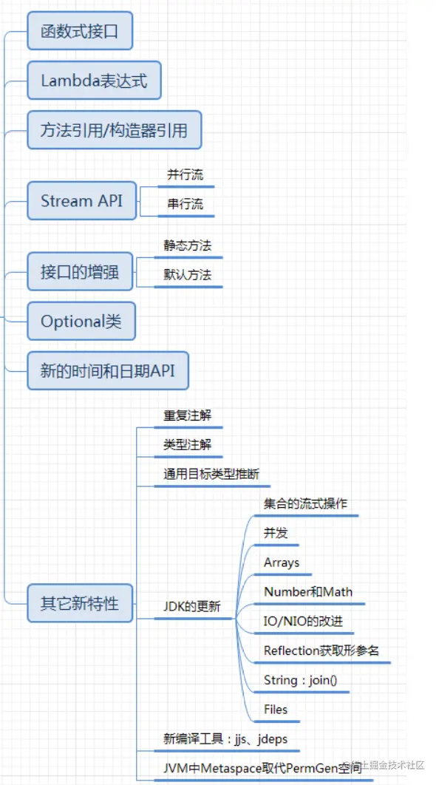

**Java 8的改进**

- 速度更快
- 代码更少（增加了新的语法：Lambda表达式）
- 引入强大的 `Stream APl`
- 便于并行
- 最大化减少空指针异常：`Optional`
- `Nashorn` 引擎，允许在JVM上运行 `JS` 应用
- 并行流就是把一个内容分成多个数据块，并用不同的线程分别处理每个数据块的流。相比较串行的流，并行的流可以很大程度上提高程序的执行效率。
- Java 8中将并行进行了优化，我们可以很容易的对数据进行并行操作。`Stream API` 可以声明性地通过 `parallel()` 与 `sequential()` 在并行流与顺序流之间进行切换

## 一、Lambda 表达式

### 1. Lamdba 表达式概述

Lambda 是一个匿名函数，可以把 Lambda 表达式理解为是一段可以传递的代码（将代码像数据一样进行传递）。使用它可以写出更简洁、更灵活的代码。作为一种更紧凑的代码风格，使 Java 的语言表达能力得到了提升。

### 2. 使用 Lambda 表达式前后对比

**示例一**：调用 Runable 接口

```java
@Test
public void test1(){
    //未使用Lambda表达式的写法
    Runnable r1 = new Runnable() {
        @Override
        public void run() {
            System.out.println("hello Lambda!");
        }
    };
    r1.run();

    System.out.println("========================");
    //Lamdba表达式写法
    Runnable r2 = () -> System.out.println("hi Lambda!");
    r2.run();
}
```

**示例二**：使用Comparator接口

```java
@Test
public void test2(){
    //未使用Lambda表达式的写法
    Comparator<Integer> com1 = new Comparator<Integer>() {
        @Override
        public int compare(Integer o1, Integer o2) {
            return Integer.compare(o1,o2);
        }
    };

    int compare1 = com1.compare(12, 32);
    System.out.println(compare1);//-1
    System.out.println("===================");

    //Lambda表达式的写法
    Comparator<Integer> com2 = (o1,o2) -> Integer.compare(o1,o2);

    int compare2 = com2.compare(54, 21);
    System.out.println(compare2);//1
    System.out.println("===================");

    //方法引用
    Comparator<Integer> cpm3 = Integer::compareTo;
    int compare3 = cpm3.compare(12, 12);
    System.out.println(compare3);//0
}

```

### 3. 怎样使用Lambda表达式

#### 3.1 Lamdba表达式基本语法

1.举例： `(o1,o2) -> Integer.compare(o1,o2);`

2.格式：

- `->` ：lambda 操作符 或 箭头操作符
- `->` 左边：lambda 形参列表 （其实就是接口中的抽象方法的形参列表）
- `->` 右边：lambda 体（其实就是重写的抽象方法的方法体）

#### 3.2 Lamdba表达式使用（包含六种情况）

**3.2.1 语法格式一：无参，有返回值**

```java
Runnable r1 = () -> {System.out.println("hello Lamdba!")}
```

**3.2.2 语法格式二：Lamdba需要一个参数，但没有返回值**

```java
Consumer<String> con = (String str) -> {System.out.println(str)}
```

**3.2.3 语法格式三：数据类型可省略，因为可由编译器推断得出，称为类型推断**

```java
Consumer<String> con = (str) -> {System.out.println(str)}
```

**3.2.4 语法格式四：Lamdba若只需要一个参数时，小括号可以省略**

```java
Consumer<String> con = str -> {System.out.println(str)}
```

**3.2.5 语法格式五：Lamdba需要两个以上的参数，多条执行语句，并且可以有返回值**

```java
Comparator<Integer>com = (o1,o1) -> {
	Syste.out.println("Lamdba表达式使用");
    return Integer.compare(o1,o2);
}
```

**3.2.6 语法格式六：当Lamdba体只有一条语句时，return和大括号若有，都可以省略**

```java
Comparator<Integer>com = (o1,o1) ->	Integer.compare(o1,o2);
```

**代码示例：**

```java
public class LamdbaTest2 {
    //语法格式一：无参，无返回值
    @Test
    public void test1() {
        //未使用Lambda表达式
        Runnable r1 = new Runnable() {
            @Override
            public void run() {
                System.out.println("Hello Lamdba");
            }
        };
        r1.run();
        System.out.println("====================");
        //使用Lambda表达式
        Runnable r2 = () -> {
            System.out.println("Hi Lamdba");
        };
        r2.run();
    }

    //语法格式二：Lambda 需要一个参数，但是没有返回值。
    @Test
    public void test2() {
        //未使用Lambda表达式
        Consumer<String> con = new Consumer<String>() {
            @Override
            public void accept(String s) {
                System.out.println(s);
            }
        };
        con.accept("你好啊Lambda！");
        System.out.println("====================");
        //使用Lambda表达式
        Consumer<String> con1 = (String s) -> {
            System.out.println(s);
        };
        con1.accept("我是Lambda");

    }

    //语法格式三：数据类型可以省略，因为可由编译器推断得出，称为“类型推断”
    @Test
    public void test3() {
        //未使用Lambda表达式
        Consumer<String> con = new Consumer<String>() {
            @Override
            public void accept(String s) {
                System.out.println(s);
            }
        };
        con.accept("你好啊Lambda！");
        System.out.println("====================");
        //使用Lambda表达式
        Consumer<String> con1 = (s) -> {
            System.out.println(s);
        };
        con1.accept("我是Lambda");
    }

    @Test
    public void test(){
        ArrayList<String> list = new ArrayList<>();//类型推断，用左边推断右边
        int[] arr = {1,2,3,4};//类型推断，用左边推断右边
    }

    //语法格式四：Lambda 若只需要一个参数时，参数的小括号可以省略
    @Test
    public void test4() {
        //未使用Lambda表达式
        Consumer<String> con = new Consumer<String>() {
            @Override
            public void accept(String s) {
                System.out.println(s);
            }
        };
        con.accept("你好啊Lambda！");
        System.out.println("====================");
        //使用Lambda表达式
        Consumer<String> con1 = s -> {
            System.out.println(s);
        };
        con1.accept("我是Lambda");
    }

    //语法格式五：Lambda 需要两个或以上的参数，多条执行语句，并且可以有返回值
    @Test
    public void test5() {
        //未使用Lambda表达式
        Comparator<Integer> com1 = new Comparator<Integer>() {
            @Override
            public int compare(Integer o1, Integer o2) {
                System.out.println(o1);
                System.out.println(o2);
                return Integer.compare(o1, o2);
            }
        };
        System.out.println(com1.compare(23, 45));
        System.out.println("====================");
        //使用Lambda表达式
        Comparator<Integer> com2 = (o1, o2) -> {
            System.out.println(o1);
            System.out.println(o2);
            return o1.compareTo(o2);
        };
        System.out.println(com2.compare(23, 12));
    }

    //语法格式六：当 Lambda 体只有一条语句时，return 与大括号若有，都可以省略
    @Test
    public void test6() {
        //未使用Lambda表达式
        Comparator<Integer> com1 = new Comparator<Integer>() {
            @Override
            public int compare(Integer o1, Integer o2) {
                return Integer.compare(o1, o2);
            }
        };
        System.out.println(com1.compare(23, 45));
        System.out.println("====================");
        //使用Lambda表达式
        Comparator<Integer> com2 = (o1, o2) -> o1.compareTo(o2);

        System.out.println(com2.compare(23, 12));
    }
    @Test
    public void test7(){
        //未使用Lambda表达式
        Consumer<String> con1 = new Consumer<String>() {
            @Override
            public void accept(String s) {
                System.out.println(s);
            }
        };
        con1.accept("hi!");
        System.out.println("====================");
        //使用Lambda表达式
        Consumer<String> con2 = s -> System.out.println(s);
        con2.accept("hello");
    }

}
```

#### 3.3 Lambda 表达式使用总结

- `->` 左边：lambda 形参列表的参数类型可以省略(类型推断)；如果 lambda 形参列表只有一个参数，其一对 `()` 也可以省略
- `->` 右边：lambda 体应该使用一对 `{}` 包裹；如果 lambda 体只有一条执行语句（可能是 `return` 语句），省略这一对 `{}` 和 `return` 关键字

### 4. Lamdba表达式总结

- Lambda 表达式的本质：作为函数式接口的实例
- 如果一个接口中，只声明了一个抽象方法，则此接口就称为函数式接口。我们可以在一个接口上使用 `@FunctionalInterface` 注解，这样做可以检查它是否是一个函数式接口。
- 因此以前用匿名实现类表示的现在都可以用 Lambda 表达式来写。

## 二、函数式接口

### 1. 函数式接口概述

- 只包含一个抽象方法的接口，称为函数式接口。
- 可以通过 Lambda 表达式来创建该接口的对象。（若 Lambda 表达式抛出一个受检异常（即：非运行时异常），那么该异常需要在目标接口的抽象方法上进行声明）。
- 可以在一个接口上使用 `@FunctionalInterface` 注解，这样做可以检查它是否是一个函数式接口。同时 `javadoc` 也会包含一条声明，说明这个接口是一个函数式接口。
- Lambda 表达式的本质：作为函数式接口的实例
- 在 `java.util.function` 包下定义了Java 8的丰富的函数式接口

**自定义函数式接口**

```java
@FunctionalInterface
public interface MyInterface {
    void method1();
}
```

### 3. Java内置函数式接口

#### 3.1 四大核心函数式接口


**应用举例**

```java
public class LambdaTest3 {
    //    消费型接口 Consumer<T>  void accept(T t)
    @Test
    public void test1() {
        //未使用Lambda表达式
        Learn("java", new Consumer<String>() {
            @Override
            public void accept(String s) {
                System.out.println("学习什么？ " + s);
            }
        });
        System.out.println("====================");
        //使用Lambda表达
        Learn("html", s -> System.out.println("学习什么？ " + s));

    }

    private void Learn(String s, Consumer<String> stringConsumer) {
        stringConsumer.accept(s);
    }

    //    供给型接口 Supplier<T>  T get()
    @Test
    public void test2() {
        //未使用Lambdabiaodas
        Supplier<String> sp = new Supplier<String>() {
            @Override
            public String get() {
                return new String("我能提供东西");
            }
        };
        System.out.println(sp.get());
        System.out.println("====================");
        //使用Lambda表达
        Supplier<String> sp1 = () -> new String("我能通过lambda提供东西");
        System.out.println(sp1.get());
    }

    //函数型接口 Function<T,R>   R apply(T t)
    @Test
    public void test3() {
        //使用Lambda表达式
        Employee employee = new Employee(1001, "Tom", 45, 10000);

        Function<Employee, String> func1 =e->e.getName();
        System.out.println(func1.apply(employee));
        System.out.println("====================");

        //使用方法引用
        Function<Employee,String>func2 = Employee::getName;
        System.out.println(func2.apply(employee));

    }

    //断定型接口 Predicate<T> boolean test(T t)
    @Test
    public void test4() {
        //使用匿名内部类
        Function<Double, Long> func = new Function<Double, Long>() {
            @Override
            public Long apply(Double aDouble) {
                return Math.round(aDouble);
            }
        };
        System.out.println(func.apply(10.5));
        System.out.println("====================");

        //使用Lambda表达式
        Function<Double, Long> func1 = d -> Math.round(d);
        System.out.println(func1.apply(12.3));
        System.out.println("====================");

        //使用方法引用
        Function<Double,Long>func2 = Math::round;
        System.out.println(func2.apply(12.6));

    }
}
```

#### 3.2 其他函数式接口

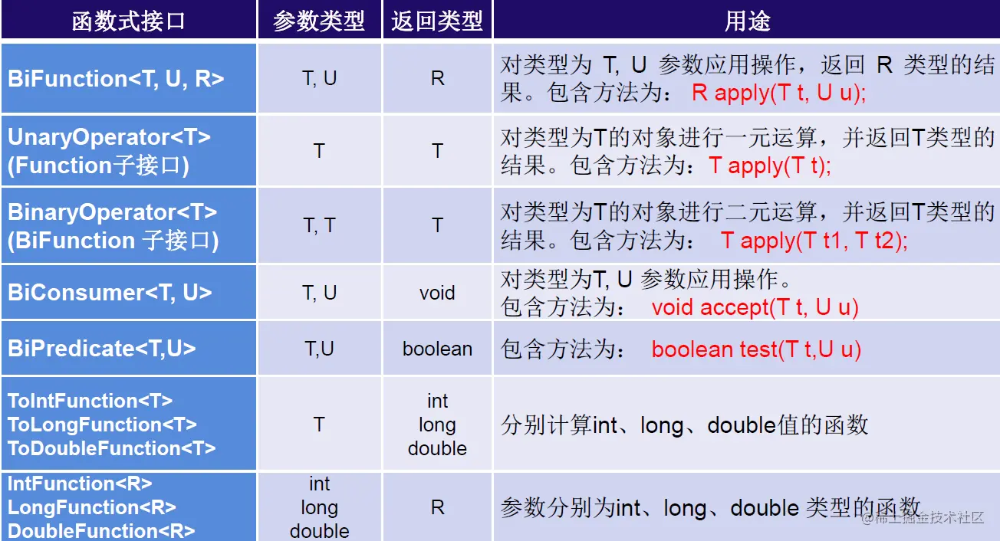

### 4. 使用总结

**4.1 何时使用lambda表达式？**

当需要对一个函数式接口实例化的时候，可以使用 lambda 表达式。

**4.2 何时使用给定的函数式接口？**

如果我们开发中需要定义一个函数式接口，首先看看在已有的jdk提供的函数式接口是否提供了能满足需求的函数式接口。如果有，则直接调用即可，不需要自己再自定义了。

## 三、方法的引用

### 1. 方法引用概述

方法引用可以看做是 Lambda 表达式深层次的表达。换句话说，方法引用就是 Lambda 表达式，也就是函数式接口的一个实例，通过方法的名字来指向一个方法。

### 2. 使用情景

当要传递给 Lambda 体的操作，已经实现的方法了，可以使用方法引用！

### 3. 使用格式

```
类(或对象) :: 方法名
```

### 4. 使用情况

- 情况1 对象 `::` 非静态方法
- 情况2 类 `::` 静态方法
- 情况3 类 `::` 非静态方法

### 5. 使用要求

- 要求接口中的抽象方法的形参列表和返回值类型与方法引用的方法的形参列表和返回值类型相同！（针对于情况1和情况2）
- 当函数式接口方法的第一个参数是需要引用方法的调用者，并且第二个参数是需要引用方法的参数(或无参数)时：`ClassName::methodName`（针对于情况3）

### 6. 使用建议

如果给函数式接口提供实例，恰好满足方法引用的使用情境，就可以考虑使用方法引用给函数式接口提供实例。如果不熟悉方法引用，那么还可以使用 lambda 表达式。

### 7. 使用举例

```java
public class MethodRefTest {

    // 情况一：对象 :: 实例方法
    //Consumer中的void accept(T t)
    //PrintStream中的void println(T t)
    @Test
    public void test1() {
        //使用Lambda表达
        Consumer<String> con1 = str -> System.out.println(str);
        con1.accept("中国");
        System.out.println("====================");

        //使用方法引用
        PrintStream ps = System.out;
        Consumer con2 = ps::println;
        con2.accept("China");

    }

    //Supplier中的T get()
    //Employee中的String getName()
    @Test
    public void test2() {
        //使用Lambda表达
        Employee emp = new Employee(1001, "Bruce", 34, 600);
        Supplier<String> sup1 = () -> emp.getName();
        System.out.println(sup1.get());
        System.out.println("====================");

        //使用方法引用
        Supplier sup2 = emp::getName;
        System.out.println(sup2.get());


    }

    // 情况二：类 :: 静态方法
    //Comparator中的int compare(T t1,T t2)
    //Integer中的int compare(T t1,T t2)
    @Test
    public void test3() {
        //使用Lambda表达
        Comparator<Integer> com1 = (t1, t2) -> Integer.compare(t1, t2);
        System.out.println(com1.compare(32, 45));
        System.out.println("====================");

        //使用方法引用
        Comparator<Integer> com2 = Integer::compareTo;
        System.out.println(com2.compare(43, 34));
    }

    //Function中的R apply(T t)
    //Math中的Long round(Double d)
    @Test
    public void test4() {
        //使用匿名内部类
        Function<Double, Long> func = new Function<Double, Long>() {
            @Override
            public Long apply(Double aDouble) {
                return Math.round(aDouble);
            }
        };
        System.out.println(func.apply(10.5));
        System.out.println("====================");

        //使用Lambda表达式
        Function<Double, Long> func1 = d -> Math.round(d);
        System.out.println(func1.apply(12.3));
        System.out.println("====================");

        //使用方法引用
        Function<Double, Long> func2 = Math::round;
        System.out.println(func2.apply(12.6));


    }

    // 情况三：类 :: 实例方法
    // Comparator中的int comapre(T t1,T t2)
    // String中的int t1.compareTo(t2)
    @Test
    public void test5() {
        //使用Lambda表达式
        Comparator<String> com1 = (s1, s2) -> s1.compareTo(s2);
        System.out.println(com1.compare("abd", "aba"));
        System.out.println("====================");

        //使用方法引用
        Comparator<String> com2 = String::compareTo;
        System.out.println(com2.compare("abd", "abc"));
    }

    //BiPredicate中的boolean test(T t1, T t2);
    //String中的boolean t1.equals(t2)
    @Test
    public void test6() {
        //使用Lambda表达式
        BiPredicate<String, String> pre1 = (s1, s2) -> s1.equals(s2);
        System.out.println(pre1.test("abc", "abc"));
        System.out.println("====================");

        //使用方法引用
        BiPredicate<String, String> pre2 = String::equals;
        System.out.println(pre2.test("abc", "abd"));

    }

    // Function中的R apply(T t)
    // Employee中的String getName();
    @Test
    public void test7() {
        //使用Lambda表达式
        Employee employee = new Employee(1001, "Tom", 45, 10000);

        Function<Employee, String> func1 =e->e.getName();
        System.out.println(func1.apply(employee));
        System.out.println("====================");

        //使用方法引用
        Function<Employee,String>func2 = Employee::getName;
        System.out.println(func2.apply(employee));
    }
}
```

## 四、构造器和数组的引用

### 1. 使用格式

方法引用：类名 `::new`

数组引用：数组类型 `[] :: new`

### 2. 使用要求

#### 2.1 构造器引用

和方法引用类似，函数式接口的抽象方法的形参列表和构造器的形参列表一致。抽象方法的返回值类型即为构造器所属的类的类型

#### 2.2 数组引用

可以把数组看做是一个特殊的类，则写法与构造器引用一致。

### 3. 使用举例

#### 3.1 构造器引用

```java
//构造器引用
//Supplier中的T get()
@Test
public void test1() {
    //使用匿名内部类
    Supplier<Employee> sup = new Supplier<Employee>() {
        @Override
        public Employee get() {
            return new Employee();
        }
    };
    System.out.println(sup.get());
    //使用Lambda表达式
    System.out.println("====================");
    Supplier<Employee> sup1 = () -> new Employee(1001, "Tom", 43, 13333);
    System.out.println(sup1.get());

    //使用方法引用
    Supplier<Employee> sup2 = Employee::new;
    System.out.println(sup2.get());

}

//Function中的R apply(T t)
@Test
public void test2() {
    //使用Lambda表达式
    Function<Integer, Employee> func1 = id -> new Employee(id);
    Employee employee = func1.apply(1001);
    System.out.println(employee);
    System.out.println("====================");

    //使用方法引用
    Function<Integer, Employee> func2 = Employee::new;
    Employee employee1 = func2.apply(1002);
    System.out.println(employee1);

}

//BiFunction中的R apply(T t,U u)
@Test
public void test3() {
    //使用Lambda表达式
    BiFunction<Integer, String, Employee> func1 = (id, name) -> new Employee(id, name);
    System.out.println(func1.apply(1001, "Tom"));
    System.out.println("====================");

    //使用方法引用
    BiFunction<Integer, String, Employee> func2 = Employee::new;
    System.out.println(func2.apply(1002, "Jarry"));
}
```

#### 3.2 数组引用

```java
//数组引用
//Function中的R apply(T t)
@Test
public void test4() {
    Function<Integer, String[]> func1 = length -> new String[length];
    String[] arr1 = func1.apply(5);
    System.out.println(Arrays.toString(arr1));

    System.out.println("====================");

    //使用方法引用
    Function<Integer,String[]>func2=String[]::new;
    String[] arr2 = func2.apply(10);
    System.out.println(Arrays.toString(arr2));
}
```

## 五、StreamAPI

### 1. Stream API概述

- `Stream` 关注的是对数据的运算，与 `CPU` 打交道;集合关注的是数据的存储，与内存打交道;
- Java 8 提供了一套 `api` ，使用这套 `api` 可以对内存中的数据进行过滤、排序、映射、归约等操作。类似于 `sql` 对数据库中表的相关操作。
- `Stream` 是数据渠道，用于操作数据源（集合、数组等）所生成的元素序列。**“集合讲的是数据， Stream讲的是计算！”**

**使用注意点:**

① `Stream` 自己不会存储元素。

② `Stream` 不会改变源对象。相反，他们会返回一个持有结果的新 `Stream`。

③ `Stream` 操作是延迟执行的。这意味着他们会等到需要结果的时候才执行。

### 2. Stream 使用流程

① Stream 的实例化

② 一系列的中间操作（过滤、映射、...)

③ 终止操作


**使用流程中的注意点：**

- 一个中间操作链，对数据源的数据进行处理
- 一旦执行终止操作，就执行中间操作链，并产生结果。之后，不会再被使用

### 3. 使用方法

#### 3.1 步骤一 创建 Stream

**3.1.1 创建方式一：通过集合**

Java 8的 `Collection` 接口被扩展，提供了两个获取流的方法：

- `default Stream\ stream()` : 返回一个顺序流
- `default Stream\ parallelStream()` : 返回一个并行流

**3.1.2 创建方式二：通过数组**

Java 8中的 `Arrays` 的静态方法 `stream()` 可以获取数组流

- 调用 `Arrays` 类的 `static\ Stream\ stream(T[] array)`: 返回一个流
- 重载形式，能够处理对应基本类型的数组： 
  - `public static IntStream stream（int[] array）`
  - `public static LongStream stream（long[] array）`
  - `public static DoubleStream stream（double[] array）`

**3.1.3 创建方式三：通过Stream的of()方法**

可以调用Stream类静态方法of()，通过显示值创建一个流。可以用于接收任意数量的参数

- `public static \Stream\ of(T...values)`:返回一个流

**3.1.4 创建方式四：创建无限流**

- 迭代: `public static\ Stream\ iterate(final T seed, final UnaryOperator\ f)`
- 生成: `public static\ Stream\ generate(Supplier\ s)`

**代码示例：**

```java
public class StreamAPITest1 {
    //创建 Stream方式一：通过集合
    @Test
    public void test1() {
        List<Employee> employees = EmployeeData.getEmployees();
        //efault Stream<E> stream() : 返回一个顺序流
        Stream<Employee> stream = employees.stream();

        //default Stream<E> parallelStream() : 返回一个并行流
        Stream<Employee> employeeStream = employees.parallelStream();
    }

    //创建 Stream方式二：通过数组
    @Test
    public void test2() {
        int[] arrs = {1, 2, 3, 6, 2};
        //调用Arrays类的static <T> Stream<T> stream(T[] array): 返回一个流
        IntStream stream = Arrays.stream(arrs);

        Employee e1 = new Employee(1001, "Tom");
        Employee e2 = new Employee(1002, "Jerry");
        Employee[] employees = {e1, e2};
        Stream<Employee> stream1 = Arrays.stream(employees);
    }

    //创建 Stream方式三：通过Stream的of()
    @Test
    public void test3() {
        Stream<Integer> integerStream = Stream.of(12, 34, 45, 65, 76);
    }

    //创建 Stream方式四：创建无限流
    @Test
    public void test4() {

        //迭代
        //public static<T> Stream<T> iterate(final T seed, final UnaryOperator<T> f)
        //遍历前10个偶数
        Stream.iterate(0, t -> t + 2).limit(10).forEach(System.out::println);

        //生成
        //public static<T> Stream<T> generate(Supplier<T> s)
        Stream.generate(Math::random).limit(10).forEach(System.out::println);
    }
}

```

#### 3.2 步骤二 中间操作

多个中间操作可以连接起来形成一个流水线，除非流水线上触发终止操作，否则中间操作不会执行任何的处理！而在终止操作时一次性全部处理，称为**惰性求值**。

**3.2.1 筛选与切片**

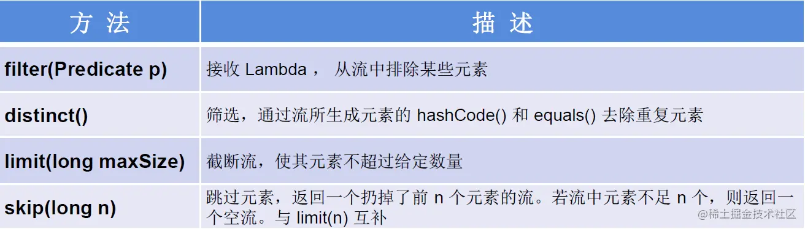

**代码示例:**

```java
//1-筛选与切片,注意执行终止操作后，Stream流就被关闭了，使用时需要再次创建Stream流
@Test
public void test1(){
    List<Employee> employees = EmployeeData.getEmployees();
    //filter(Predicate p)——接收 Lambda ， 从流中排除某些元素。
    Stream<Employee> employeeStream = employees.stream();
    //练习：查询员工表中薪资大于7000的员工信息
    employeeStream.filter(e -> e.getSalary() > 7000).forEach(System.out::println);

    //limit(n)——截断流，使其元素不超过给定数量。
    employeeStream.limit(3).forEach(System.out::println);
    System.out.println();

    //skip(n) —— 跳过元素，返回一个扔掉了前 n 个元素的流。若流中元素不足 n 个，则返回一个空流。与 limit(n) 互补
    employeeStream.skip(3).forEach(System.out::println);
    //distinct()——筛选，通过流所生成元素的 hashCode() 和 equals() 去除重复元素
    employees.add(new Employee(1010,"刘庆东",56,8000));
    employees.add(new Employee(1010,"刘庆东",56,8000));
    employees.add(new Employee(1010,"刘庆东",56,8000));
    employees.add(new Employee(1010,"刘庆东",56,8000));

    employeeStream.distinct().forEach(System.out::println);
}

```

**3.2.2 映射**

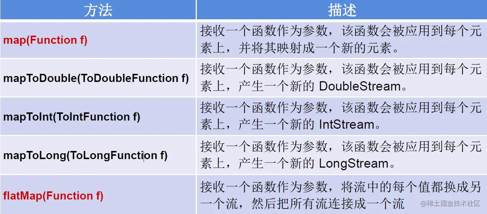

**代码示例:**

```java
//2-映射
@Test
public void test2(){
    List<String> list = Arrays.asList("aa", "bb", "cc", "dd");
    //map(Function f)——接收一个函数作为参数，将元素转换成其他形式或提取信息，该函数会被应用到每个元素上，并将其映射成一个新的元素。
    list.stream().map(str -> str.toUpperCase()).forEach(System.out::println);

    //练习1：获取员工姓名长度大于3的员工的姓名。
    List<Employee> employees = EmployeeData.getEmployees();
    Stream<String> nameStream = employees.stream().map(Employee::getName);
    nameStream.filter(name -> name.length() >3).forEach(System.out::println);
    System.out.println();
    //练习2：使用map()中间操作实现flatMap()中间操作方法
    Stream<Stream<Character>> streamStream = list.stream().map(StreamAPITest2::fromStringToStream);
    streamStream.forEach(s ->{
        s.forEach(System.out::println);
    });
    System.out.println();
    //flatMap(Function f)——接收一个函数作为参数，将流中的每个值都换成另一个流，然后把所有流连接成一个流。
    Stream<Character> characterStream = list.stream().flatMap(StreamAPITest2::fromStringToStream);
    characterStream.forEach(System.out::println);

}
//将字符串中的多个字符构成的集合转换为对应的Stream的实例
public static Stream<Character>fromStringToStream(String str){
    ArrayList<Character> list = new ArrayList<>();
    for (Character c :
         str.toCharArray()) {
        list.add(c);
    }
    return list.stream();
}
//map()和flatMap()方法类似于List中的add()和addAll()方法
@Test
public void test(){
    ArrayList<Object> list1 = new ArrayList<>();
    list1.add(1);
    list1.add(2);
    list1.add(3);
    list1.add(4);

    ArrayList<Object> list2 = new ArrayList<>();
    list2.add(5);
    list2.add(6);
    list2.add(7);
    list2.add(8);

    list1.add(list2);
    System.out.println(list1);//[1, 2, 3, 4, [5, 6, 7, 8]]
    list1.addAll(list2);
    System.out.println(list1);//[1, 2, 3, 4, [5, 6, 7, 8], 5, 6, 7, 8]

}

```

**3.2.3 排序**


**代码示例:**

```java
//3-排序
@Test
public void test3(){
    //sorted()——自然排序
    List<Integer> list = Arrays.asList(12, 34, 54, 65, 32);
    list.stream().sorted().forEach(System.out::println);

    //抛异常，原因:Employee没有实现Comparable接口
    List<Employee> employees = EmployeeData.getEmployees();
    employees.stream().sorted().forEach(System.out::println);

    //sorted(Comparator com)——定制排序
    List<Employee> employees1 = EmployeeData.getEmployees();
    employees1.stream().sorted((e1,e2)->{
        int ageValue = Integer.compare(e1.getAge(), e2.getAge());
        if (ageValue != 0){
            return ageValue;
        }else {
            return -Double.compare(e1.getSalary(),e2.getSalary());
        }

    }).forEach(System.out::println);
}

```

#### 3.3 步骤三 终止操作

- 终端操作会从流的流水线生成结果。其结果可以是任何不是流的值，例如：`List`、 `Integer`，甚至是 `void`
- 流进行了终止操作后，不能再次使用。

**3.3.1 匹配与查找**


**代码示例：**

```java
//1-匹配与查找
@Test
public void test1(){
    List<Employee> employees = EmployeeData.getEmployees();

    //allMatch(Predicate p)——检查是否匹配所有元素。
    //练习：是否所有的员工的年龄都大于18
    boolean allMatch = employees.stream().allMatch(e -> e.getAge() > 18);
    System.out.println(allMatch);
    //anyMatch(Predicate p)——检查是否至少匹配一个元素。
    //练习：是否存在员工的工资大于 5000
    boolean anyMatch = employees.stream().anyMatch(e -> e.getSalary() > 5000);
    System.out.println(anyMatch);

    //noneMatch(Predicate p)——检查是否没有匹配的元素。
    //练习：是否存在员工姓“雷”
    boolean noneMatch = employees.stream().noneMatch(e -> e.getName().startsWith("雷"));
    System.out.println(noneMatch);

    //findFirst——返回第一个元素
    Optional<Employee> first = employees.stream().findFirst();
    System.out.println(first);

    //findAny——返回当前流中的任意元素
    Optional<Employee> employee = employees.parallelStream().findAny();
    System.out.println(employee);


}

@Test
public void test2(){
    List<Employee> employees = EmployeeData.getEmployees();
    // count——返回流中元素的总个数
    long count = employees.stream().filter(e -> e.getSalary()>5000).count();
    System.out.println(count);

    //max(Comparator c)——返回流中最大值
    //练习：返回最高的工资
    Stream<Double> salaryStream = employees.stream().map(e -> e.getSalary());
    Optional<Double> maxSalary = salaryStream.max(Double::compareTo);
    System.out.println(maxSalary);

    //min(Comparator c)——返回流中最小值
    //练习：返回最低工资的员工
    Optional<Double> minSalary = employees.stream().map(e -> e.getSalary()).min(Double::compareTo);
    System.out.println(minSalary);

    //forEach(Consumer c)——内部迭代
    employees.stream().forEach(System.out::println);
    System.out.println();
    //使用集合的遍历操作
    employees.forEach(System.out::println);

}

```

**3.3.2 归约**

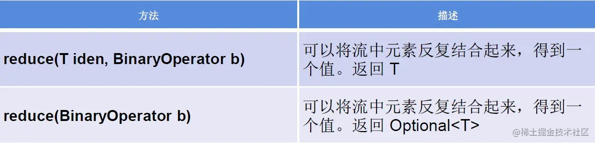

> 备注：`map` 和 `reduce` 的连接通常称为 `map-reduce` 模式，因 Google 用它来进行网络搜索而出名

**代码示例：**

```java
//2-归约
@Test
public void test3(){
    //reduce(T identity, BinaryOperator)——可以将流中元素反复结合起来，得到一个值。返回 T
    //练习1：计算1-10的自然数的和
    List<Integer> list = Arrays.asList(1, 2, 3, 4, 5, 6, 7, 8, 9, 10);
    Integer sum = list.stream().reduce(0, Integer::sum);
    System.out.println(sum);

    //reduce(BinaryOperator) ——可以将流中元素反复结合起来，得到一个值。返回 Optional<T>
    //练习2：计算公司所有员工工资的总和
    List<Employee> employees = EmployeeData.getEmployees();
    Optional<Double> sumSalary = employees.stream().map(e -> e.getSalary()).reduce(Double::sum);
    System.out.println(sumSalary);

}

```

**3.3.3 收集**


`Collector` 接口中方法的实现决定了如何对流执行收集的操作（如收集到 `List`、`Set`、`Map`）

`Collectors` 实用类提供了很多静态方法，可以方便地创建常见收集器实例具体方法与实例如下表：


**代码示例：**

```java
//3-收集
@Test
public void test4(){
    //collect(Collector c)——将流转换为其他形式。接收一个 Collector接口的实现，用于给Stream中元素做汇总的方法
    //练习1：查找工资大于6000的员工，结果返回为一个List或Set
    List<Employee> employees = EmployeeData.getEmployees();
    List<Employee> employeeList = employees.stream().filter(e -> e.getSalary() > 6000).collect(Collectors.toList());

    employeeList.forEach(System.out::println);
    System.out.println();
    Set<Employee> employeeSet = employees.stream().filter(e -> e.getSalary() > 6000).collect(Collectors.toSet());
    employeeSet.forEach(System.out::println);
}
```

## 六、Optional 类的使用

### 1. OPtional 类的概述

- 为了解决 java 中的空指针问题而生！
- `Optional 类(java.util.Optional)` 是一个容器类，它可以保存类型 `T` 的值，代表这个值存在。或者仅仅保存 `null`，表示这个值不存在。原来用 `null` 表示一个值不存在，现在 `Optional` 可以更好的表达这个概念。并且可以避免空指针异常。

### 2. Optional 类提供的方法

`Optional` 类提供了很多方法，可以不用再现实的进行空值检验。

#### 2.1 创建 Optional 类对象的方法

- `Optional.of(T t)` : 创建一个 `Optional` 实例，`t` 必须非空；
- `Optional.empty()` : 创建一个空的 `Optional` 实例
- `Optional.ofNullable(T t)`：`t` 可以为 `null`

#### 2.2 判断Optional容器是否包含对象

- `boolean isPresent()`：判断是否包含对象
- `void ifPresent(Consumer consumer)`：如果有值，就执行 `Consumer` 接口的实现代码，并且该值会作为参数传给它。

#### 2.3 获取 Optional 容器的对象

- `T get()`：如果调用对象包含值，返回该值，否则抛异常
- `T orElse(T other)`：如果有值则将其返回，否则返回指定的 `other` 对象
- `T orElseGet(Supplier other)`：如果有值则将其返回，否则返回由 `Supplier` 接口实现提供的对象。
- `T orElseThrow(Supplier exceptionSupplier)`：如果有值则将其返回，否则抛出由 `Supplier` 接口实现提供的异常。

#### 2.4 搭配使用

- `of()` 和 `get()` 方法搭配使用，明确对象非空
- `ofNullable()` 和 `orElse()` 搭配使用，不确定对象非空

### 3. 应用举例

```java
public class OptionalTest {
    @Test
    public void test1() {
        //empty():创建的Optional对象内部的value = null
        Optional<Object> op1 = Optional.empty();
        if (!op1.isPresent()){//Optional封装的数据是否包含数据
            System.out.println("数据为空");
        }
        System.out.println(op1);
        System.out.println(op1.isPresent());

        //如果Optional封装的数据value为空，则get()报错。否则，value不为空时，返回value.
        System.out.println(op1.get());
    }
    @Test
    public void test2(){
        String str = "hello";
//        str = null;
        //of(T t):封装数据t生成Optional对象。要求t非空，否则报错。
        Optional<String> op1 = Optional.of(str);
        //get()通常与of()方法搭配使用。用于获取内部的封装的数据value
        String str1 = op1.get();
        System.out.println(str1);
    }
    @Test
    public void test3(){
        String str ="Beijing";
        str = null;
        //ofNullable(T t) ：封装数据t赋给Optional内部的value。不要求t非空
        Optional<String> op1 = Optional.ofNullable(str);
        System.out.println(op1);
        //orElse(T t1):如果Optional内部的value非空，则返回此value值。如果
        //value为空，则返回t1.
        String str2 = op1.orElse("shanghai");
        System.out.println(str2);
    }
}
```

使用 `Optional` 类避免产生空指针异常

```java
public class GirlBoyOptionalTest {

    //使用原始方法进行非空检验
    public String getGrilName1(Boy boy){
        if (boy != null){
            Girl girl = boy.getGirl();
            if (girl != null){
                return girl.getName();
            }
        }
        return null;
    }
    //使用Optional类的getGirlName()进行非空检验
    public String getGirlName2(Boy boy){
        Optional<Boy> boyOptional = Optional.ofNullable(boy);
        //此时的boy1一定非空,boy为空是返回“迪丽热巴”
        Boy boy1 = boyOptional.orElse(new Boy(new Girl("迪丽热巴")));

        Girl girl = boy1.getGirl();
        //girl1一定非空,girl为空时返回“古力娜扎”
        Optional<Girl> girlOptional = Optional.ofNullable(girl);
        Girl girl1 = girlOptional.orElse(new Girl("古力娜扎"));

        return girl1.getName();
    }

    //测试手动写的控制检测
    @Test
    public void test1(){

        Boy boy = null;
        System.out.println(getGrilName1(boy));

        boy = new Boy();
        System.out.println(getGrilName1(boy));

        boy = new Boy(new Girl("杨幂"));
        System.out.println(getGrilName1(boy));
    }
    //测试用Optional类写的控制检测
    @Test
    public void test2(){
        Boy boy = null;
        System.out.println(getGirlName2(boy));

        boy = new Boy();
        System.out.println(getGirlName2(boy));

        boy = new Boy(new Girl("杨幂"));
        System.out.println(getGirlName2(boy));

    }
}
```

## 七、对反射的支持增强

提高了创建对象、对象赋值和反射创建对象的时间

**代码示例：**

```java
public class testReflection {
    // 循环次数10亿次
    private static final int loopCnt = 1000 * 1000 * 1000;

    public static void main(String[] args) throws InvocationTargetException, NoSuchMethodException, InstantiationException, IllegalAccessException {
        // 输出jdk版本
        System.out.println("java version is" + System.getProperty("java.version"));
        creatNewObject();
        optionObject();
        reflectCreatObject();
    }

    // person对象
    static class Person {
        private Integer age = 20;

        public Integer getAge() {
            return age;
        }

        public void setAge(Integer age) {
            this.age = age;
        }
    }

    // 每次创建新对象
    public static void creatNewObject() {
        long startTime = System.currentTimeMillis();
        for (int i = 0; i < loopCnt; i++) {
            Person person = new Person();
            person.setAge(30);
        }
        long endTime = System.currentTimeMillis();
        System.out.println("循环十亿次创建对象所需的时间：" + (endTime - startTime));
    }

    // 为同一个对象赋值
    public static void optionObject() {
        long startTime = System.currentTimeMillis();
        Person p = new Person();
        for (int i = 0; i < loopCnt; i++) {
            p.setAge(10);
        }
        long endTime = System.currentTimeMillis();
        System.out.println("循环十亿次为同一对象赋值所需的时间：" + (endTime - startTime));
    }

    // 通过反射创建对象
    public static void reflectCreatObject() throws IllegalAccessException, InstantiationException, NoSuchMethodException, InvocationTargetException {
        long startTime = System.currentTimeMillis();
        Class<Person> personClass = Person.class;
        Person person = personClass.newInstance();
        Method setAge = personClass.getMethod("setAge", Integer.class);
        for (int i = 0; i < loopCnt; i++) {
            setAge.invoke(person, 90);
        }
        long endTime = System.currentTimeMillis();
        System.out.println("循环十亿次反射创建对象所需的时间：" + (endTime - startTime));
    }
}
```

**编译级别为JDK8时**

```txt
java version is 1.8.0_201
循环十亿次创建对象所需的时间：9
循环十亿次为同一对象赋值所需的时间：59
循环十亿次反射创建对象所需的时间：2622
```

**编译级别为JDK7时**

```txt
java version is 1.7
循环十亿次创建对象所需的时间：6737
循环十亿次为同一对象赋值所需的时间：3394
循环十亿次反射创建对象所需的时间：293603
```


